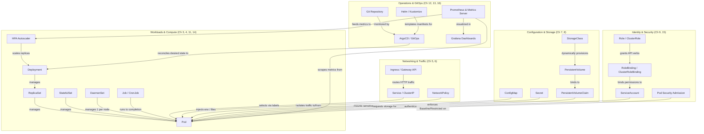

# Appendix E: Kubernetes Master Concept Map

> **TL;DR:** Kubernetes is a rich ecosystem of declarative APIs. This master diagram illustrates how every major resource covered in this book interconnects across compute, networking, configuration, storage, security, observability, and deployment pipelines.

---

## The Master Architecture & Resource Graph

---

## Resource Relationship Quick Reference

| Resource | Interacts With | Relationship Description |
|---|---|---|
| **Deployment** | `ReplicaSet`, `Pod`, `HPA` | Manages declarative rolling updates and replica counts. |
| **Service** | `Pod`, `Ingress`, `CoreDNS` | Provides a stable virtual IP and DNS name across ephemeral pod endpoints. |
| **Ingress / Gateway** | `Service`, `Secret` (TLS) | Routes external HTTP/HTTPS host and path traffic to backend services. |
| **ConfigMap & Secret** | `Pod`, `Deployment` | Externalizes configuration and credentials without rebuilding container images. |
| **PVC & StorageClass** | `PersistentVolume`, `Pod` | Requests durable, persistent block or file storage that survives pod destruction. |
| **ServiceAccount & RBAC** | `Pod`, `RoleBinding` | Assigns an identity to pods for interacting with the Kubernetes API server securely. |
| **NetworkPolicy** | `Pod`, `Namespace` | Acts as a distributed firewall enforcing ingress/egress allowlists. |
| **Prometheus & HPA** | `Pod`, `Deployment` | Collects CPU, memory, and custom metrics to automatically scale workloads. |
| **ArgoCD & Git** | `Deployment`, `Service`, etc. | Continuously reconciles cluster state to match the Git repository source of truth. |

---

## Navigating the Book by Architectural Layer

- **Need Compute & Workload Basics?** → Start with [Chapter 3: Pods](./ch03-pods/index.md) and [Chapter 4: Workload Controllers](./ch04-workloads/index.md).
- **Need Traffic Routing & DNS?** → See [Chapter 5: Services](./ch05-services/index.md) and [Chapter 6: Ingress & Gateway API](./ch06-ingress/index.md).
- **Need Persistence & Secrets?** → See [Chapter 7: Config](./ch07-configuration/index.md) and [Chapter 8: Storage](./ch08-storage/index.md).
- **Hardening for Production?** → Go to [Chapter 9: RBAC](./ch09-rbac/index.md) and [Chapter 15: Security Hardening](./ch15-security/index.md).
- **Automating Deployments?** → Head to [Chapter 12: Helm & Kustomize](./ch12-helm/index.md) and [Chapter 16: CI/CD & GitOps](./ch16-cicd/index.md).
- **Investigating Errors & Internals?** → Dive into [Chapter 17: Internals](./ch17-internals/index.md) and [Chapter 18: Troubleshooting](./ch18-troubleshooting/index.md).
