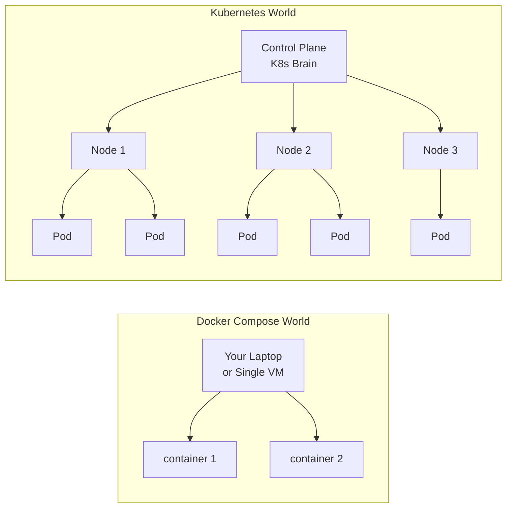
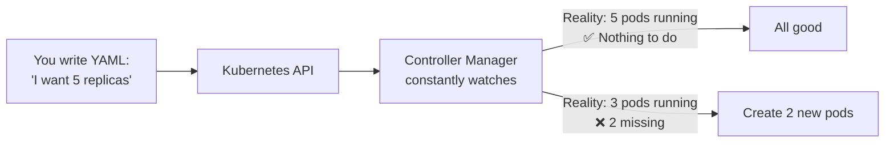

# 1.1 From Docker to Orchestration — Why Compose Isn't Enough

⏱️ **~8 min read**

> **TL;DR:** Docker Compose is a great local tool, but it breaks down the moment you need resilience, scaling, or multi-host deployments. Kubernetes solves all of that — systematically.

---

## You Already Know How to Do This

Here's a dead-simple Docker Compose file that runs a web app and its database:

```yaml
# docker-compose.yml
services:
  web:
    image: myapp:latest
    ports:
      - "3000:3000"
    environment:
      - DB_HOST=db
    depends_on:
      - db

  db:
    image: mongo:7
    volumes:
      - mongo_data:/data/db

volumes:
  mongo_data:
```

Run `docker compose up` and it works. Beautifully simple.

Now your app gets traffic. Real traffic. And things start to go wrong.

---

## The Five Walls You'll Hit

### Wall 1: No Self-Healing

Your `web` container crashes at 3am. Compose does nothing. It's dead until someone manually restarts it.

> 🔗 **Docker Parallel:** `restart: always` in Compose helps, but only on the same host. If the host dies, so does everything on it.

### Wall 2: Manual Scaling

You need 10 instances of `web` to handle load:

```bash
docker compose up --scale web=10
```

OK — but now all 10 are on the *same machine*, competing for the same CPU and RAM. You've created 10x the problem.

### Wall 3: Rolling Updates Are Your Problem

Deploying a new version means downtime unless you write complex scripts yourself. Compose has no concept of "replace containers one at a time while keeping traffic flowing."

### Wall 4: Single Host

Compose is a single-machine tool. Your app is bound to one server. If that server goes down, everything goes down. Scale beyond one machine? You're on your own.

### Wall 5: No Load Balancing

Who distributes traffic across your 10 web containers? Compose doesn't. You'd need to set up Nginx or HAProxy yourself, manually update configs when containers come and go.

---

## What Kubernetes Gives You

Kubernetes is what happens when you solve all five walls systematically.



| Problem | Compose | Kubernetes |
|---------|---------|------------|
| Container crashes | Stays dead (or restarts on same host only) | Automatically restarted anywhere in the cluster |
| Need more instances | Manual `--scale`, same machine | `kubectl scale`, spread across nodes |
| Deploy new version | Downtime or custom scripts | Built-in rolling updates |
| Multi-host | Not supported | Native — designed for it |
| Load balancing | DIY | Built in via Services |
| Secrets management | `.env` files | Encrypted Secrets objects |
| Health checks | Basic `healthcheck:` | Liveness, readiness, startup probes |

---

## The Mental Shift: Desired State

The single most important concept in Kubernetes:

> **You declare what you want. Kubernetes makes it happen and keeps it that way.**

In Docker Compose, you issue commands: "start this container", "stop that container." You're in control.

In Kubernetes, you write a declaration: "I want 5 instances of this app running at all times." Then you walk away. Kubernetes watches the cluster 24/7 and reconciles reality with your declaration.



This is called the **reconciliation loop** — or more precisely, the **control loop**. It runs constantly, forever, for every resource in your cluster.

> 🔗 **Docker Parallel:** There's no equivalent in Compose. The closest thing is `restart: always`, but that only handles crashes, not desired-count enforcement.

---

### Try It

Before we write any Kubernetes configs, let's see Compose's limit firsthand:

```bash
# Kill a container and watch Compose do nothing (without restart policy)
docker run -d --name test-no-restart nginx
docker kill test-no-restart
docker ps -a  # Status: Exited
```

**Expected output:**
```
CONTAINER ID   IMAGE   COMMAND   CREATED   STATUS                     PORTS   NAMES
abc123         nginx   ...       ...       Exited (137) 5 seconds ago         test-no-restart
```

Dead. Staying dead. Now you understand why you need Kubernetes.

```bash
# Cleanup
docker rm test-no-restart
```

---

## Key Takeaways

| # | Concept | One-liner |
|---|---------|-----------|
| 1 | Compose is single-host | It cannot span multiple machines |
| 2 | No self-healing in Compose | Crashed containers stay crashed |
| 3 | Desired State | K8s continuously reconciles reality with your declaration |
| 4 | K8s is an orchestrator | It manages containers *across a cluster* of machines |

---

## ✅ Quick Check

**Q1:** You have 3 replicas of your app running. You manually delete one. What does Kubernetes do?

<details>
<summary>Answer</summary>
Kubernetes detects that the actual state (2 replicas) differs from the desired state (3 replicas) and immediately creates a new pod to restore the count. This happens automatically, typically within seconds.
</details>

**Q2:** Your team uses `docker-compose up --scale web=5`. Why is this insufficient for production?

<details>
<summary>Answer</summary>
All 5 containers run on the same machine, sharing its CPU/RAM. There's no multi-host distribution, no load balancer, and if the machine fails, all 5 instances die simultaneously. It also doesn't provide rolling updates or automatic recovery.
</details>

**Q3:** What happens in Kubernetes if you don't explicitly tell it to stop something?

<details>
<summary>Answer</summary>
It keeps running indefinitely. The control loop ensures the desired state is maintained. If you want something gone, you delete the resource declaration — Kubernetes then reconciles by terminating the pods.
</details>
