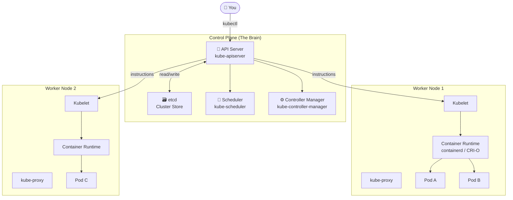
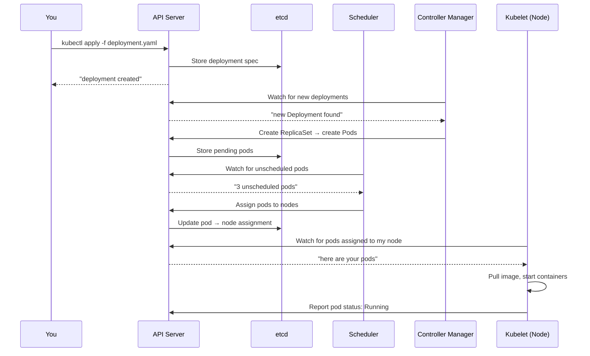

# 1.2 Kubernetes Architecture — The 10,000ft View

⏱️ **~8 min read**

> **TL;DR:** A Kubernetes cluster has two kinds of machines: a **Control Plane** (the brain) and **Worker Nodes** (the muscle). Everything you do goes through the API Server.

---

## The Two-Tier Architecture

Every Kubernetes cluster, whether it's running on your laptop via Minikube or powering Netflix in production, follows the same fundamental architecture.



---

## The Control Plane — The Brain

The control plane runs on dedicated machines (usually 1–3 for HA). It makes all the cluster-wide decisions. You never run application workloads on control plane nodes.

| Component | Role | Analogy |
|-----------|------|---------|
| **API Server** | The single entry point for all cluster operations | Hotel reception desk — every request goes through here |
| **etcd** | Distributed key-value store — the source of truth for all cluster state | The hotel's booking ledger |
| **Scheduler** | Decides which node a new pod runs on | Hotel concierge assigning rooms |
| **Controller Manager** | Runs control loops that watch state and reconcile | Floor supervisors who enforce the rules |

> 📝 **Note:** The control plane components communicate only through the API Server. Nothing talks to etcd directly except the API Server.

---

## Worker Nodes — The Muscle

Worker nodes are where your application pods actually run. A cluster can have 1 to thousands of them.

| Component | Role |
|-----------|------|
| **Kubelet** | The K8s agent on each node — receives pod specs and ensures containers are running |
| **kube-proxy** | Maintains network rules so pods can communicate via Services |
| **Container Runtime** | Actually runs containers (containerd, CRI-O, Docker Engine via shim) |

> 🔗 **Docker Parallel:** The container runtime on a worker node is doing the same job as the Docker daemon on your machine — pulling images and running containers. The Kubelet is the layer above it telling it *what* to run.

---

## The Flow: What Happens When You Run `kubectl apply`

Let's trace a deployment request through the entire system:



The key insight: **everything is mediated by the API Server and persisted in etcd.** Components don't talk to each other directly — they all watch the API Server for changes.

---

## Minikube: One Machine, Full Cluster

For local development, Minikube runs the entire cluster (control plane + one worker node) inside a single VM or Docker container on your machine.

```
Your Laptop
└── Minikube VM / Docker Container
    ├── Control Plane (kube-apiserver, etcd, scheduler, controller-manager)
    └── Worker Node (kubelet, kube-proxy, containerd)
        └── Your pods run here
```

This is why Minikube is perfect for learning — you get a real K8s cluster with no cloud bills.

> ⚠️ **Warning:** Minikube's single-node setup means control plane and workloads share resources. Never use Minikube in production.

---

### Try It

```bash
# Start minikube (if not already running)
minikube start

# See all cluster components
kubectl get pods -n kube-system
```

**Expected output:**
```
NAME                               READY   STATUS    RESTARTS   AGE
coredns-5dd5756b68-xxxxx           1/1     Running   0          5m
etcd-minikube                      1/1     Running   0          5m
kube-apiserver-minikube            1/1     Running   0          5m
kube-controller-manager-minikube   1/1     Running   0          5m
kube-proxy-xxxxx                   1/1     Running   0          5m
kube-scheduler-minikube            1/1     Running   0          5m
storage-provisioner                1/1     Running   0          5m
```

You're looking at the control plane components running as pods. Yes — K8s runs its own control plane inside itself (except etcd, which runs as a static pod directly managed by the kubelet).

```bash
# Inspect your single node
kubectl get nodes
```

**Expected output:**
```
NAME       STATUS   ROLES           AGE   VERSION
minikube   Ready    control-plane   5m    v1.30.x
```

---

## Key Takeaways

| # | Concept | One-liner |
|---|---------|-----------|
| 1 | Control Plane | The brain — makes decisions, never runs your workloads |
| 2 | Worker Nodes | The muscle — where your pods actually run |
| 3 | API Server | Every operation goes through it; it's the cluster's front door |
| 4 | etcd | The single source of truth for all cluster state |
| 5 | Minikube | Packs the entire cluster into one machine for local dev |

---

## ✅ Quick Check

**Q1:** You submit a pod spec with `kubectl apply`. Which component decides which node the pod runs on?

<details>
<summary>Answer</summary>
The **Scheduler** (`kube-scheduler`). It watches for unscheduled pods and assigns them to nodes based on available resources, affinity rules, taints, and tolerations.
</details>

**Q2:** etcd goes down in your production cluster. What happens?

<details>
<summary>Answer</summary>
The cluster becomes read-only effectively — existing workloads keep running (kubelets continue managing their pods locally), but no new changes can be made. New pods cannot be scheduled, deleted resources won't be removed, and `kubectl` commands will fail. This is why production clusters run etcd with 3 or 5 replicas.
</details>

**Q3:** A worker node loses network connectivity to the control plane. What happens to the pods already running on it?

<details>
<summary>Answer</summary>
The pods keep running — the kubelet manages them locally and doesn't need constant control-plane connectivity to keep existing containers alive. However, after ~5 minutes (the node eviction timeout), the control plane marks the node as `NotReady` and starts scheduling replacement pods on other healthy nodes.
</details>
