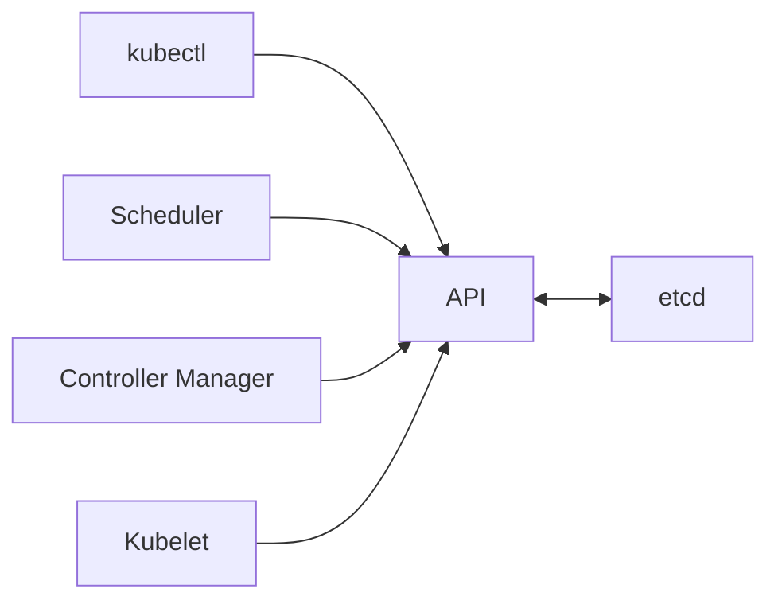
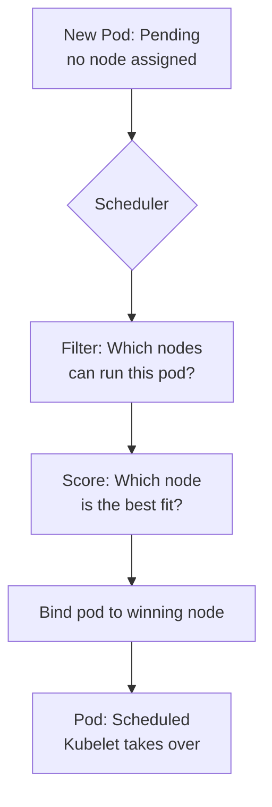
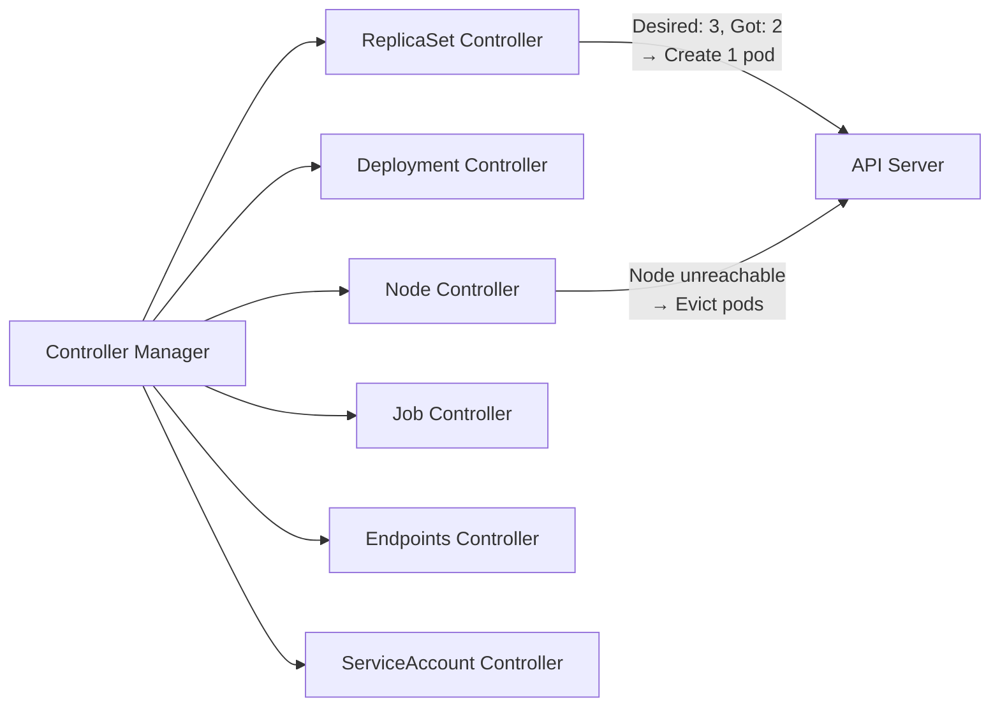

# 1.3 Control Plane Deep Dive

⏱️ **~6 min read**

> **TL;DR:** Four components run the K8s control plane. Understanding what each one does — and what breaks when it's gone — will save you hours of debugging.

---

## The Four Components, Explained

### 🔵 API Server (`kube-apiserver`)

The API Server is the **only component that talks to etcd**. Everything else — the scheduler, controller manager, kubelet, kubectl — talks to the API Server, never directly to each other.



**What it does:**
- Validates and processes all API requests (authentication, authorization, admission control)
- Reads/writes cluster state to etcd
- Exposes the Kubernetes REST API on port `6443`

**What breaks without it:** Everything. You can't do anything. Existing pods keep running (kubelet is independent), but no changes are possible.

---

### 🗃️ etcd

etcd is a **distributed key-value store** used as Kubernetes' backing store for all cluster data. Every object you create — every Pod, Service, ConfigMap, Secret — is stored here as JSON.

```bash
# What etcd stores (conceptually):
/registry/pods/default/my-nginx-pod         → { "kind": "Pod", "status": "Running", ... }
/registry/deployments/default/my-app        → { "kind": "Deployment", "replicas": 3, ... }
/registry/services/default/my-svc          → { "kind": "Service", "clusterIP": "10.96.0.1", ... }
```

**Key facts:**
- Uses the **Raft consensus algorithm** — needs a majority (quorum) of members to be healthy
- Always run **3 or 5** instances in production (never 2 or 4 — even numbers create split-brain risk)
- **Back up etcd** regularly — losing it means losing all cluster state

> ⚠️ **Warning:** etcd is not a general-purpose database. It's purpose-built for small, critical configuration data. Don't store application data in it.

---

### 📅 Scheduler (`kube-scheduler`)

The scheduler watches for **Pending pods** (pods with no node assigned) and decides where to run them.



**The scheduling decision considers:**
- Resource requests (CPU/memory) — does the node have enough?
- Node selectors and affinity rules — does the pod want a specific node?
- Taints and tolerations — is the pod "allowed" on this node?
- Pod spread constraints — for even distribution

> 📝 **Note:** The scheduler doesn't start containers — it just writes a node assignment to etcd. The kubelet on that node then picks it up and does the actual work.

### Try It

Watch the scheduler in action:

```bash
# Create a pod and watch its transition through Pending → Running
kubectl run watcher-test --image=nginx --restart=Never
kubectl get pod watcher-test -w
```

**Expected output:**
```
NAME           READY   STATUS    RESTARTS   AGE
watcher-test   0/1     Pending   0          0s
watcher-test   0/1     ContainerCreating   0          1s
watcher-test   1/1     Running   0          3s
```

```bash
# Cleanup
kubectl delete pod watcher-test
```

---

### ⚙️ Controller Manager (`kube-controller-manager`)

This is a single binary that runs **dozens of controllers** — each one a control loop watching for a specific resource type.



**A few important controllers:**

| Controller | What it watches | What it does |
|-----------|----------------|--------------|
| ReplicaSet | ReplicaSets | Ensures desired pod count is maintained |
| Deployment | Deployments | Manages rolling updates via ReplicaSets |
| Node | Nodes | Marks nodes as unreachable, evicts pods |
| Job | Jobs | Ensures batch jobs run to completion |
| Endpoints | Services | Keeps endpoint lists updated as pods come/go |

> 💡 **Tip:** When you're confused about why something happened automatically (a pod was deleted, a new one appeared), the answer is almost always "a controller did it."

---

## What Each Component's Failure Looks Like

| Component Down | Immediate Impact | Pods Still Running? |
|---------------|-----------------|---------------------|
| API Server | No kubectl, no changes possible | ✅ Yes |
| etcd | API Server can't read/write state | ✅ Yes (cached state) |
| Scheduler | New pods stay Pending forever | ✅ Yes (existing pods) |
| Controller Manager | No self-healing, no rollouts | ✅ Yes |

This table reveals something important: **your applications keep running even if the control plane goes down**. The kubelet on each worker node is self-sufficient enough to maintain existing pods. The control plane is only needed for *changes*.

---

## Key Takeaways

| # | Concept | One-liner |
|---|---------|-----------|
| 1 | API Server is the hub | Nothing talks to etcd except the API Server |
| 2 | etcd = cluster brain | Losing it loses all cluster state — back it up |
| 3 | Scheduler = placement | Picks which node, then hands off to kubelet |
| 4 | Controllers = reconcilers | Each runs a loop: compare desired vs actual, fix the diff |

---

## ✅ Quick Check

**Q1:** You scale a Deployment from 3 to 5 replicas. Which control plane component actually creates the 2 new pods?

<details>
<summary>Answer</summary>
The **ReplicaSet Controller** (inside the Controller Manager). The Deployment Controller updates the ReplicaSet spec, then the ReplicaSet Controller detects the count is wrong (3 actual vs 5 desired) and creates 2 new pod objects in etcd. The Scheduler then assigns those pods to nodes, and the Kubelet runs them.
</details>

**Q2:** Why does Kubernetes run etcd with 3 instances instead of 2?

<details>
<summary>Answer</summary>
Raft consensus requires a majority (quorum) to agree on writes. With 3 nodes, you can lose 1 and still have a majority (2 of 3). With 2 nodes, losing 1 means you have no quorum and the cluster halts. 2-node clusters provide no fault tolerance.
</details>

**Q3:** Your Scheduler pod crashes on Minikube. You had 3 running nginx pods. What happens to them?

<details>
<summary>Answer</summary>
Nothing immediately — the 3 existing pods keep running. The Scheduler is only needed for new pod placement. However, if one of those pods dies and a new one needs to be created, it will stay in `Pending` state indefinitely until the Scheduler recovers.
</details>
