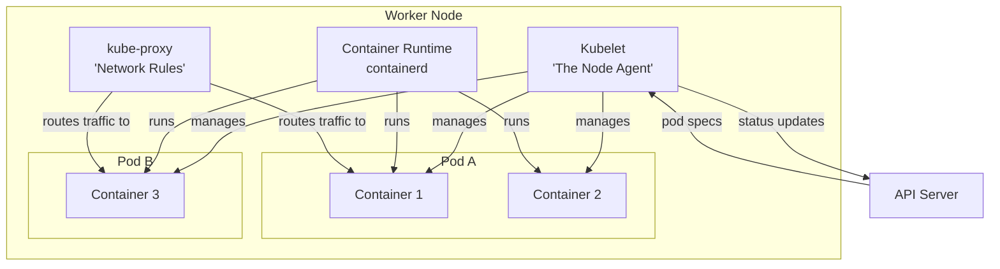
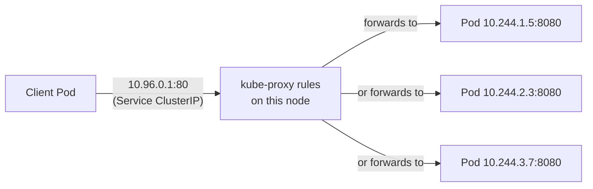
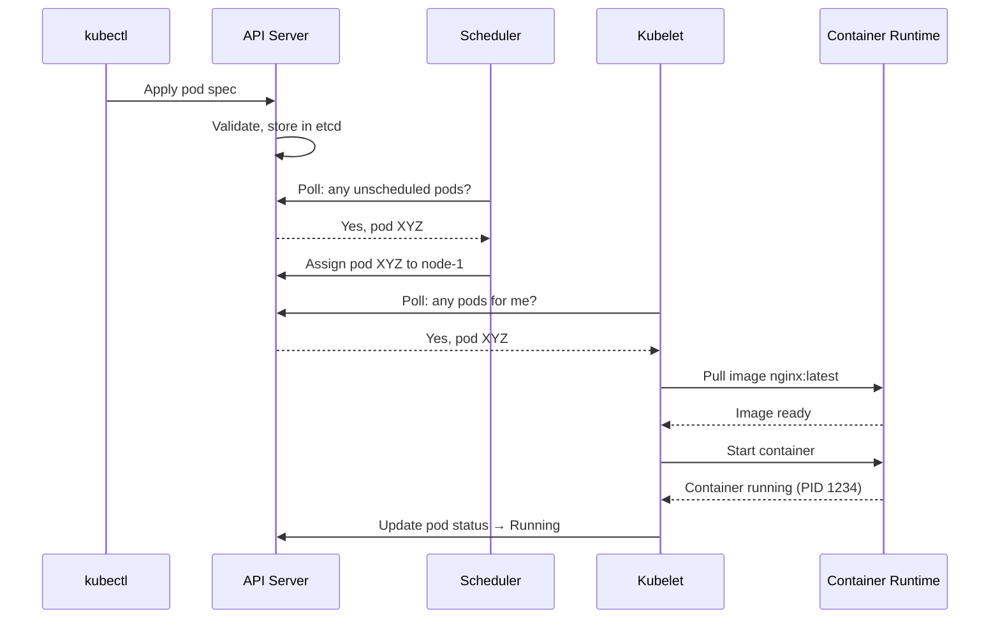

# 1.4 Worker Nodes and the Kubelet

⏱️ **~5 min read**

> **TL;DR:** Worker nodes are where your pods actually live. Three components do the work: **Kubelet** (the agent), **kube-proxy** (the network rules), and a **container runtime** (the actual container runner).

---

## The Three Node Components



---

## Kubelet — The Node Agent

The Kubelet is the **most important component on each worker node**. It's the bridge between the control plane and the containers.

**What the Kubelet does:**
1. **Watches the API Server** for pods assigned to its node
2. **Tells the container runtime** to pull images and start containers
3. **Runs health checks** (liveness/readiness probes) on containers
4. **Reports pod status** back to the API Server continuously

```bash
# See kubelet logs on Minikube
minikube ssh "sudo journalctl -u kubelet -n 50 --no-pager"
```

> 📝 **Note:** The Kubelet is the only component that runs directly on the node as a systemd service — not as a pod. Everything else can be containerized, but not the thing that starts containers.

> 🔗 **Docker Parallel:** The Kubelet is like a smarter, cluster-aware `docker run` — but instead of you telling it what to run, the API Server does.

---

## kube-proxy — Network Rules Manager

kube-proxy runs on every node and maintains **iptables/IPVS rules** that implement Kubernetes Services.

**What it does:** When you create a Service with a virtual IP (ClusterIP), kube-proxy programs the node's networking layer to forward traffic destined for that IP to the correct pods.



> 📝 **Note:** In modern clusters (K8s 1.9+), kube-proxy defaults to IPVS mode, which is more efficient than iptables for large clusters with thousands of services.

---

## Container Runtime — The Actual Container Runner

The container runtime is what actually pulls images and runs containers. Kubernetes uses the **Container Runtime Interface (CRI)** to talk to it, making the runtime swappable.

| Runtime | Used By | Notes |
|---------|---------|-------|
| **containerd** | Most clusters (GKE, AKS, EKS) | Default runtime since K8s 1.24 |
| **CRI-O** | OpenShift | Lightweight, OCI-compliant |
| **Docker Engine** | Legacy | Removed as direct runtime in K8s 1.24 |

> ⚠️ **Warning:** Docker was removed as a direct Kubernetes runtime in v1.24. Minikube still uses Docker as the *node driver* (to create the VM), but **containerd** is the runtime inside the cluster. Your Docker images still work — the image format is standardized (OCI).

```bash
# Check the runtime on your minikube node
kubectl get node minikube -o jsonpath='{.status.nodeInfo.containerRuntimeVersion}'
```

**Expected output:**
```
containerd://1.7.x
```

---

## How a Pod Gets Running: The Full Chain

Here's the complete journey from your `kubectl apply` to a running container:



---

### Try It

```bash
# Get detailed node info — see the kubelet version, container runtime, OS
kubectl describe node minikube | head -40
```

Look for:
- `Container Runtime Version` — shows containerd
- `Kubelet Version` — the K8s version running on this node
- `Allocatable` — how much CPU/memory is available for pods
- `Conditions` — should be `Ready: True`

---

## Key Takeaways

| # | Concept | One-liner |
|---|---------|-----------|
| 1 | Kubelet is the node agent | Watches API Server and manages pods on its node |
| 2 | Kubelet is not a pod | Runs as a systemd service — it can't manage itself |
| 3 | kube-proxy = Service networking | Programs iptables/IPVS rules for Service routing |
| 4 | Container runtime = OCI layer | Pulls images and runs containers via CRI |

---

## ✅ Quick Check

**Q1:** The Kubelet on node-2 crashes. What happens to pods on that node?

<details>
<summary>Answer</summary>
Existing containers keep running — the container runtime manages them independently. However, health checks stop running, so K8s won't restart failing containers. The API Server will eventually mark the node `NotReady` and start evicting pods to schedule on healthy nodes.
</details>

**Q2:** Why can't Kubernetes use the Docker daemon directly as its container runtime after v1.24?

<details>
<summary>Answer</summary>
Docker Engine doesn't implement the Container Runtime Interface (CRI) directly. The `dockershim` compatibility layer that K8s maintained was complex and buggy — the K8s team removed it in v1.24. Containerd (which Docker uses internally anyway) implements CRI natively and is simpler and faster.
</details>

**Q3:** You create a Service with `clusterIP: 10.96.5.50`. Which component makes that IP actually work?

<details>
<summary>Answer</summary>
**kube-proxy** on every node. It programs iptables/IPVS rules so that traffic to `10.96.5.50` gets load-balanced to the backend pods. Without kube-proxy, the ClusterIP would be a phantom — the IP exists in etcd but no traffic would route to it.
</details>
