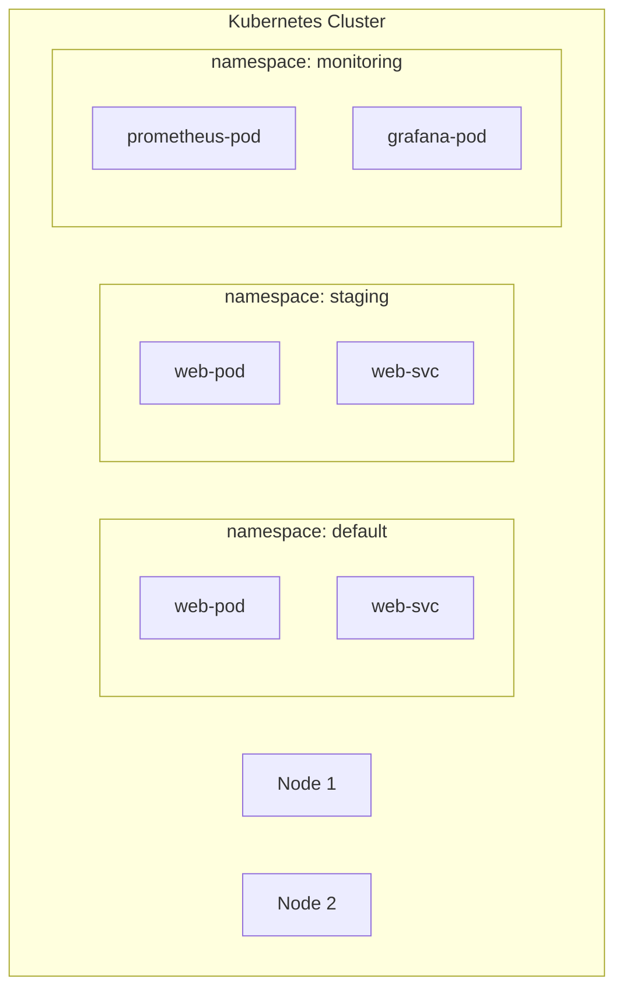

# 2.3 Context, Namespaces, and kubeconfig

⏱️ **~5 min read**

> **TL;DR:** `kubeconfig` stores your cluster credentials. A **context** is a named combo of cluster + user + namespace. **Namespaces** isolate resources within a cluster. Knowing how to switch between them is essential once you have more than one cluster.

---

## The kubeconfig File

When you ran `minikube start`, it automatically configured `~/.kube/config`. This file tells kubectl *which cluster to talk to* and *how to authenticate*.

```bash
cat ~/.kube/config
```

**Structure (simplified):**
```yaml
apiVersion: v1
kind: Config

clusters:
- name: minikube
  cluster:
    server: https://192.168.49.2:8443          # API Server URL
    certificate-authority: ~/.minikube/ca.crt  # TLS cert to trust

users:
- name: minikube
  user:
    client-certificate: ~/.minikube/profiles/minikube/client.crt
    client-key: ~/.minikube/profiles/minikube/client.key

contexts:
- name: minikube
  context:
    cluster: minikube    # which cluster
    user: minikube       # which credentials
    namespace: default   # default namespace

current-context: minikube   # ← which context is active RIGHT NOW
```

Three sections: **clusters** (where), **users** (who), **contexts** (which cluster + which user + which namespace).

---

## Working with Contexts

A context is a named shortcut: "cluster X, authenticated as user Y, defaulting to namespace Z."

```bash
# See all contexts
kubectl config get-contexts

# See the current context
kubectl config current-context

# Switch to a different context
kubectl config use-context my-other-cluster

# View the full kubeconfig
kubectl config view
```

**Expected output for `get-contexts`:**
```
CURRENT   NAME       CLUSTER    AUTHINFO   NAMESPACE
*         minikube   minikube   minikube   default
```

The `*` marks your active context. If you had an AKS cluster configured, it would appear here too.

> ⚠️ **Warning:** The classic ops horror story: running `kubectl delete` against production when you meant staging. Always verify your current context before destructive commands. Some teams alias `kubectl` to print the context on every command.

```bash
# Quick safety check — add this to your .bashrc or .zshrc
alias kctx='kubectl config current-context'
```

---

## Namespaces — Isolation Within a Cluster

A **namespace** is a virtual partition within a single cluster. Resources in different namespaces are isolated from each other (mostly — Nodes and PersistentVolumes are cluster-wide).



The pods named `web-pod` in `default` and `staging` are completely separate objects — same name, different namespaces.

```bash
# List namespaces
kubectl get namespaces

# Create a namespace
kubectl create namespace staging

# Run a command in a specific namespace
kubectl get pods -n staging

# Set your default namespace (so you don't type -n every time)
kubectl config set-context --current --namespace=staging

# Reset to default
kubectl config set-context --current --namespace=default
```

### Namespace DNS

Services in different namespaces can reach each other via DNS:

```
# Format: SERVICE-NAME.NAMESPACE.svc.cluster.local
# From any pod in the cluster:
curl http://web-svc.staging.svc.cluster.local
curl http://web-svc.default.svc.cluster.local

# Short form works within the same namespace:
curl http://web-svc
```

---

## Managing Multiple Clusters

In the real world you'll have multiple clusters (local minikube, staging, production). The workflow:

```bash
# Add a new cluster config (e.g., after AKS provisioning)
az aks get-credentials --resource-group my-rg --name my-aks-cluster

# Now you have two contexts
kubectl config get-contexts

# Switch between them
kubectl config use-context minikube
kubectl config use-context my-aks-cluster
```

> 💡 **Tip:** Install [**kubectx + kubens**](https://github.com/ahmetb/kubectx) — tiny tools that make switching contexts and namespaces much faster:
> ```bash
> kubectx minikube          # switch cluster context
> kubens staging            # switch namespace
> ```
> They also highlight the current context in your shell prompt.

---

### Try It

```bash
# Create two namespaces
kubectl create namespace dev
kubectl create namespace staging

# Deploy an nginx pod to each
kubectl run nginx-dev --image=nginx -n dev
kubectl run nginx-staging --image=nginx -n staging

# See both — notice same name, different namespace
kubectl get pods -A | grep nginx

# Clean up
kubectl delete namespace dev staging
```

**Expected output:**
```
dev         nginx-dev       1/1     Running   0   30s
staging     nginx-staging   1/1     Running   0   28s
```

---

## Key Takeaways

| # | Concept | One-liner |
|---|---------|-----------|
| 1 | kubeconfig | Stores cluster URLs, credentials, and context definitions |
| 2 | Context | Named combo of cluster + user + namespace |
| 3 | Namespace | Virtual partition within a cluster; resources isolated by name |
| 4 | Cross-namespace DNS | `<svc>.<ns>.svc.cluster.local` reaches any service |

---

## ✅ Quick Check

**Q1:** You accidentally ran a command against production instead of staging. How could you prevent this in the future?

<details>
<summary>Answer</summary>
Multiple approaches: (1) Use `kubectx` and display the active context in your shell prompt so it's always visible. (2) Use RBAC to limit what your production context credentials can do. (3) Use a plugin like `kubectl-safe` that warns before destructive operations on production contexts. (4) Rename contexts to include `prod-READONLY` or similar warnings.
</details>

**Q2:** A pod in namespace `frontend` needs to call a service named `api` in namespace `backend`. What URL should it use?

<details>
<summary>Answer</summary>
`http://api.backend.svc.cluster.local` — the full DNS name format is `SERVICE.NAMESPACE.svc.cluster.local`. The short form `http://api` only works within the same namespace.
</details>

**Q3:** You set `kubectl config set-context --current --namespace=staging`. What changes in your kubeconfig?

<details>
<summary>Answer</summary>
The `namespace` field of the current context in `~/.kube/config` is updated to `staging`. From now on, all commands that don't specify `-n` will operate in `staging` instead of `default`. It does NOT affect other contexts.
</details>
