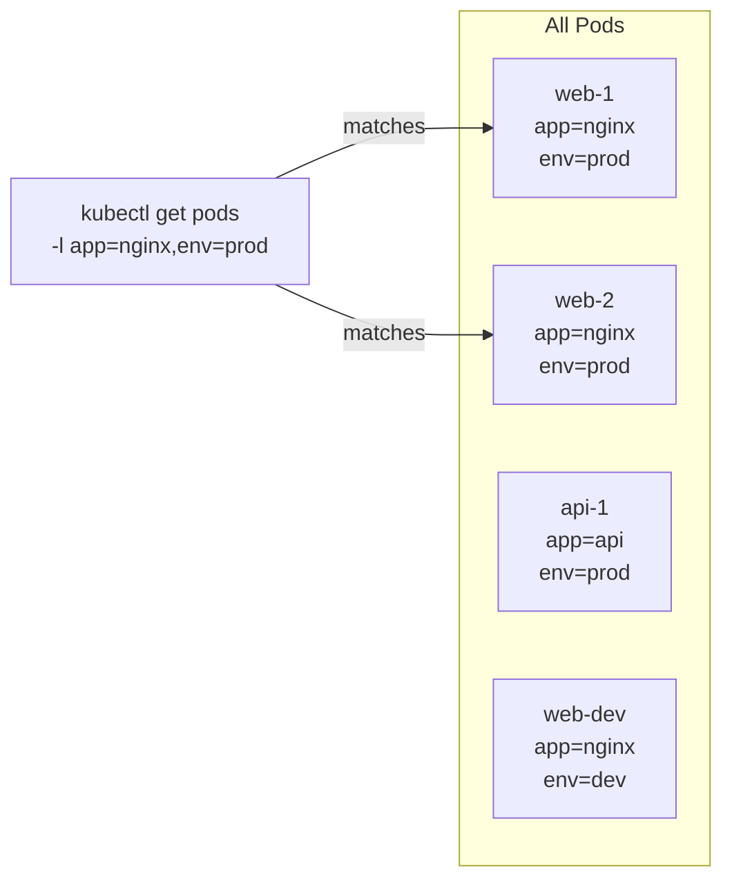

# 2.4 Output Formatting, Filtering, and JSONPath

⏱️ **~6 min read**

> **TL;DR:** `kubectl get` is not just for listing things — with the right flags it's a precision query tool. `-o wide`, `-o yaml`, `-o jsonpath`, and `-l` (label selectors) are how senior engineers extract exactly the information they need.

---

## Output Formats

```bash
# Default tabular output
kubectl get pods

# More columns (node, IP)
kubectl get pods -o wide

# Full YAML — what's actually stored in etcd
kubectl get pod my-pod -o yaml

# JSON format
kubectl get pod my-pod -o json

# Just the names — great for piping
kubectl get pods -o name
```

**The `-o yaml` trick is critical.** When you want to understand what fields a resource has, or when you need to copy an existing resource and modify it:

```bash
# Export a live resource as editable YAML
kubectl get deployment my-app -o yaml > my-app-copy.yaml
# Edit the file, change the name, apply it
kubectl apply -f my-app-copy.yaml
```

---

## Label Selectors — Filtering by Label

Labels are key-value pairs attached to resources. They're how K8s knows which pods belong to which Service or Deployment.

```bash
# List pods with a specific label
kubectl get pods -l app=nginx

# Multiple labels (AND)
kubectl get pods -l app=nginx,env=production

# All resources with a label, across types
kubectl get all -l app=my-app

# Show labels in output
kubectl get pods --show-labels
```



> 🔗 **Docker Parallel:** Docker Compose has `labels:` on services too, but they're mostly cosmetic. In Kubernetes, labels are fundamental — Services and Deployments use label selectors to know which pods they own.

---

## Field Selectors — Filtering by Status Fields

```bash
# Only Running pods
kubectl get pods --field-selector=status.phase=Running

# Pods on a specific node
kubectl get pods --field-selector=spec.nodeName=minikube

# Failed pods across all namespaces
kubectl get pods -A --field-selector=status.phase=Failed
```

---

## JSONPath — Surgical Extraction

When you need one specific field from a resource, JSONPath is the tool.

```bash
# Get just the node's IP address
kubectl get node minikube -o jsonpath='{.status.addresses[0].address}'

# Get all pod names
kubectl get pods -o jsonpath='{.items[*].metadata.name}'

# Get image names for every container in every pod
kubectl get pods -o jsonpath='{range .items[*]}{.metadata.name}{"\t"}{.spec.containers[0].image}{"\n"}{end}'

# Get the ClusterIP of a service
kubectl get svc my-svc -o jsonpath='{.spec.clusterIP}'
```

**Expected output for pod names:**
```
my-nginx-abc12   my-api-def34   redis-xyz56
```

> 💡 **Tip:** Not sure of the JSONPath for what you want? Start with `-o json` to see the full structure, then build your JSONPath from there.

---

## Custom Columns — Table Output You Define

```bash
# Custom table: name, image, node
kubectl get pods -o custom-columns=\
'NAME:.metadata.name,IMAGE:.spec.containers[0].image,NODE:.spec.nodeName'
```

**Expected output:**
```
NAME             IMAGE          NODE
my-nginx-abc12   nginx:1.25     minikube
my-api-def34     node:20-slim   minikube
```

---

## Sorting Output

```bash
# Sort pods by creation time (newest last)
kubectl get pods --sort-by=.metadata.creationTimestamp

# Sort by restart count (most restarted first — useful for debugging)
kubectl get pods --sort-by='.status.containerStatuses[0].restartCount'

# Sort nodes by CPU capacity
kubectl get nodes --sort-by='.status.capacity.cpu'
```

---

## Combining It All — Real-World Recipes

```bash
# "Which pods are running on which nodes, sorted by node?"
kubectl get pods -o wide --sort-by='.spec.nodeName'

# "What images are my deployments using?"
kubectl get deployments -o jsonpath='{range .items[*]}{.metadata.name}{"\t"}{.spec.template.spec.containers[0].image}{"\n"}{end}'

# "Find all pods NOT in Running state"
kubectl get pods -A --field-selector='status.phase!=Running'

# "Get the NodePort for a service"
kubectl get svc my-svc -o jsonpath='{.spec.ports[0].nodePort}'
```

---

### Try It

```bash
# Create a test deployment
kubectl create deployment fmt-demo --image=nginx:1.25 --replicas=2

# Try each format
kubectl get pods -l app=fmt-demo -o wide
kubectl get pods -l app=fmt-demo -o yaml | grep -A3 "image:"
kubectl get pods -l app=fmt-demo -o jsonpath='{range .items[*]}{.metadata.name}{"\n"}{end}'

# Custom columns
kubectl get pods -l app=fmt-demo \
  -o custom-columns='POD:.metadata.name,STATUS:.status.phase,NODE:.spec.nodeName'

# Cleanup
kubectl delete deployment fmt-demo
```

---

## Key Takeaways

| # | Concept | One-liner |
|---|---------|-----------|
| 1 | `-o wide` | Extra columns: IP, node, nominated node |
| 2 | `-o yaml` | Full resource spec — use for copying/debugging |
| 3 | `-l key=value` | Filter by label — the primary K8s query mechanism |
| 4 | `-o jsonpath='{...}'` | Extract a single field from any resource |
| 5 | `--sort-by` | Sort output by any JSONPath field |

---

## ✅ Quick Check

**Q1:** You want a list of all pod names and their container images in a single line per pod. Which output format do you use?

<details>
<summary>Answer</summary>
JSONPath with a range loop:
```bash
kubectl get pods -o jsonpath='{range .items[*]}{.metadata.name}{"\t"}{.spec.containers[0].image}{"\n"}{end}'
```
Or custom columns:
```bash
kubectl get pods -o custom-columns='NAME:.metadata.name,IMAGE:.spec.containers[0].image'
```
</details>

**Q2:** A Service's label selector is `app=backend`. You have pods labeled `app=backend-v2`. Does the Service route to them?

<details>
<summary>Answer</summary>
No. Label selectors are exact matches. `app=backend` does NOT match `app=backend-v2`. The selector must exactly match all the specified labels on the pod. You'd need to change either the pod labels or the Service selector.
</details>

**Q3:** You need to find all pods that are NOT in the `Running` phase across all namespaces. What command?

<details>
<summary>Answer</summary>
```bash
kubectl get pods -A --field-selector='status.phase!=Running'
```
This uses a field selector with a not-equal operator (`!=`) on the `status.phase` field.
</details>
