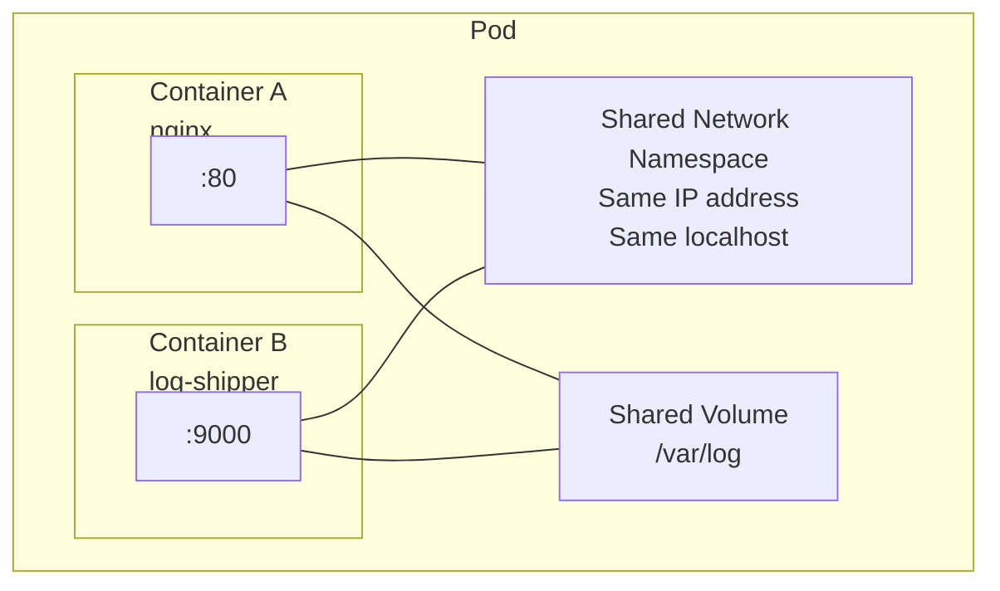

# 3.1 What Is a Pod, Really?

⏱️ **~5 min read**

> **TL;DR:** A Pod is NOT a container. It's a wrapper around one or more containers that share the same network namespace and can share storage volumes. It's the smallest deployable unit in Kubernetes.

---

## The Key Insight: Pods Are Not Containers

> 🔗 **Docker Parallel:** In Docker, you deploy containers. In Kubernetes, you deploy **Pods**. A Pod can contain one container (usually) or multiple tightly-coupled containers that need to share a network stack.

Here's the minimal pod definition:

```yaml
# my-pod.yaml
apiVersion: v1
kind: Pod
metadata:
  name: my-nginx
  labels:
    app: nginx
spec:
  containers:
  - name: nginx
    image: nginx:1.25
    ports:
    - containerPort: 80
```

```bash
kubectl apply -f my-pod.yaml
kubectl get pod my-nginx
```

---

## What Containers in a Pod Share

This is what makes pods special. Every container in a pod shares:



| Resource | Shared? | Meaning |
|----------|---------|---------|
| Network namespace | ✅ Yes | Same IP, can talk via `localhost` |
| Ports | ✅ Yes | Port conflicts between containers ARE possible |
| Volumes | Optional | Volumes must be explicitly mounted by each container |
| Filesystem | ❌ No | Each container has its own isolated filesystem |
| Process namespace | Optional | Can share via `shareProcessNamespace: true` |

> ⚠️ **Warning:** Because containers in a pod share a network namespace, two containers cannot both listen on port 80. Plan your container ports carefully in multi-container pods.

---

## Why Not Just Run Containers Directly?

Valid question. The answer is: pods add a layer of abstraction that gives Kubernetes useful guarantees.

1. **Atomic scheduling** — all containers in a pod land on the same node together
2. **Shared lifecycle** — pod-level restart policies apply to all containers
3. **Co-location guarantee** — sidecar and main container are always on the same machine, eliminating network latency between them

> 📝 **Note:** In practice, 90% of pods contain exactly one container. Multi-container pods are for specific patterns (sidecar, init) covered in section 3.3.

---

## The Pod YAML Anatomy

```yaml
apiVersion: v1           # API group version — always v1 for Pods
kind: Pod                # Resource type
metadata:
  name: my-app           # Unique name within a namespace
  namespace: default     # Namespace (defaults to "default")
  labels:                # Key-value pairs for selecting/grouping
    app: my-app
    version: "1.0"
  annotations:           # Non-identifying metadata (not used for selection)
    description: "Demo pod"
spec:
  containers:            # List of containers (at least one required)
  - name: app            # Container name (unique within the pod)
    image: nginx:1.25    # Image:tag — always pin the tag!
    ports:
    - containerPort: 80  # Informational only — doesn't actually publish the port
    env:                 # Environment variables
    - name: ENV
      value: production
    resources:           # CPU/memory limits (covered in 3.4)
      requests:
        memory: "64Mi"
        cpu: "100m"
      limits:
        memory: "128Mi"
        cpu: "200m"
  restartPolicy: Always  # Always | OnFailure | Never
```

> ⚠️ **Warning:** `containerPort` in a pod spec is **purely informational** — it doesn't actually open a firewall port or publish the container. Networking is handled by Services (Chapter 5).

---

### Try It

```bash
# Apply the pod
cat <<'EOF' | kubectl apply -f -
apiVersion: v1
kind: Pod
metadata:
  name: my-nginx
  labels:
    app: nginx
spec:
  containers:
  - name: nginx
    image: nginx:1.25
    ports:
    - containerPort: 80
EOF

# Watch it start
kubectl get pod my-nginx -w

# Once Running — get full details
kubectl describe pod my-nginx

# Access it directly (no Service needed for testing)
kubectl port-forward pod/my-nginx 8080:80 &
curl http://localhost:8080
kill %1

# Cleanup
kubectl delete pod my-nginx
```

---

## Key Takeaways

| # | Concept | One-liner |
|---|---------|-----------|
| 1 | Pod ≠ Container | A pod wraps 1+ containers that share network and optionally storage |
| 2 | Shared network | Containers in a pod use `localhost` to talk to each other |
| 3 | `containerPort` is cosmetic | It doesn't publish anything — Services do the actual networking |
| 4 | Always pin image tags | `nginx:latest` in production is a reliability disaster |

---

## ✅ Quick Check

**Q1:** You have two containers in a pod. Container A listens on port 8080. Can Container B also listen on port 8080?

<details>
<summary>Answer</summary>
No. They share a network namespace, which means they share the same port space. If both try to bind port 8080, the second one will fail to start. Treat the port space of a pod as if it were a single machine.
</details>

**Q2:** Container A in a pod writes a file to `/tmp/data`. Can Container B read it?

<details>
<summary>Answer</summary>
No — not without explicitly sharing a volume. Containers have isolated filesystems. To share files between containers in a pod, you must define a `volume` in the pod spec and mount it in both containers.
</details>

**Q3:** You delete a pod. Does Kubernetes immediately create a new one?

<details>
<summary>Answer</summary>
Only if the pod is managed by a controller (Deployment, ReplicaSet, etc.). A bare pod — one you created directly with `kubectl apply -f pod.yaml` — is gone when deleted. This is why you almost never create bare pods in production; you always use a Deployment.
</details>
