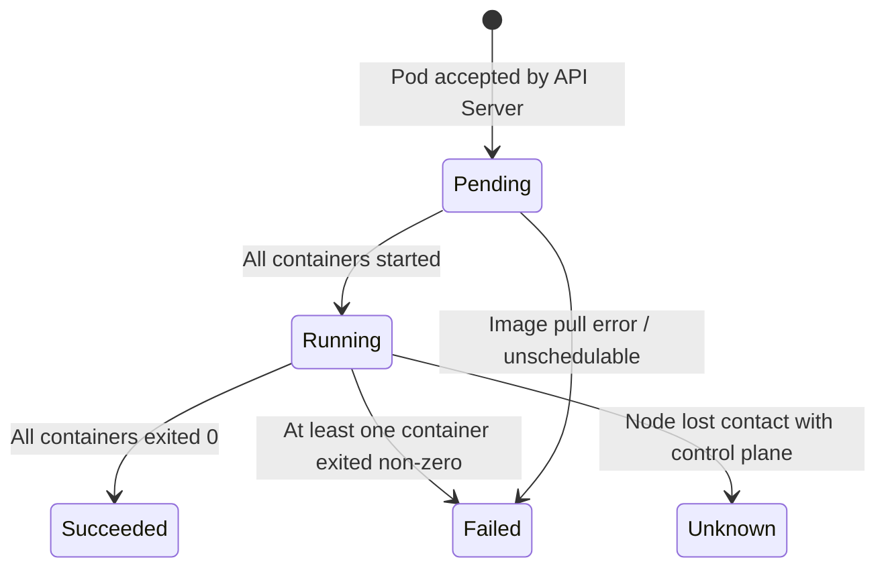

# 3.2 Pod Lifecycle and Phases

⏱️ **~6 min read**

> **TL;DR:** A pod moves through phases: `Pending → Running → Succeeded/Failed`. Each container inside has its own state too. Understanding both levels is how you debug 80% of pod problems.

---

## Pod Phases



| Phase | Meaning |
|-------|---------|
| `Pending` | Pod accepted, but not all containers are running yet. Could be scheduling, image pulling, or init container running. |
| `Running` | Pod bound to a node; at least one container is running (or starting/restarting) |
| `Succeeded` | All containers exited with code 0. Terminal state. |
| `Failed` | All containers have exited; at least one exited non-zero. Terminal state. |
| `Unknown` | Pod state can't be determined — usually a node communication problem |

```bash
# Check phase
kubectl get pod my-pod -o jsonpath='{.status.phase}'
```

---

## Container States

Inside a running pod, each container has its own state — independent of the pod phase:

| Container State | Meaning |
|----------------|---------|
| `Waiting` | Not running yet. Check `reason` — usually `ContainerCreating`, `ImagePullBackOff`, or `CrashLoopBackOff` |
| `Running` | Container started and process is alive |
| `Terminated` | Container process exited. Check `exitCode` and `reason` |

```bash
# Get container state details
kubectl get pod my-pod -o jsonpath='{.status.containerStatuses[0].state}'
```

---

## Pod Conditions

Conditions give more granular status than phase. They're how kubectl determines what to show in `kubectl describe`:

| Condition | Meaning |
|-----------|---------|
| `PodScheduled` | Pod has been assigned to a node |
| `Initialized` | All init containers completed successfully |
| `ContainersReady` | All containers are ready |
| `Ready` | Pod is ready to serve traffic (used by Services) |

```bash
kubectl get pod my-pod -o jsonpath='{.status.conditions}' | python3 -m json.tool
```

---

## The Critical Failure Modes

### `CrashLoopBackOff`
The container keeps crashing. K8s restarts it, but adds an exponential back-off delay (10s, 20s, 40s… up to 5 min).

```bash
# Cause: check the logs from the PREVIOUS run
kubectl logs my-pod --previous

# Or describe to see restart count and last exit code
kubectl describe pod my-pod | grep -A5 "Last State:"
```

### `ImagePullBackOff` / `ErrImagePull`
Kubernetes can't pull the container image. Causes:
- Wrong image name / tag
- Private registry without credentials
- No internet connectivity on the node

```bash
# See the exact error
kubectl describe pod my-pod | grep -A5 "Events:"
```

### `OOMKilled`
The container exceeded its memory limit and was killed by the kernel.

```bash
# Check exit code — OOMKilled shows exitCode: 137
kubectl get pod my-pod -o jsonpath='{.status.containerStatuses[0].lastState.terminated}'
```

### `Pending` (stuck)
Pod can't be scheduled. Causes:
- Not enough CPU/memory on any node
- Node selector or affinity rules don't match any node
- Taint not tolerated

```bash
# See why it's stuck
kubectl describe pod my-pod | grep -A10 "Events:"
```

---

## Restart Policies

`restartPolicy` controls what happens when a container exits:

| Policy | Behavior | Use Case |
|--------|----------|----------|
| `Always` | Always restart, regardless of exit code | Long-running services (default) |
| `OnFailure` | Restart only if exit code != 0 | Batch jobs that should succeed |
| `Never` | Never restart | One-shot diagnostic containers |

```yaml
spec:
  restartPolicy: OnFailure   # for Jobs
  containers:
  - name: worker
    image: my-batch-job
```

> 🔗 **Docker Parallel:** This is equivalent to `restart: unless-stopped` (Always), `restart: on-failure` (OnFailure), and no restart policy (Never) in Docker Compose.

---

### Try It

```bash
# Create a pod that immediately crashes
cat <<'EOF' | kubectl apply -f -
apiVersion: v1
kind: Pod
metadata:
  name: crasher
spec:
  containers:
  - name: app
    image: busybox
    command: ["sh", "-c", "echo 'Starting...' && exit 1"]
  restartPolicy: Always
EOF

# Watch it crash and enter CrashLoopBackOff
kubectl get pod crasher -w

# See the logs from the crashed run
kubectl logs crasher
kubectl logs crasher --previous   # After it's restarted at least once

# See restart count and exit code
kubectl describe pod crasher | grep -A8 "Containers:"

# Cleanup
kubectl delete pod crasher
```

**Expected progression:**
```
NAME      READY   STATUS              RESTARTS   AGE
crasher   0/1     ContainerCreating   0          2s
crasher   0/1     Error               0          3s
crasher   0/1     CrashLoopBackOff    1          8s
crasher   0/1     Error               2          28s
crasher   0/1     CrashLoopBackOff    3          42s
```

---

## Key Takeaways

| # | Concept | One-liner |
|---|---------|-----------|
| 1 | 5 pod phases | Pending → Running → Succeeded/Failed/Unknown |
| 2 | Container states | Waiting / Running / Terminated — separate from pod phase |
| 3 | `CrashLoopBackOff` | Container keeps crashing — check `logs --previous` |
| 4 | `OOMKilled` = exitCode 137 | Container exceeded memory limit |
| 5 | `restartPolicy` | Always (default), OnFailure (jobs), Never (one-shots) |

---

## ✅ Quick Check

**Q1:** A pod is in `Running` phase but `0/1 READY`. What does this mean?

<details>
<summary>Answer</summary>
The container is running (it started successfully), but its **readiness probe** is failing — meaning K8s doesn't consider the pod ready to serve traffic yet. The pod won't receive traffic from a Service until it becomes Ready. Common causes: the app is still initializing, or the readiness probe endpoint returns a non-200 status.
</details>

**Q2:** Your pod has `RESTARTS: 47` and status `CrashLoopBackOff`. What's your first debugging step?

<details>
<summary>Answer</summary>
Run `kubectl logs my-pod --previous` to see the logs from the last crashed container. The `--previous` flag is critical here — without it, you'd see logs from the current (possibly empty) container start. Look for the error message or stack trace that caused the exit.
</details>

**Q3:** What's the difference between a pod in `Failed` phase vs `CrashLoopBackOff` status?

<details>
<summary>Answer</summary>
`Failed` is a terminal pod phase — the pod has stopped and will not be restarted (typically when `restartPolicy: Never` or `OnFailure` with a zero-exit scenario). `CrashLoopBackOff` is a container **status** — the pod is still alive and K8s is still trying to restart the container, but applying exponential back-off. The pod phase would be `Running` in CrashLoopBackOff.
</details>
