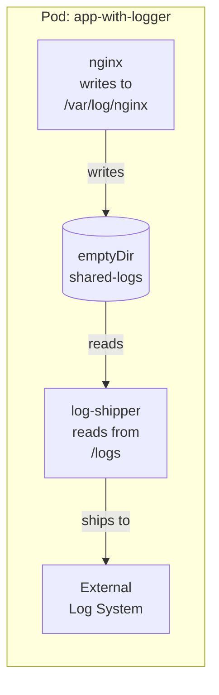
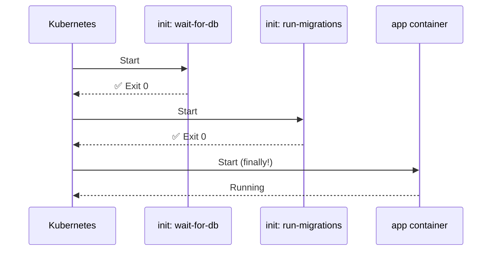

# 3.3 Multi-Container Pods: Sidecars, Init, and Ambassadors

⏱️ **~7 min read**

> **TL;DR:** Multi-container pods solve specific co-location problems. The three patterns are: **sidecar** (augments the main container), **init container** (runs setup before the main container), and **ambassador** (proxies external traffic). Show the YAML first, understand the pattern second.

---

## Pattern 1: Sidecar

A sidecar runs alongside the main container, sharing its network and storage. The most common use case: log shipping.

```yaml
# sidecar-pod.yaml
apiVersion: v1
kind: Pod
metadata:
  name: app-with-logger
spec:
  volumes:
  - name: shared-logs      # Shared volume between containers
    emptyDir: {}

  containers:
  # Main application
  - name: app
    image: nginx:1.25
    volumeMounts:
    - name: shared-logs
      mountPath: /var/log/nginx

  # Sidecar: ships logs from shared volume
  - name: log-shipper
    image: busybox
    command: ["sh", "-c", "tail -f /logs/access.log"]
    volumeMounts:
    - name: shared-logs
      mountPath: /logs         # Same volume, different mount path
```



**Key facts about `emptyDir`:**
- Created when the pod starts, deleted when the pod dies
- Lives on the node's disk (or RAM if `medium: Memory`)
- Perfect for sharing data between containers in a pod

> 🔗 **Docker Parallel:** No direct equivalent in Compose. You'd need to set up a log driver or bind mount. The sidecar pattern keeps the main app container simple and logging as a separate concern.

---

## Pattern 2: Init Containers

Init containers run **sequentially before** any regular containers start. They must complete successfully. If they fail, the pod restarts.

```yaml
# init-container-pod.yaml
apiVersion: v1
kind: Pod
metadata:
  name: app-with-init
spec:
  initContainers:
  # Runs FIRST — waits for a dependency to be ready
  - name: wait-for-db
    image: busybox
    command:
    - sh
    - -c
    - |
      until nc -z postgres-svc 5432; do
        echo "Waiting for postgres..."
        sleep 2
      done
      echo "Postgres is up!"

  # Runs SECOND — database migration
  - name: run-migrations
    image: myapp:latest
    command: ["python", "manage.py", "migrate"]
    env:
    - name: DATABASE_URL
      value: "postgresql://postgres-svc:5432/mydb"

  # Only starts AFTER all init containers succeed
  containers:
  - name: app
    image: myapp:latest
    ports:
    - containerPort: 8000
```



**Why use init containers instead of a startup script in the main container?**
- Separation of concerns — the app image stays clean
- Different image per init step (wait with busybox, migrate with your app)
- Init containers can have different security contexts
- Failures are clearly visible: `kubectl get pod` shows `Init:0/2` then `Init:1/2` etc.

```bash
# See init container progress
kubectl get pod app-with-init
# Output: Init:1/2  ← first init done, waiting on second
```

---

## Pattern 3: Ambassador

An ambassador container proxies connections between the main container and external services — useful for handling TLS, service discovery, or protocol translation locally.

```yaml
# ambassador-pod.yaml
apiVersion: v1
kind: Pod
metadata:
  name: app-with-ambassador
spec:
  containers:
  # Main app talks to localhost:6379 (simple, no auth)
  - name: app
    image: myapp:latest
    env:
    - name: REDIS_HOST
      value: localhost      # ← talks to ambassador, not Redis directly
    - name: REDIS_PORT
      value: "6379"

  # Ambassador: handles auth and TLS to real Redis
  - name: redis-proxy
    image: envoyproxy/envoy:v1.29
    # Envoy configured to proxy localhost:6379 → redis-cloud.example.com:6380 (TLS+auth)
```

> 📝 **Note:** The ambassador pattern is less common today — service meshes (Istio, Linkerd) have largely replaced it for production TLS/auth proxying. But it's still useful for local development and specific edge cases.

---

## Checking Multi-Container Pods

With multiple containers, you must specify which one you're targeting:

```bash
# Logs from a specific container
kubectl logs app-with-logger -c log-shipper
kubectl logs app-with-logger -c app

# Exec into a specific container
kubectl exec -it app-with-logger -c app -- bash
kubectl exec -it app-with-logger -c log-shipper -- sh

# Describe shows all containers
kubectl describe pod app-with-logger
```

---

### Try It

```bash
# Deploy the sidecar pod
cat <<'EOF' | kubectl apply -f -
apiVersion: v1
kind: Pod
metadata:
  name: sidecar-demo
spec:
  volumes:
  - name: shared-data
    emptyDir: {}
  containers:
  - name: writer
    image: busybox
    command: ["sh", "-c", "while true; do date >> /data/log.txt; sleep 2; done"]
    volumeMounts:
    - name: shared-data
      mountPath: /data
  - name: reader
    image: busybox
    command: ["sh", "-c", "tail -f /shared/log.txt"]
    volumeMounts:
    - name: shared-data
      mountPath: /shared
EOF

# Watch both containers start
kubectl get pod sidecar-demo -w

# See the writer's output via reader's logs
kubectl logs sidecar-demo -c reader -f &

# Let it run for 10 seconds, then stop
sleep 10 && kill %1

# Exec into the writer and check the file directly
kubectl exec -it sidecar-demo -c writer -- cat /data/log.txt

# Cleanup
kubectl delete pod sidecar-demo
```

**Expected log output (reader):**
```
Mon Jul 14 10:00:01 UTC 2026
Mon Jul 14 10:00:03 UTC 2026
Mon Jul 14 10:00:05 UTC 2026
```

---

## Key Takeaways

| # | Pattern | When to Use |
|---|---------|-------------|
| 1 | Sidecar | Augment main container: log shipping, metrics, proxy |
| 2 | Init Container | Pre-flight checks, DB migrations, dependency waiting |
| 3 | Ambassador | Protocol translation, local proxy to external service |
| 4 | `emptyDir` | Ephemeral shared storage within a pod |

---

## ✅ Quick Check

**Q1:** Your app container takes 60 seconds to initialize and fails readiness checks during that time. Should you use an init container or a startup probe?

<details>
<summary>Answer</summary>
A **startup probe** (covered in Chapter 11). Init containers are for pre-flight tasks that run *before* the main container starts. If your app is initializing but already running, a startup probe tells K8s to give it more time before declaring it failed. Use init containers for things like DB migrations or waiting for dependencies.
</details>

**Q2:** An init container in a pod exits with code 1. What happens?

<details>
<summary>Answer</summary>
The main containers never start. Kubernetes restarts the init container according to the pod's `restartPolicy`. If `restartPolicy: Always`, it keeps retrying with exponential back-off until the init container succeeds. The pod stays in `Init:0/N` status. This is by design — it prevents your app from starting against an unready dependency.
</details>

**Q3:** You have a sidecar container that ships logs to an external service. The main app container crashes and restarts. What happens to the sidecar?

<details>
<summary>Answer</summary>
The sidecar keeps running. Container restarts in a pod are per-container — if only the main container crashes, only that container is restarted. The sidecar stays alive and continues running. (Exception: if the pod itself is killed and rescheduled, all containers restart together.)
</details>
