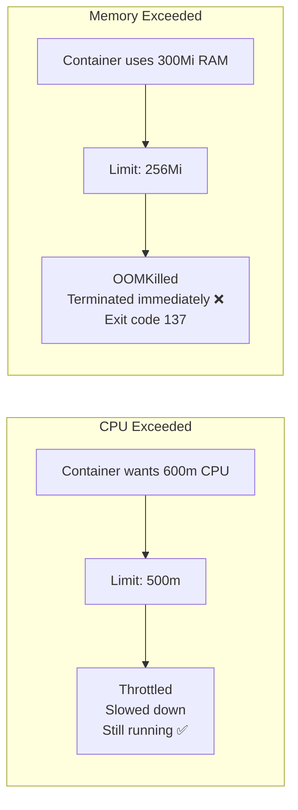

# 3.4 Resource Requests and Limits

⏱️ **~6 min read**

> **TL;DR:** `requests` = "I need at least this much" (used for scheduling). `limits` = "I cannot exceed this much" (enforced at runtime). Getting these right is the difference between a stable cluster and one that OOMKills pods in the middle of the night.

---

## The Two Numbers: Requests vs Limits

```yaml
resources:
  requests:
    memory: "128Mi"   # Scheduler guarantee: only place me on a node with 128Mi free
    cpu: "250m"       # Scheduler guarantee: only place me on a node with 250m CPU free
  limits:
    memory: "256Mi"   # Hard limit: if I exceed this, I get OOMKilled
    cpu: "500m"       # Soft limit: if I exceed this, I get throttled (not killed)
```

The difference in behavior between CPU and memory limits is critical:

| Resource | Over Limit Behavior |
|----------|-------------------|
| **CPU** | **Throttled** — the container is slowed down but keeps running |
| **Memory** | **OOMKilled** — the container is immediately terminated (exit code 137) |



---

## CPU Units: Millicores

CPU is measured in **millicores** (m). `1000m = 1 CPU core`.

```
250m  = ¼ of a CPU core
500m  = ½ of a CPU core
1000m = 1 full CPU core  (same as writing "1")
2000m = 2 CPU cores      (same as writing "2")
```

```yaml
# These are equivalent:
cpu: "1"
cpu: "1000m"
```

> 💡 **Tip:** For most web services, start with `requests: 100m` and `limits: 500m`. Adjust based on profiling. Node.js and Python are rarely CPU-bound; JVM apps need more.

---

## Memory Units

Memory uses standard binary suffixes:

```
64Mi   = 64 mebibytes (~67 MB)
128Mi  = 128 mebibytes (~134 MB)
256Mi  = 256 mebibytes
1Gi    = 1 gibibyte (~1.07 GB)
```

> ⚠️ **Warning:** `M` (megabytes) and `Mi` (mebibytes) are different. Use `Mi` to avoid confusion. K8s accepts both but they differ by ~5%.

---

## QoS Classes: What Kubernetes Does Under Pressure

Based on how you set requests/limits, Kubernetes assigns each pod a **Quality of Service class**. This determines which pods get evicted first when a node runs low on memory.

| QoS Class | Condition | Eviction Priority |
|-----------|-----------|------------------|
| **Guaranteed** | `requests == limits` for all containers | Last to be evicted |
| **Burstable** | `requests < limits`, or only one set | Middle priority |
| **BestEffort** | No requests or limits set | **First** to be evicted |

```yaml
# Guaranteed QoS — for critical workloads
resources:
  requests:
    memory: "256Mi"
    cpu: "500m"
  limits:
    memory: "256Mi"   # ← same as requests
    cpu: "500m"       # ← same as requests

# BestEffort QoS — avoid in production
# (no resources block at all)
```

> 🏭 **In Production:** Always set resource requests for every container. Without them, the scheduler makes uninformed decisions and nodes can get overloaded. BestEffort pods are the first to die when the node gets memory pressure.

---

## LimitRange: Cluster-Wide Defaults

Admins can set default limits per namespace so developers don't have to:

```yaml
# limitrange.yaml
apiVersion: v1
kind: LimitRange
metadata:
  name: default-limits
  namespace: default
spec:
  limits:
  - type: Container
    default:            # Applied if no limits set
      memory: "256Mi"
      cpu: "500m"
    defaultRequest:     # Applied if no requests set
      memory: "128Mi"
      cpu: "100m"
    max:                # Nobody in this namespace can set higher than this
      memory: "2Gi"
      cpu: "2"
```

---

### Try It

```bash
# Deploy a pod with resource limits
cat <<'EOF' | kubectl apply -f -
apiVersion: v1
kind: Pod
metadata:
  name: resource-demo
spec:
  containers:
  - name: app
    image: nginx:1.25
    resources:
      requests:
        memory: "64Mi"
        cpu: "100m"
      limits:
        memory: "128Mi"
        cpu: "200m"
EOF

# See its QoS class
kubectl get pod resource-demo -o jsonpath='{.status.qosClass}'

# See resource requests on the node
kubectl describe node minikube | grep -A6 "Allocated resources:"

# Cleanup
kubectl delete pod resource-demo
```

**Expected QoS output:**
```
Burstable
```
(Because requests < limits. Set them equal for `Guaranteed`.)

---

## Key Takeaways

| # | Concept | One-liner |
|---|---------|-----------|
| 1 | `requests` = scheduling | Minimum guaranteed resources; used by the Scheduler |
| 2 | `limits` = enforcement | Hard cap: CPU throttles, memory kills |
| 3 | OOMKilled = exit 137 | Container exceeded memory limit — raise the limit or fix the leak |
| 4 | Always set requests | Without them, the Scheduler flies blind |
| 5 | QoS classes | Guaranteed > Burstable > BestEffort for eviction order |

---

## ✅ Quick Check

**Q1:** A container with `limits.cpu: 500m` suddenly needs 800m CPU to handle a traffic spike. What happens?

<details>
<summary>Answer</summary>
The container is **CPU-throttled** — it gets slowed down but keeps running. The kernel's CFS (Completely Fair Scheduler) enforces the limit by reducing how much CPU time the container gets. Response times increase, but the container doesn't crash. This is why CPU limits are "soft" limits.
</details>

**Q2:** You set `requests.memory: 128Mi` and `limits.memory: 128Mi`. What QoS class does this pod get?

<details>
<summary>Answer</summary>
**Guaranteed** — because requests equal limits for all resources. This pod is the last to be evicted when the node is under memory pressure. Use this for critical production workloads.
</details>

**Q3:** Your node has 4Gi of RAM. You have 40 pods each with `requests.memory: 128Mi` and no limits set. A burst of traffic causes one pod to use 2Gi. What happens?

<details>
<summary>Answer</summary>
Without limits, the pod can consume up to 2Gi (or more). This creates **memory pressure** on the node. K8s starts evicting **BestEffort** pods first (those with no requests or limits), then **Burstable**, then **Guaranteed**. The overcommitted pod itself might eventually be killed when the node's OOM killer fires. This is why setting both requests AND limits is essential.
</details>
