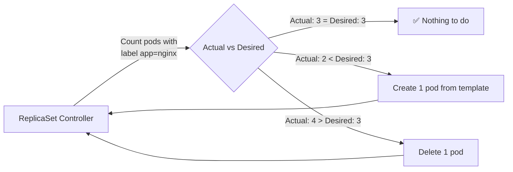
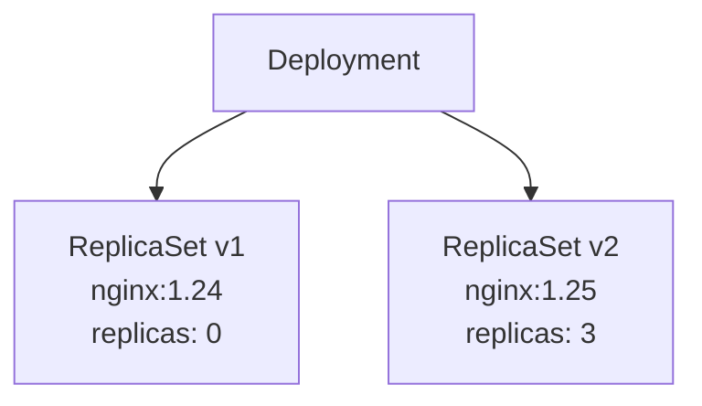

# 4.1 ReplicaSets — Desired State and Self-Healing

⏱️ **~5 min read**

> **TL;DR:** A ReplicaSet ensures N copies of a pod are always running. If one dies, it creates a replacement. You almost never create ReplicaSets directly — Deployments manage them for you. But understanding them explains how Deployments work.

---

## What a ReplicaSet Does

```yaml
# replicaset.yaml
apiVersion: apps/v1
kind: ReplicaSet
metadata:
  name: nginx-rs
spec:
  replicas: 3               # I want 3 pods running at all times
  selector:
    matchLabels:
      app: nginx            # I own pods with this label
  template:                 # Pod template — used to create new pods
    metadata:
      labels:
        app: nginx          # Must match selector above
    spec:
      containers:
      - name: nginx
        image: nginx:1.25
```

The ReplicaSet Controller runs a continuous loop:



---

## The Label Selector — The Critical Link

The ReplicaSet knows which pods it "owns" via a **label selector**. This has an important implication:

> ⚠️ **Warning:** If you manually create a pod with a label that matches a ReplicaSet's selector, the ReplicaSet will immediately **delete** it — it's trying to maintain exactly N pods.

```bash
# A ReplicaSet with replicas: 3 and selector app=nginx
# If you manually add a 4th pod with the same label:
kubectl run extra --image=nginx --labels=app=nginx

# The ReplicaSet controller sees 4 pods when it wants 3
# → It immediately deletes one of them (randomly, often the one you just made)
```

---

## Why Not Create ReplicaSets Directly?

One word: **updates**.

If you have a ReplicaSet running `nginx:1.24` and you want to update to `nginx:1.25`, you'd need to delete the ReplicaSet and create a new one — causing downtime. There's no rolling update.

**Deployments** solve this by managing two ReplicaSets during a rollout: the old one scales down as the new one scales up. The ReplicaSet is the mechanism; the Deployment is the orchestrator.



The old RS stays (with 0 replicas) to allow rollbacks.

---

### Try It

```bash
# Create a ReplicaSet directly (educational — not how you'd do it in practice)
cat <<'EOF' | kubectl apply -f -
apiVersion: apps/v1
kind: ReplicaSet
metadata:
  name: nginx-rs
spec:
  replicas: 3
  selector:
    matchLabels:
      app: nginx-rs-demo
  template:
    metadata:
      labels:
        app: nginx-rs-demo
    spec:
      containers:
      - name: nginx
        image: nginx:1.25
EOF

kubectl get pods -l app=nginx-rs-demo

# Delete one pod — watch it get recreated
POD=$(kubectl get pods -l app=nginx-rs-demo -o name | head -1)
kubectl delete $POD

# Immediately check — RS creates a replacement
kubectl get pods -l app=nginx-rs-demo

# Cleanup
kubectl delete replicaset nginx-rs
```

---

## Key Takeaways

| # | Concept | One-liner |
|---|---------|-----------|
| 1 | ReplicaSet = desired count enforcer | Continuously reconciles actual pod count to `replicas` |
| 2 | Label selector = ownership | RS owns any pod whose labels match its selector |
| 3 | Don't use ReplicaSets directly | Use Deployments — they add rolling updates and rollback |
| 4 | Old RS kept at 0 replicas | Enables instant rollback without re-pulling images |

---

## ✅ Quick Check

**Q1:** You have a ReplicaSet with `replicas: 5`. You manually `kubectl delete pod` one of them. How many pods will exist 10 seconds later?

<details>
<summary>Answer</summary>
Still 5. The ReplicaSet controller detects the count dropped to 4 and immediately creates a new pod from its template. This is the self-healing behavior — the desired state (5 replicas) is continuously enforced.
</details>

**Q2:** Can one ReplicaSet manage pods running different container images?

<details>
<summary>Answer</summary>
No. A ReplicaSet has a single pod template. All pods it creates are identical. If you need pods with different specs (e.g., different images), you need separate ReplicaSets or a higher-level controller like a Deployment (which manages RS generations).
</details>

**Q3:** Why does a Deployment keep the old ReplicaSet around at 0 replicas after a rollout?

<details>
<summary>Answer</summary>
For instant rollback. When you run `kubectl rollout undo`, Kubernetes simply scales the old ReplicaSet back up and scales the new one down. Because the old RS already exists and the pods' image layers are cached on the node, this is very fast — no re-pulling required.
</details>
