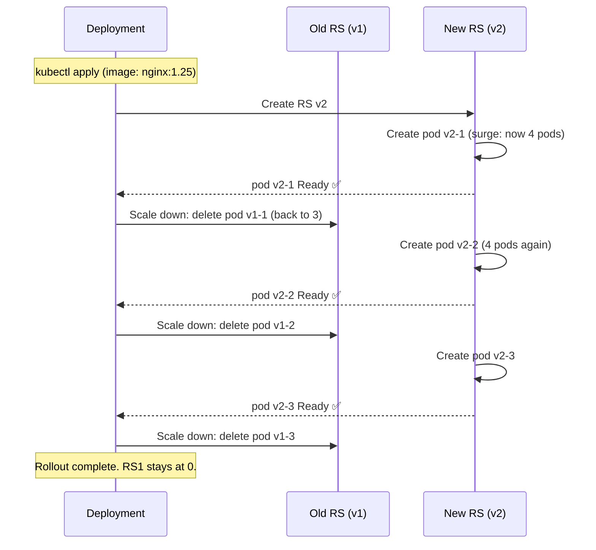

# 4.2 Deployments — Rolling Updates, Rollbacks, and Strategy

⏱️ **~8 min read**

> **TL;DR:** Deployments are how you deploy everything in Kubernetes. They manage ReplicaSets to give you zero-downtime rolling updates, instant rollbacks, and declarative version history. This is the controller you'll use 90% of the time.

---

## The Full Deployment YAML

```yaml
# deployment.yaml
apiVersion: apps/v1
kind: Deployment
metadata:
  name: my-app
  labels:
    app: my-app
spec:
  replicas: 3
  selector:
    matchLabels:
      app: my-app

  strategy:
    type: RollingUpdate          # Default — zero downtime
    rollingUpdate:
      maxSurge: 1                # Allow 1 extra pod above desired during rollout
      maxUnavailable: 0          # Never go below desired count (zero downtime)

  template:
    metadata:
      labels:
        app: my-app
    spec:
      containers:
      - name: app
        image: nginx:1.24        # ← version we'll upgrade
        ports:
        - containerPort: 80
        resources:
          requests:
            memory: "64Mi"
            cpu: "100m"
          limits:
            memory: "128Mi"
            cpu: "200m"
        readinessProbe:          # Deployment waits for this before continuing rollout
          httpGet:
            path: /
            port: 80
          initialDelaySeconds: 5
          periodSeconds: 3
```

---

## Rolling Update — What Actually Happens

With `maxSurge: 1` and `maxUnavailable: 0` on a 3-replica deployment:



The key: **a pod must pass its readiness probe before the old one is deleted**. This guarantees at least 3 healthy pods throughout.

---

## Update Strategy Options

### RollingUpdate (default)

```yaml
strategy:
  type: RollingUpdate
  rollingUpdate:
    maxSurge: 1          # or "25%" — extra pods above desired
    maxUnavailable: 0    # or "25%" — pods below desired allowed to be unavailable
```

| maxSurge | maxUnavailable | Behavior |
|----------|----------------|----------|
| 1 | 0 | Zero-downtime; slower (one at a time) |
| 25% | 25% | Balanced; default K8s behavior |
| 100% | 0 | Blue-green style (doubles pod count briefly) |
| 0 | 1 | Takes one down, brings one up (canary-like) |

### Recreate

```yaml
strategy:
  type: Recreate     # Kill ALL old pods, then create new ones
```

Causes downtime. Use only when old and new versions **cannot run simultaneously** (e.g., DB schema migrations with breaking changes).

---

## Performing a Rolling Update

```bash
# Method 1: Edit the deployment file and kubectl apply
# (change nginx:1.24 → nginx:1.25 in deployment.yaml)
kubectl apply -f deployment.yaml

# Method 2: Set image imperatively
kubectl set image deployment/my-app app=nginx:1.25

# Method 3: Edit live
kubectl edit deployment my-app  # opens in $EDITOR

# Watch the rollout happen
kubectl rollout status deployment/my-app
```

**Expected rollout output:**
```
Waiting for deployment "my-app" rollout to finish: 1 out of 3 new replicas have been updated...
Waiting for deployment "my-app" rollout to finish: 2 out of 3 new replicas have been updated...
Waiting for deployment "my-app" rollout to finish: 1 old replicas are pending termination...
deployment "my-app" successfully rolled out
```

---

## Rollback

```bash
# See rollout history
kubectl rollout history deployment/my-app

# Rollout history output:
# REVISION  CHANGE-CAUSE
# 1         <none>
# 2         <none>

# Add change-cause annotation for meaningful history
kubectl annotate deployment/my-app kubernetes.io/change-cause="Update to nginx 1.25"

# Rollback to previous version (RS v1 scales back up)
kubectl rollout undo deployment/my-app

# Rollback to a specific revision
kubectl rollout undo deployment/my-app --to-revision=1

# Watch the rollback
kubectl rollout status deployment/my-app
```

> 🏭 **In Production:** Always annotate deployments with `--record` (deprecated) or `kubernetes.io/change-cause` so `rollout history` is meaningful. "Deployed by CI build #1234 - ticket PROJ-567" is infinitely more useful than `<none>`.

---

## Pausing and Resuming Rollouts

```bash
# Make multiple changes without triggering a rollout each time
kubectl rollout pause deployment/my-app

kubectl set image deployment/my-app app=nginx:1.25
kubectl set resources deployment/my-app -c app --limits=memory=256Mi,cpu=400m

# Apply all changes at once
kubectl rollout resume deployment/my-app
```

---

## Scaling

```bash
# Scale manually
kubectl scale deployment my-app --replicas=10

# Or edit the YAML and kubectl apply
# In production: use HPA (Chapter 13) to autoscale
```

---

### Try It

```bash
# Create a deployment with nginx:1.24
kubectl create deployment update-demo --image=nginx:1.24 --replicas=3

# Verify
kubectl get deploy update-demo
kubectl get pods -l app=update-demo

# Perform a rolling update to nginx:1.25
kubectl set image deployment/update-demo update-demo=nginx:1.25

# Watch it roll out
kubectl rollout status deployment/update-demo

# Confirm new image
kubectl get pods -l app=update-demo -o jsonpath='{range .items[*]}{.spec.containers[0].image}{"\n"}{end}'

# Check history
kubectl rollout history deployment/update-demo

# Rollback
kubectl rollout undo deployment/update-demo
kubectl rollout status deployment/update-demo

# Confirm original image restored
kubectl get pods -l app=update-demo -o jsonpath='{range .items[*]}{.spec.containers[0].image}{"\n"}{end}'

# Cleanup
kubectl delete deployment update-demo
```

---

## Key Takeaways

| # | Concept | One-liner |
|---|---------|-----------|
| 1 | Deployment manages ReplicaSets | Creates a new RS per rollout; keeps old ones for rollback |
| 2 | `maxSurge` + `maxUnavailable` | Control speed vs safety tradeoff in rolling updates |
| 3 | Readiness probe gates rollout | New pod must be Ready before old one is deleted |
| 4 | `rollout undo` = instant rollback | Old RS scales back up — no re-download needed |
| 5 | `Recreate` = downtime strategy | Use only when old/new versions can't coexist |

---

## ✅ Quick Check

**Q1:** Your deployment has `maxSurge: 0` and `maxUnavailable: 1`. During a rolling update of 5 replicas, how many pods are running at any given time?

<details>
<summary>Answer</summary>
At minimum 4. With `maxUnavailable: 1`, one pod can be unavailable at any time. With `maxSurge: 0`, no extra pods can be created. So the pattern is: terminate one old pod → create one new pod → wait for it to become Ready → repeat. You'll always have 4–5 pods, never 6.
</details>

**Q2:** A rollout is in progress. You update the deployment image again. What happens?

<details>
<summary>Answer</summary>
Kubernetes aborts the current rollout and starts a new one for the latest change. The in-progress RS is scaled back, and a new RS for the new image is created. You can see this with `kubectl rollout history` — each change creates a new revision.
</details>

**Q3:** `kubectl rollout undo` fails with "no previous revision." Why?

<details>
<summary>Answer</summary>
The deployment has only one revision in history — it was never updated. `rollout undo` requires at least two revisions to have a "previous" one to roll back to. You can check with `kubectl rollout history deployment/my-app`.
</details>
