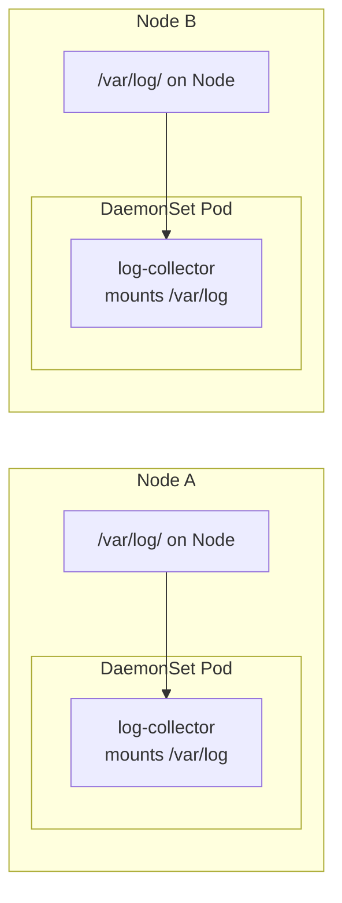

# 4.3 DaemonSets — One Per Node

⏱️ **~5 min read**

> **TL;DR:** A DaemonSet ensures exactly one pod runs on **every node** in the cluster. When new nodes are added, a pod is automatically scheduled on them. When nodes are removed, the pods are garbage collected.

---

## When You Need Exactly One Pod Per Node

Some workloads are inherently node-level — they need to run on every machine:

| Use Case | Example |
|----------|---------|
| Log collection | Fluentd, Filebeat — collect logs from the node's filesystem |
| Metrics collection | Prometheus Node Exporter — scrape node-level metrics |
| Network plugins | Calico, Flannel — implement pod networking (CNI) |
| Storage agents | Ceph, Longhorn — manage node-local storage |
| Security agents | Falco — monitor syscalls on each node |

> 📝 **Note:** Look at your `kube-system` namespace — `kube-proxy` is itself a DaemonSet. It runs on every node to maintain iptables rules.

---

## DaemonSet YAML

```yaml
# daemonset.yaml
apiVersion: apps/v1
kind: DaemonSet
metadata:
  name: log-collector
  namespace: kube-system
spec:
  selector:
    matchLabels:
      app: log-collector
  template:
    metadata:
      labels:
        app: log-collector
    spec:
      tolerations:
      # Allow scheduling on control plane nodes too
      - key: node-role.kubernetes.io/control-plane
        operator: Exists
        effect: NoSchedule

      containers:
      - name: fluentd
        image: fluent/fluentd:v1.16
        resources:
          limits:
            memory: "200Mi"
            cpu: "100m"
        volumeMounts:
        - name: varlog
          mountPath: /var/log
        - name: varlibdockercontainers
          mountPath: /var/lib/docker/containers
          readOnly: true

      terminationGracePeriodSeconds: 30
      volumes:
      - name: varlog
        hostPath:              # Mount the NODE's /var/log — not the pod's
          path: /var/log
      - name: varlibdockercontainers
        hostPath:
          path: /var/lib/docker/containers
```

### The Key Difference: `hostPath` Volumes

DaemonSets typically mount **host directories** — they need to read files from the actual node filesystem. This is a `hostPath` volume, which is different from `emptyDir` or PersistentVolumes:



> ⚠️ **Warning:** `hostPath` volumes are powerful and dangerous. A pod with a `hostPath` mount to `/` can read the entire node filesystem. In production, restrict DaemonSet permissions with Pod Security Standards (Chapter 14).

---

## DaemonSets vs Deployments

| | Deployment | DaemonSet |
|---|---|---|
| Pod count control | You set `replicas` | One per node (automatic) |
| Scheduling | Scheduler picks nodes | Runs on ALL nodes (or subset via `nodeSelector`) |
| Scaling | Manual or HPA | Automatic as nodes are added/removed |
| Use case | Stateless apps | Node-level infrastructure |

---

## Targeting Specific Nodes

You can restrict a DaemonSet to a subset of nodes using `nodeSelector` or `nodeAffinity`:

```yaml
spec:
  template:
    spec:
      nodeSelector:
        disk: ssd     # Only run on nodes labeled disk=ssd
```

```bash
# Label a node
kubectl label node minikube disk=ssd

# DaemonSet will now only schedule on labeled nodes
```

---

### Try It

```bash
# On minikube (single node), a DaemonSet creates exactly 1 pod
cat <<'EOF' | kubectl apply -f -
apiVersion: apps/v1
kind: DaemonSet
metadata:
  name: ds-demo
spec:
  selector:
    matchLabels:
      app: ds-demo
  template:
    metadata:
      labels:
        app: ds-demo
    spec:
      containers:
      - name: agent
        image: busybox
        command: ["sh", "-c", "while true; do echo 'Monitoring node...'; sleep 10; done"]
        resources:
          limits:
            memory: "32Mi"
            cpu: "50m"
EOF

# Exactly 1 pod on our 1-node cluster
kubectl get pods -l app=ds-demo -o wide

# See which node it's on
kubectl get pod -l app=ds-demo -o jsonpath='{.items[0].spec.nodeName}'

# Cleanup
kubectl delete daemonset ds-demo
```

---

## Key Takeaways

| # | Concept | One-liner |
|---|---------|-----------|
| 1 | One pod per node | DaemonSet guarantees node-level coverage |
| 2 | Auto-scales with cluster | New node → new pod; removed node → pod cleaned up |
| 3 | Uses `hostPath` | Typically mounts the node's own filesystem |
| 4 | `kube-proxy` is a DaemonSet | Node networking implemented this way in every cluster |

---

## ✅ Quick Check

**Q1:** Your 10-node cluster runs a log-collector DaemonSet. You add 3 more nodes. What happens?

<details>
<summary>Answer</summary>
Kubernetes automatically schedules one log-collector pod on each of the 3 new nodes. You now have 13 pods total with zero manual intervention. This is the entire point of DaemonSets.
</details>

**Q2:** You want a DaemonSet to run on all nodes EXCEPT the control plane. How?

<details>
<summary>Answer</summary>
By default, DaemonSets don't schedule on control-plane nodes because control-plane nodes have a `NoSchedule` taint. Simply don't add the `tolerations` block for `node-role.kubernetes.io/control-plane` — the DaemonSet will skip control-plane nodes automatically.
</details>

**Q3:** Can you `kubectl scale` a DaemonSet to 0?

<details>
<summary>Answer</summary>
No — DaemonSets don't have a `replicas` field. The pod count is determined by the number of matching nodes, not a user-specified number. To "disable" a DaemonSet, you'd either delete it or use a `nodeSelector` that matches no nodes.
</details>
