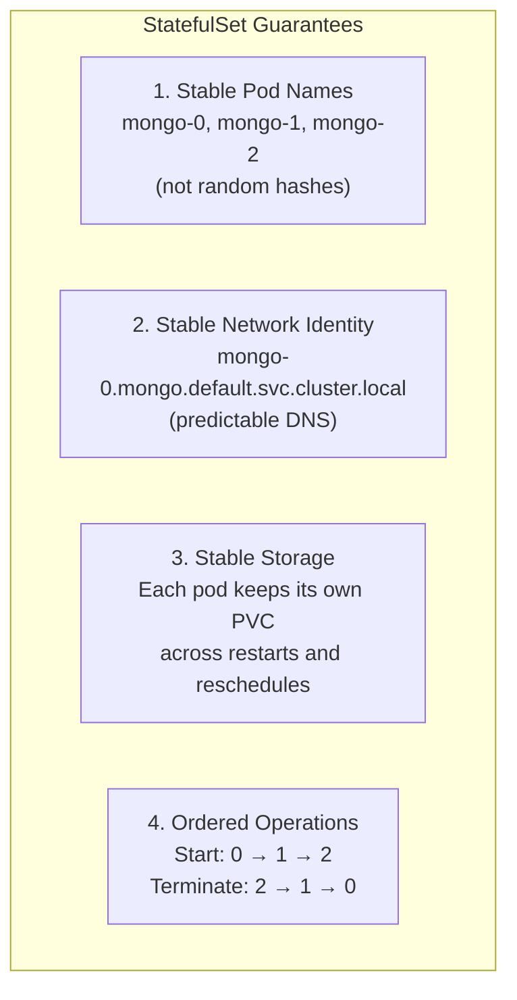

# 4.4 StatefulSets — When Identity Matters

⏱️ **~6 min read**

> **TL;DR:** StatefulSets are for applications that need **stable network identity** and **stable storage** — databases, message queues, consensus systems. Each pod gets a persistent name (`pod-0`, `pod-1`) and its own PersistentVolumeClaim that follows it across restarts.

---

## The Problem with Deployments for Stateful Apps

Deployments give each pod a random suffix (`my-app-7f4b9c-x8p2q`). If a pod is replaced, it gets a new random name, a new IP, and starts with an empty disk.

That's fine for stateless services. But try running a database replica set where:
- Replica 1 needs to always be `db-0` so others can find it
- `db-0` needs its data to survive restarts
- Replicas must start in order (primary before secondaries)

Deployments can't do this. StatefulSets can.

---

## StatefulSet YAML

```yaml
# statefulset.yaml
apiVersion: apps/v1
kind: StatefulSet
metadata:
  name: mongo
spec:
  serviceName: mongo          # Must match a Headless Service (see below)
  replicas: 3
  selector:
    matchLabels:
      app: mongo
  template:
    metadata:
      labels:
        app: mongo
    spec:
      containers:
      - name: mongo
        image: mongo:7
        ports:
        - containerPort: 27017
        volumeMounts:
        - name: data
          mountPath: /data/db    # Each pod mounts ITS OWN volume here

  volumeClaimTemplates:         # ← This is the StatefulSet superpower
  - metadata:
      name: data
    spec:
      accessModes: ["ReadWriteOnce"]
      resources:
        requests:
          storage: 1Gi
```

The `volumeClaimTemplates` section automatically creates a separate PVC for each pod:
- `data-mongo-0` → `mongo-0`
- `data-mongo-1` → `mongo-1`
- `data-mongo-2` → `mongo-2`

---

## The Four Guarantees of StatefulSets



| Feature | Deployment | StatefulSet |
|---------|-----------|-------------|
| Pod names | Random (`abc-7f4-x8p`) | Ordinal (`db-0`, `db-1`) |
| Pod DNS | Random | `pod-name.svc-name.ns.svc.cluster.local` |
| Storage | Shared or none | Each pod gets its own PVC |
| Start order | Parallel | Sequential (0, 1, 2...) |
| Delete order | Parallel | Reverse sequential (2, 1, 0...) |

---

## The Required Headless Service

StatefulSets require a **Headless Service** (`clusterIP: None`) to provide stable DNS for individual pods:

```yaml
# headless-service.yaml
apiVersion: v1
kind: Service
metadata:
  name: mongo             # Must match StatefulSet's serviceName
spec:
  clusterIP: None         # ← Headless: no virtual IP, DNS returns pod IPs directly
  selector:
    app: mongo
  ports:
  - port: 27017
```

With this, each pod gets a stable DNS record:
```
mongo-0.mongo.default.svc.cluster.local  → 10.244.0.5
mongo-1.mongo.default.svc.cluster.local  → 10.244.0.6
mongo-2.mongo.default.svc.cluster.local  → 10.244.0.7
```

If `mongo-1` is rescheduled to a different node, its DNS name stays `mongo-1.mongo...` — it just resolves to a new IP. Other services can always reach it by name.

---

## When to Use StatefulSets

**Use StatefulSets for:**
- Databases (MongoDB, PostgreSQL, MySQL clusters)
- Message queues (Kafka, RabbitMQ)
- Consensus systems (Zookeeper, etcd)
- Any app that needs persistent, pod-specific identity

**Don't use StatefulSets for:**
- Stateless web services (use Deployment)
- Batch jobs (use Jobs)
- Any app that doesn't need stable identity or its own storage

> 🏭 **In Production:** Most teams use Helm charts (Chapter 12) for databases, which package StatefulSets with the right configuration. Don't roll your own database StatefulSet for production without understanding your specific database's clustering requirements.

---

### Try It

```bash
# Create the headless service
cat <<'EOF' | kubectl apply -f -
apiVersion: v1
kind: Service
metadata:
  name: nginx-headless
spec:
  clusterIP: None
  selector:
    app: nginx-sts
  ports:
  - port: 80
---
apiVersion: apps/v1
kind: StatefulSet
metadata:
  name: nginx-sts
spec:
  serviceName: nginx-headless
  replicas: 3
  selector:
    matchLabels:
      app: nginx-sts
  template:
    metadata:
      labels:
        app: nginx-sts
    spec:
      containers:
      - name: nginx
        image: nginx:1.25
        resources:
          limits:
            memory: "64Mi"
            cpu: "100m"
EOF

# Watch them start IN ORDER (0, then 1, then 2)
kubectl get pods -l app=nginx-sts -w

# See stable pod names
kubectl get pods -l app=nginx-sts

# Delete the middle pod — it comes back with the SAME name
kubectl delete pod nginx-sts-1
kubectl get pods -l app=nginx-sts -w  # nginx-sts-1 returns with same name

# Cleanup
kubectl delete statefulset nginx-sts
kubectl delete service nginx-headless
```

**Expected pod names:**
```
NAME          READY   STATUS    RESTARTS   AGE
nginx-sts-0   1/1     Running   0          30s
nginx-sts-1   1/1     Running   0          25s
nginx-sts-2   1/1     Running   0          20s
```

---

## Key Takeaways

| # | Concept | One-liner |
|---|---------|-----------|
| 1 | Stable pod names | `pod-0`, `pod-1` — never random hashes |
| 2 | `volumeClaimTemplates` | Each pod gets its own persistent disk that follows it |
| 3 | Headless Service required | Provides per-pod DNS for stable network identity |
| 4 | Ordered start/stop | Pods start 0→N, stop N→0 — critical for cluster consensus |

---

## ✅ Quick Check

**Q1:** A StatefulSet pod `kafka-2` gets rescheduled to a new node. Does it retain its data?

<details>
<summary>Answer</summary>
Yes. The PVC `data-kafka-2` is bound to a PersistentVolume that exists independently of the pod. When `kafka-2` restarts on the new node, the StatefulSet controller ensures the same PVC is mounted. The data survives node changes.
</details>

**Q2:** You scale a StatefulSet from 3 to 5 replicas. In what order do pods `3` and `4` start?

<details>
<summary>Answer</summary>
Pod `3` starts first and must become `Running` and `Ready` before pod `4` is created. StatefulSets always maintain sequential ordering during scale-up. This is critical for databases where nodes join the cluster in a specific sequence.
</details>

**Q3:** Can you use a regular (non-headless) Service with a StatefulSet?

<details>
<summary>Answer</summary>
Yes — and it's common to have both. A regular ClusterIP Service provides a load-balanced entry point for clients that don't care which replica they hit. The headless Service provides per-pod DNS for applications that need to target specific replicas (like a primary node). StatefulSets often have both types.
</details>
