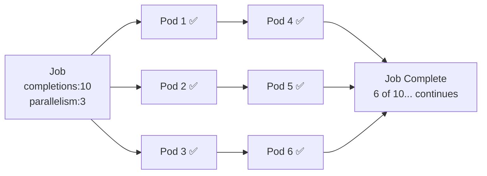

# 4.5 Jobs and CronJobs — Run-to-Completion Workloads

⏱️ **~5 min read**

> **TL;DR:** Jobs run a task to completion (exit 0) and then stop. CronJobs run Jobs on a schedule. Use them for database backups, data processing, report generation — anything that has a start and end.

---

## Jobs

A Job creates one or more pods, runs them to completion, and tracks success/failure.

```yaml
# job.yaml
apiVersion: batch/v1
kind: Job
metadata:
  name: db-backup
spec:
  completions: 1          # How many successful pod completions we need
  parallelism: 1          # How many pods to run in parallel
  backoffLimit: 3         # Retry up to 3 times before marking Job failed
  activeDeadlineSeconds: 300  # Kill the job if it runs longer than 5 min

  template:
    spec:
      restartPolicy: OnFailure   # Required — Never or OnFailure (not Always)
      containers:
      - name: backup
        image: postgres:16
        command:
        - sh
        - -c
        - |
          pg_dump -h $DB_HOST -U $DB_USER mydb | gzip > /backup/backup-$(date +%Y%m%d).sql.gz
          echo "Backup complete!"
        env:
        - name: DB_HOST
          value: postgres-svc
        - name: PGPASSWORD
          valueFrom:
            secretKeyRef:
              name: db-secret
              key: password
```

> ⚠️ **Warning:** Jobs require `restartPolicy: OnFailure` or `Never`. The default `Always` is not allowed — a Job that restarts forever never "completes."

---

## Parallel Jobs

Run multiple pods simultaneously for parallelizable work:

```yaml
spec:
  completions: 10      # Need 10 successful completions total
  parallelism: 3       # Run 3 pods at a time
  backoffLimit: 5
```



---

## CronJobs

A CronJob creates a new Job on a schedule, using standard cron syntax.

```yaml
# cronjob.yaml
apiVersion: batch/v1
kind: CronJob
metadata:
  name: daily-backup
spec:
  schedule: "0 2 * * *"         # Every day at 2:00 AM
  concurrencyPolicy: Forbid      # Don't start a new Job if the last one is still running
  successfulJobsHistoryLimit: 3  # Keep last 3 successful job records
  failedJobsHistoryLimit: 1      # Keep last 1 failed job record
  startingDeadlineSeconds: 60    # If missed schedule by 60s, skip this run

  jobTemplate:                   # The Job spec to run
    spec:
      backoffLimit: 2
      template:
        spec:
          restartPolicy: OnFailure
          containers:
          - name: backup
            image: postgres:16
            command: ["sh", "-c", "echo 'Running backup...' && sleep 5 && echo 'Done!'"]
```

### CronJob Schedule Syntax

```
┌─── minute (0–59)
│ ┌─── hour (0–23)
│ │ ┌─── day of month (1–31)
│ │ │ ┌─── month (1–12)
│ │ │ │ ┌─── day of week (0–7, 0=Sunday)
│ │ │ │ │
* * * * *

"0 2 * * *"      → Every day at 2:00 AM
"*/15 * * * *"   → Every 15 minutes
"0 9 * * 1"      → Every Monday at 9:00 AM
"0 0 1 * *"      → First day of every month at midnight
```

> 💡 **Tip:** Use [crontab.guru](https://crontab.guru) to validate cron expressions before applying them.

---

## ConcurrencyPolicy Options

| Policy | Behavior |
|--------|----------|
| `Allow` (default) | Multiple Jobs can run concurrently |
| `Forbid` | Skip new run if previous is still running |
| `Replace` | Kill the running Job and start a fresh one |

Use `Forbid` for anything that shouldn't overlap (database backups, report generation). Use `Allow` for independent tasks.

---

### Try It

```bash
# Create a simple job
cat <<'EOF' | kubectl apply -f -
apiVersion: batch/v1
kind: Job
metadata:
  name: hello-job
spec:
  backoffLimit: 2
  template:
    spec:
      restartPolicy: Never
      containers:
      - name: hello
        image: busybox
        command: ["sh", "-c", "echo 'Job started!'; sleep 3; echo 'Job done!'; exit 0"]
EOF

# Watch it run to completion
kubectl get pods -l job-name=hello-job -w

# See Job status
kubectl get job hello-job

# Read the output
kubectl logs -l job-name=hello-job

# Create a CronJob (runs every minute for demo)
cat <<'EOF' | kubectl apply -f -
apiVersion: batch/v1
kind: CronJob
metadata:
  name: minutely-hello
spec:
  schedule: "* * * * *"
  successfulJobsHistoryLimit: 3
  jobTemplate:
    spec:
      template:
        spec:
          restartPolicy: Never
          containers:
          - name: hello
            image: busybox
            command: ["sh", "-c", "date; echo 'Cron tick!'"]
EOF

# Wait ~70 seconds, then see the created Jobs
sleep 70 && kubectl get jobs

# Cleanup
kubectl delete job hello-job
kubectl delete cronjob minutely-hello
```

**Expected Job output:**
```
NAME        STATUS     COMPLETIONS   DURATION   AGE
hello-job   Complete   1/1           4s         30s
```

---

## Key Takeaways

| # | Concept | One-liner |
|---|---------|-----------|
| 1 | Job = run-to-completion | Pod exits 0 = success; retried up to `backoffLimit` on failure |
| 2 | `restartPolicy: OnFailure` | Required for Jobs — `Always` is forbidden |
| 3 | `parallelism` + `completions` | Control parallel batch processing workloads |
| 4 | CronJob = scheduled Job | Standard cron syntax; creates a new Job each trigger |
| 5 | `concurrencyPolicy: Forbid` | Prevents overlapping runs for non-reentrant tasks |

---

## ✅ Quick Check

**Q1:** A Job with `backoffLimit: 3` fails 4 times. What happens?

<details>
<summary>Answer</summary>
After the 4th failure (exceeding the backoff limit of 3), the Job is marked as **Failed** and no more pods are created. The failed pods remain for log inspection. You'd need to delete and recreate the Job to try again.
</details>

**Q2:** A CronJob with `concurrencyPolicy: Forbid` is scheduled every 5 minutes but takes 8 minutes to run. What happens?

<details>
<summary>Answer</summary>
The second scheduled run is **skipped** because the first is still running. The third run (at 10 minutes) also gets skipped. The first run completes at ~8 minutes, and the next scheduled run after that proceeds normally. You never have two copies running simultaneously.
</details>

**Q3:** You need to process 1000 independent work items, running 10 workers at a time. Which Job fields do you set?

<details>
<summary>Answer</summary>
Set `completions: 1000` and `parallelism: 10`. Kubernetes runs 10 pods simultaneously, and as each completes, a new one starts until 1000 successful completions are reached. Each pod should process one work item and exit 0 on success.
</details>
