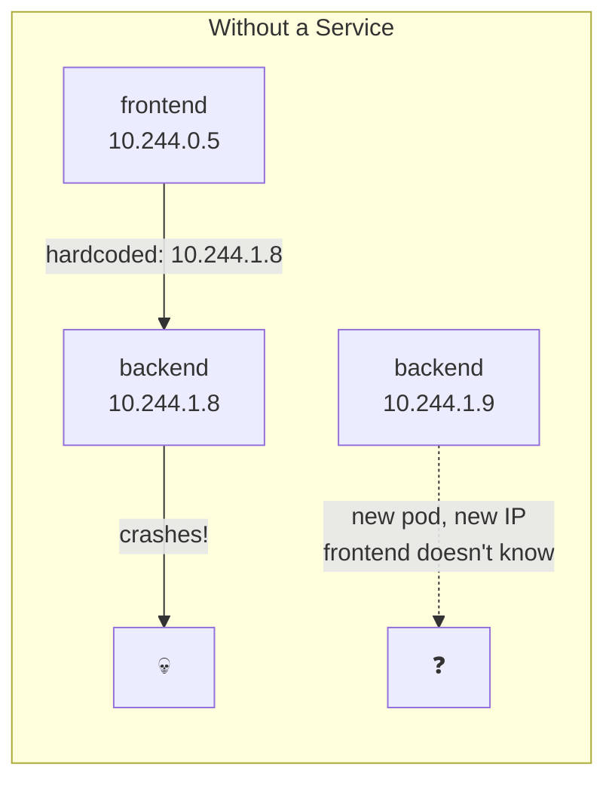
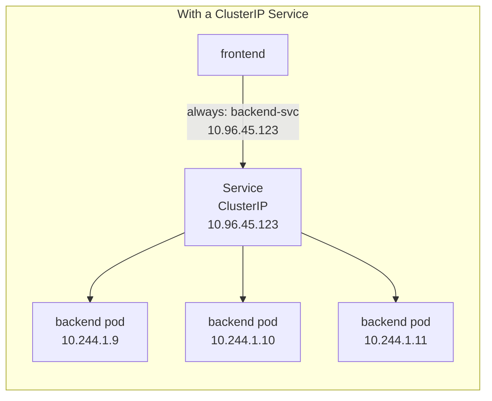
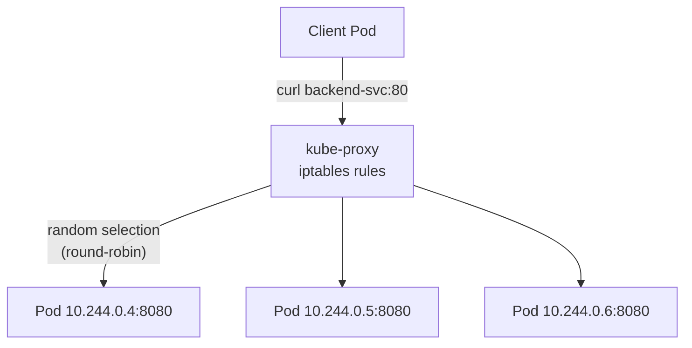

# 5.1 ClusterIP — Internal Communication

⏱️ **~6 min read**

> **TL;DR:** ClusterIP is the default Service type. It gives a group of pods a **stable virtual IP** that other pods can reach by name. Pod IPs change constantly; Service IPs never do.

---

## The Problem Services Solve

Pods are ephemeral. Every time a pod restarts, it gets a new IP address. If Service A hardcodes Service B's pod IP, it breaks the moment B's pod is replaced.





The Service IP **never changes**. The pods behind it come and go — the Service automatically routes to healthy ones.

---

## ClusterIP Service YAML

```yaml
# service-clusterip.yaml
apiVersion: v1
kind: Service
metadata:
  name: backend-svc
spec:
  type: ClusterIP        # Default — omitting type also gives ClusterIP
  selector:
    app: backend         # Route traffic to pods with this label
  ports:
  - name: http
    port: 80             # Port the Service listens on
    targetPort: 8080     # Port on the pods to forward to
    protocol: TCP
```

```bash
kubectl apply -f service-clusterip.yaml
kubectl get svc backend-svc
```

**Expected output:**
```
NAME          TYPE        CLUSTER-IP     EXTERNAL-IP   PORT(S)   AGE
backend-svc   ClusterIP   10.96.45.123   <none>        80/TCP    10s
```

The `CLUSTER-IP` is the stable virtual IP. `EXTERNAL-IP: <none>` means it's not reachable from outside the cluster — by design.

---

## How It Works Under the Hood

When a Service is created, the Endpoints controller builds a list of pod IPs matching the selector:

```bash
# See which pod IPs are behind a Service
kubectl get endpoints backend-svc
```

**Expected output:**
```
NAME          ENDPOINTS                                         AGE
backend-svc   10.244.0.4:8080,10.244.0.5:8080,10.244.0.6:8080   1m
```

kube-proxy on every node watches these Endpoints and programs iptables rules to load-balance traffic to those IPs.



---

## Service DNS — The Real Power

Every Service gets an automatic DNS entry maintained by CoreDNS:

```
# Full DNS name format:
SERVICE-NAME.NAMESPACE.svc.cluster.local

# Examples:
backend-svc.default.svc.cluster.local
postgres.database.svc.cluster.local
redis.cache.svc.cluster.local

# Short form (same namespace only):
backend-svc
```

From any pod in the cluster:
```bash
# These all reach the same Service:
curl http://backend-svc                              # same namespace only
curl http://backend-svc.default                      # same cluster
curl http://backend-svc.default.svc.cluster.local    # fully qualified
```

> 🔗 **Docker Parallel:** In Docker Compose, containers reach each other by service name (`http://backend`). Kubernetes Services work the same way — but across multiple nodes and with automatic load balancing.

---

## Port Mapping: `port` vs `targetPort`

```yaml
ports:
- port: 80           # What OTHER pods use to reach this Service
  targetPort: 8080   # What port YOUR pods actually listen on
```

This decouples the internal implementation from the interface. Your app can change from port 8080 to 9000 — just update `targetPort`, no changes needed by consumers.

```bash
# Named targetPort (better — references container's port by name)
spec:
  containers:
  - name: app
    ports:
    - name: http
      containerPort: 8080

# Service can reference by name instead of number
spec:
  ports:
  - port: 80
    targetPort: http   # ← references the named port
```

---

### Try It

```bash
# Deploy a backend
kubectl create deployment backend --image=nginx:1.25 --replicas=3

# Create a ClusterIP Service
kubectl expose deployment backend --port=80 --target-port=80 --name=backend-svc

# Verify
kubectl get svc backend-svc
kubectl get endpoints backend-svc

# Access from another pod (using DNS)
kubectl run curl-test --image=curlimages/curl --rm -it --restart=Never -- \
  curl -s http://backend-svc

# Cleanup
kubectl delete deployment backend
kubectl delete svc backend-svc
```

---

## Key Takeaways

| # | Concept | One-liner |
|---|---------|-----------|
| 1 | ClusterIP = stable virtual IP | Pod IPs change; Service IP never does |
| 2 | Label selector = routing | Service routes to pods matching its selector |
| 3 | Endpoints object | Maintained automatically; lists live pod IPs |
| 4 | DNS auto-registered | Every Service gets a DNS name via CoreDNS |
| 5 | `port` vs `targetPort` | Service port vs pod port — can be different |

---

## ✅ Quick Check

**Q1:** A ClusterIP Service has 3 healthy pods and 1 crashed pod (all matching the selector). Does the Service route to the crashed pod?

<details>
<summary>Answer</summary>
No. The Endpoints controller only includes pods that are **Running and Ready**. If a pod's readiness probe fails or it crashes, it's removed from the Endpoints list. Traffic is only sent to healthy pods.
</details>

**Q2:** You change a Deployment's label from `app: backend` to `app: backend-v2`. The Service selector is `app: backend`. What happens?

<details>
<summary>Answer</summary>
The Service stops routing to the new pods. The Endpoints list becomes empty (no pods match `app: backend` anymore). Traffic to the Service will fail with connection refused. You'd need to update either the Service selector or the pod labels to restore connectivity.
</details>

**Q3:** Two Services in different namespaces are both named `api`. Can they coexist? How does a pod tell them apart?

<details>
<summary>Answer</summary>
Yes — Services are scoped to a namespace, so two Services named `api` in different namespaces are completely separate objects. Pods distinguish them via the full DNS name: `api.namespace-a.svc.cluster.local` vs `api.namespace-b.svc.cluster.local`. Using the short form `api` only reaches the Service in the same namespace.
</details>
