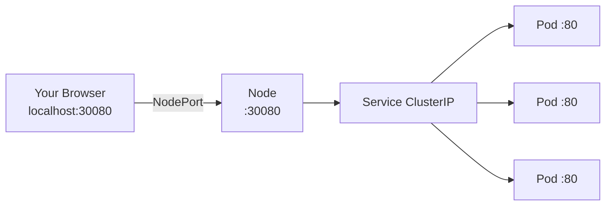

# 5.2 NodePort — Exposing to the Outside

⏱️ **~5 min read**

> **TL;DR:** NodePort opens a port (30000–32767) on **every node** in the cluster and forwards traffic to your Service. It's the simplest way to expose an app externally — but rarely used in production (Ingress is preferred).

---

## How NodePort Works

```yaml
# service-nodeport.yaml
apiVersion: v1
kind: Service
metadata:
  name: web-nodeport
spec:
  type: NodePort
  selector:
    app: web
  ports:
  - port: 80          # ClusterIP port (internal)
    targetPort: 80    # Pod port
    nodePort: 30080   # External port on every node (30000–32767)
                      # Omit to let K8s auto-assign
```



Traffic flow:
1. External client hits **any node** on port `30080`
2. Node forwards to the Service's ClusterIP
3. Service load-balances to a pod

---

## The NodePort Range

By default, `nodePort` values must be in **30000–32767**. This range is intentionally high to avoid conflicts with system ports.

```bash
# Omit nodePort — K8s picks one for you
kubectl expose deployment web --type=NodePort --port=80

# See the assigned port
kubectl get svc web
# PORTS column: 80:31245/TCP  ← 31245 is the auto-assigned NodePort
```

---

## Accessing on Minikube

On Minikube, the "node" is a VM or container with its own IP, not `localhost`:

```bash
# Get the Minikube IP
minikube ip
# Output: 192.168.49.2

# Access the NodePort
curl http://$(minikube ip):30080

# Or use the shortcut — minikube opens it in a browser
minikube service web-nodeport

# Or get the URL directly
minikube service web-nodeport --url
```

---

## NodePort vs ClusterIP

| Feature | ClusterIP | NodePort |
|---------|-----------|----------|
| Accessible from | Inside cluster only | Inside cluster + external |
| Includes ClusterIP | — | ✅ Yes (NodePort extends it) |
| Port range | Any | 30000–32767 |
| Production use | ✅ Standard | ⚠️ Rarely — use Ingress instead |

> 🏭 **In Production:** NodePort has two problems: (1) clients must know the node IP, which changes when nodes are replaced, and (2) you can't use standard ports 80/443. In production, use an **Ingress** (Chapter 6) or **LoadBalancer** Service instead.

---

### Try It

```bash
# Deploy a simple web app
kubectl create deployment web --image=nginx:1.25 --replicas=2

# Expose with NodePort — let K8s pick the port
kubectl expose deployment web --type=NodePort --port=80

# See the assigned NodePort
kubectl get svc web

# Access it on Minikube
minikube service web --url

# Or manually:
NODE_PORT=$(kubectl get svc web -o jsonpath='{.spec.ports[0].nodePort}')
MINIKUBE_IP=$(minikube ip)
curl http://$MINIKUBE_IP:$NODE_PORT

# Cleanup
kubectl delete deployment web
kubectl delete svc web
```

---

## Key Takeaways

| # | Concept | One-liner |
|---|---------|-----------|
| 1 | NodePort opens on every node | Traffic to ANY node on that port reaches your Service |
| 2 | Range: 30000–32767 | Avoids conflicts with system/app ports |
| 3 | Extends ClusterIP | NodePort Services also have a ClusterIP for internal use |
| 4 | Minikube needs `minikube ip` | The node IP is the VM/container IP, not localhost |

---

## ✅ Quick Check

**Q1:** You have a 5-node cluster with a NodePort Service on port 31000. Client sends traffic to node 3. Node 3 has no matching pods — they all run on nodes 1 and 2. Does the request succeed?

<details>
<summary>Answer</summary>
Yes. kube-proxy on node 3 has iptables rules to forward the traffic to the Service's ClusterIP, which then routes to pods on nodes 1 and 2. NodePort traffic is forwarded cluster-wide, not limited to pods on the receiving node.
</details>

**Q2:** Can you set `nodePort: 80` to use a standard HTTP port?

<details>
<summary>Answer</summary>
No by default. The allowed range is 30000–32767. You can change this range in the kube-apiserver config (`--service-node-port-range`), but using standard ports for NodePort in production is a security and operational anti-pattern. Use Ingress with a proper LoadBalancer instead.
</details>

**Q3:** You delete the NodePort Service and recreate it. Does it get the same NodePort number?

<details>
<summary>Answer</summary>
Only if you explicitly set `nodePort: 31000` in the spec. If you omit it and let K8s auto-assign, you get a random available port in the range — potentially a different one. This is another reason NodePort is awkward in production: clients must be updated if the port changes.
</details>
