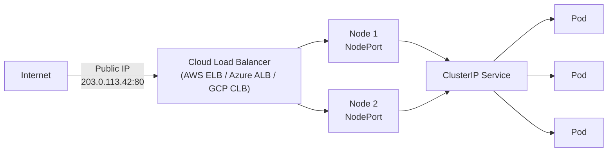

# 5.3 LoadBalancer — Cloud-Native Exposure

⏱️ **~5 min read**

> **TL;DR:** A LoadBalancer Service provisions a real cloud load balancer (AWS ELB, Azure ALB, GCP CLB) with a public IP automatically. On Minikube, use `minikube tunnel` to simulate this. In production, this is the standard way to expose services to the internet.

---

## How LoadBalancer Works

```yaml
# service-loadbalancer.yaml
apiVersion: v1
kind: Service
metadata:
  name: web-lb
spec:
  type: LoadBalancer
  selector:
    app: web
  ports:
  - port: 80
    targetPort: 80
```



A LoadBalancer Service is really three services stacked:
1. A **ClusterIP** (internal routing)
2. A **NodePort** (on each node)
3. A **cloud load balancer** pointed at those NodePorts

When you `kubectl apply` a LoadBalancer Service in a cloud cluster, the cloud controller manager calls the cloud API to provision a real load balancer. The external IP appears in the `EXTERNAL-IP` column after ~30–60 seconds.

```bash
# Cloud cluster — shows a real external IP
kubectl get svc web-lb
# NAME    TYPE           CLUSTER-IP     EXTERNAL-IP     PORT(S)        AGE
# web-lb  LoadBalancer   10.96.10.5     203.0.113.42    80:31456/TCP   45s
```

---

## On Minikube: `minikube tunnel`

Minikube doesn't have a cloud controller, so LoadBalancer Services stay in `pending` state without help:

```bash
kubectl get svc web-lb
# EXTERNAL-IP: <pending>  ← stuck without tunnel
```

Fix this with `minikube tunnel` — it creates a network route on your machine that acts as the load balancer:

```bash
# Run in a separate terminal (requires sudo on macOS/Linux)
minikube tunnel

# Now in your original terminal:
kubectl get svc web-lb
# EXTERNAL-IP: 127.0.0.1  ← now accessible on localhost!

curl http://127.0.0.1:80
```

> ⚠️ **Warning:** `minikube tunnel` requires elevated privileges and must stay running. If you close the terminal, the tunnel closes and `EXTERNAL-IP` goes back to `pending`.

---

## When to Use LoadBalancer vs Ingress

| Scenario | Use |
|----------|-----|
| Single service to expose | LoadBalancer — simple, one command |
| Multiple services on same domain | Ingress — HTTP routing, one LB shared |
| TCP/UDP (non-HTTP) | LoadBalancer — Ingress is HTTP-only |
| TLS termination at L7 | Ingress — with TLS certs |
| Cost-conscious (cloud bills per LB) | Ingress — one LB for many services |

> 💡 **Tip:** In production, most teams use **one** LoadBalancer that fronts an Ingress Controller (like NGINX), then use Ingress resources for path/host routing. This avoids paying for a separate cloud load balancer per service.

---

### Try It

```bash
# Deploy app
kubectl create deployment web --image=nginx:1.25 --replicas=2

# Create LoadBalancer Service
kubectl expose deployment web --type=LoadBalancer --port=80

# Watch EXTERNAL-IP (starts as <pending>)
kubectl get svc web -w &

# In a new terminal, start the tunnel
# minikube tunnel   ← run this in another terminal

# After tunnel starts, EXTERNAL-IP becomes 127.0.0.1
# Kill the watch
kill %1

# Access it (with tunnel running)
curl http://127.0.0.1

# Cleanup
kubectl delete deployment web
kubectl delete svc web
```

---

## Key Takeaways

| # | Concept | One-liner |
|---|---------|-----------|
| 1 | LoadBalancer = cloud LB + NodePort + ClusterIP | Three layers stacked |
| 2 | Cloud controller provisions the LB | Calls AWS/Azure/GCP API automatically |
| 3 | `minikube tunnel` simulates it locally | Routes `127.0.0.1` to the Service |
| 4 | Prefer Ingress for HTTP in production | One LB shared across many services = cost savings |

---

## ✅ Quick Check

**Q1:** You apply a LoadBalancer Service on a bare-metal cluster with no cloud provider. What is `EXTERNAL-IP`?

<details>
<summary>Answer</summary>
`pending` — indefinitely. Without a cloud controller manager to provision an external load balancer, the IP is never assigned. Solutions for bare-metal include **MetalLB** (assigns IPs from a configured pool) or exposing via NodePort + an external load balancer configured manually.
</details>

**Q2:** You have 20 microservices. Should each get its own LoadBalancer Service?

<details>
<summary>Answer</summary>
No — that's 20 cloud load balancers, each costing money (~$20–30/month each on major clouds). The standard pattern is one LoadBalancer in front of an NGINX Ingress Controller, then one Ingress resource per service for HTTP routing. Chapter 6 covers this in detail.
</details>

**Q3:** A LoadBalancer Service has `port: 443`. Does this mean TLS is terminated at the load balancer?

<details>
<summary>Answer</summary>
Not necessarily — by default, the cloud LB passes TCP traffic through (SSL passthrough), and your pods handle TLS. To terminate TLS at the LB level, you need cloud-specific annotations (e.g., `service.beta.kubernetes.io/aws-load-balancer-ssl-cert` on EKS). For standard TLS termination in Kubernetes, use Ingress with TLS configuration (Chapter 6).
</details>
