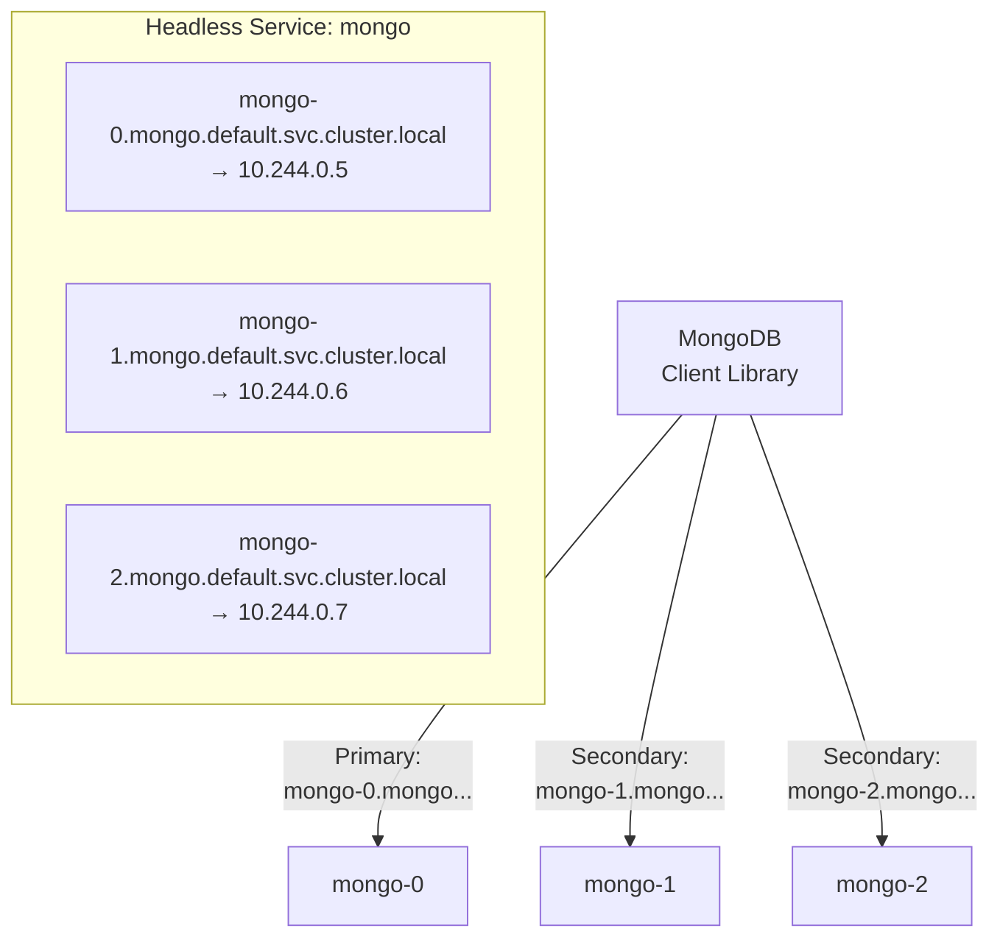

# 5.4 Headless Services and DNS

⏱️ **~5 min read**

> **TL;DR:** A Headless Service (`clusterIP: None`) skips the virtual IP entirely. DNS returns the **actual pod IPs** directly. This is essential for StatefulSets and any app that needs to know which specific instance it's talking to.

---

## Regular vs Headless DNS

With a regular ClusterIP Service, DNS returns one stable virtual IP:

```
# Regular Service DNS lookup:
nslookup backend-svc.default.svc.cluster.local
→ Address: 10.96.45.123   (one ClusterIP)
```

With a Headless Service, DNS returns all matching pod IPs directly:

```
# Headless Service DNS lookup:
nslookup mongo.default.svc.cluster.local
→ Address: 10.244.0.5   (mongo-0's IP)
→ Address: 10.244.0.6   (mongo-1's IP)
→ Address: 10.244.0.7   (mongo-2's IP)
```

The client picks which IP to use — enabling **client-side load balancing** and **direct pod addressing**.

---

## Headless Service YAML

```yaml
# headless-service.yaml
apiVersion: v1
kind: Service
metadata:
  name: mongo
spec:
  clusterIP: None       # ← This is what makes it headless
  selector:
    app: mongo
  ports:
  - port: 27017
```

That's the only difference from a regular Service — `clusterIP: None`.

---

## Per-Pod DNS (StatefulSets)

When a Headless Service is used with a StatefulSet (`serviceName: mongo`), each pod gets its own stable DNS record:



The MongoDB client can discover and address each replica independently — something impossible with a ClusterIP Service that hides individual pod identities.

---

## DNS Record Types

| DNS Query | Regular Service | Headless Service |
|-----------|----------------|-----------------|
| `A` record for service | Returns ClusterIP | Returns all pod IPs |
| `SRV` record | Returns service ClusterIP + port | Returns pod IPs + ports |
| `A` record for pod (`pod-0.svc.ns...`) | Not possible | ✅ Each StatefulSet pod has one |

```bash
# Inside a pod — check the DNS for a headless Service
kubectl run dns-test --image=busybox --rm -it --restart=Never -- \
  nslookup mongo.default.svc.cluster.local

# For a regular Service — one IP
# For a headless Service — multiple IPs (one per pod)
```

---

## Headless Without a Selector

You can also create a headless Service with **no selector** — then manually manage the Endpoints. Useful for bridging to external databases:

```yaml
# External database bridge
apiVersion: v1
kind: Service
metadata:
  name: external-db
spec:
  clusterIP: None
  ports:
  - port: 5432
---
apiVersion: v1
kind: Endpoints
metadata:
  name: external-db    # Must match Service name
subsets:
- addresses:
  - ip: 192.168.1.100  # Your external DB server IP
  ports:
  - port: 5432
```

Now pods can reach your external DB via `external-db.default.svc.cluster.local:5432` — a fully internal DNS name pointing to an external resource.

---

### Try It

```bash
# Create a headless Service backed by a Deployment
kubectl create deployment headless-demo --image=nginx:1.25 --replicas=3

cat <<'EOF' | kubectl apply -f -
apiVersion: v1
kind: Service
metadata:
  name: headless-demo
spec:
  clusterIP: None
  selector:
    app: headless-demo
  ports:
  - port: 80
EOF

# Regular Service for comparison
kubectl expose deployment headless-demo --name=regular-svc --port=80

# Now compare DNS responses from inside a pod
kubectl run dns-test --image=busybox --rm -it --restart=Never -- sh -c "
  echo '--- Headless (multiple IPs):';
  nslookup headless-demo.default.svc.cluster.local;
  echo '--- Regular (one ClusterIP):';
  nslookup regular-svc.default.svc.cluster.local
"

# Cleanup
kubectl delete deployment headless-demo
kubectl delete svc headless-demo regular-svc
```

**Expected output:**
```
--- Headless (multiple IPs):
Server:    10.96.0.10
Address 1: 10.244.0.4
Address 2: 10.244.0.5
Address 3: 10.244.0.6

--- Regular (one ClusterIP):
Server:    10.96.0.10
Address 1: 10.96.45.200
```

---

## Key Takeaways

| # | Concept | One-liner |
|---|---------|-----------|
| 1 | `clusterIP: None` = headless | No virtual IP; DNS returns real pod IPs |
| 2 | StatefulSet per-pod DNS | `pod-N.svc.ns.svc.cluster.local` per pod |
| 3 | Client-side load balancing | The client app chooses which pod IP to use |
| 4 | Selector-less headless | Bridge to external services via manual Endpoints |

---

## ✅ Quick Check

**Q1:** A StatefulSet pod `kafka-1` is rescheduled to a different node with a new IP. Does `kafka-1.kafka.default.svc.cluster.local` still work?

<details>
<summary>Answer</summary>
Yes. The DNS record for `kafka-1.kafka.default.svc.cluster.local` is automatically updated to point to kafka-1's new IP. The DNS name is stable — only the IP it resolves to changes. This is the stable network identity guarantee of StatefulSets.
</details>

**Q2:** A regular ClusterIP Service has 5 pods. You do an `nslookup` for the Service — how many IPs are returned?

<details>
<summary>Answer</summary>
One — the ClusterIP (virtual IP). Individual pod IPs are hidden behind the virtual IP. Load balancing happens via kube-proxy's iptables rules, not at the DNS level.
</details>

**Q3:** When would you use a headless Service WITHOUT a StatefulSet?

<details>
<summary>Answer</summary>
When your client application implements its own load balancing or service discovery (e.g., gRPC clients, Cassandra drivers, Kafka clients). These apps want to discover all pod IPs and manage connections themselves. Using a headless Service lets them get the full pod IP list from DNS without going through kube-proxy.
</details>
