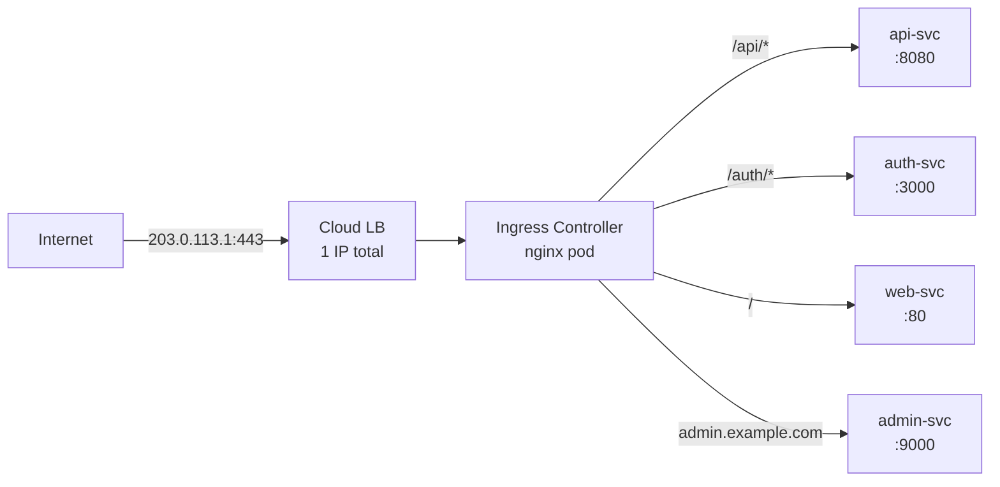

# 6.1 Ingress Controllers and Resources

⏱️ **~5 min read**

> **TL;DR:** Ingress is a two-part system: an **Ingress Controller** (a running pod that does the actual routing) and **Ingress Resources** (YAML rules that tell it where to send traffic). Without an Ingress Controller, Ingress Resources do nothing.

---

## The Problem Ingress Solves

You have 5 microservices. Without Ingress:
- 5 LoadBalancer Services = 5 cloud load balancers = 5 external IPs = 5 monthly bills
- Clients need to know 5 different IPs/ports
- TLS certificates per service = complexity multiplied by 5

With Ingress:
- 1 LoadBalancer Service for the Ingress Controller
- 1 external IP for all services
- All routing rules defined in simple YAML
- TLS terminated once, centrally



---

## The Two Parts

### 1. Ingress Controller

A running pod (or set of pods) that watches Ingress Resources and configures itself to route traffic. It's NOT built into Kubernetes — you install it separately.

Popular controllers:

| Controller | Use Case |
|-----------|----------|
| **NGINX Ingress** | Most widely used; great for Minikube and most production setups |
| **Traefik** | Auto-discovers services; popular with Docker/K8s |
| **HAProxy Ingress** | High-performance TCP/HTTP |
| **Kong** | API gateway features built in |
| **AWS ALB Ingress** | Native AWS Application Load Balancer |
| **GKE Ingress** | Native Google Cloud |

### 2. Ingress Resource

A Kubernetes object (`kind: Ingress`) that declares routing rules. The controller reads these and updates its config:

```yaml
# ingress.yaml
apiVersion: networking.k8s.io/v1
kind: Ingress
metadata:
  name: my-ingress
  annotations:
    nginx.ingress.kubernetes.io/rewrite-target: /
spec:
  ingressClassName: nginx          # Which controller handles this
  rules:
  - host: myapp.example.com
    http:
      paths:
      - path: /api
        pathType: Prefix
        backend:
          service:
            name: api-svc
            port:
              number: 8080
      - path: /
        pathType: Prefix
        backend:
          service:
            name: web-svc
            port:
              number: 80
```

---

## The Ingress Resource Anatomy

```yaml
spec:
  ingressClassName: nginx    # Required in modern K8s (1.18+)
  
  tls:                       # Optional TLS config
  - hosts:
    - myapp.example.com
    secretName: myapp-tls
  
  rules:
  - host: myapp.example.com  # Match by hostname (optional — omit for any host)
    http:
      paths:
      - path: /api           # URL path to match
        pathType: Prefix     # Prefix | Exact | ImplementationSpecific
        backend:
          service:
            name: api-svc    # Route to this Service
            port:
              number: 8080
```

**`pathType` options:**

| PathType | Behavior |
|----------|----------|
| `Prefix` | Matches path and all sub-paths: `/api` matches `/api`, `/api/users`, `/api/v2/...` |
| `Exact` | Exact match only: `/api` matches ONLY `/api`, not `/api/users` |
| `ImplementationSpecific` | Controller-defined behavior (rarely used) |

---

## Key Takeaways

| # | Concept | One-liner |
|---|---------|-----------|
| 1 | Controller ≠ Resource | The controller does the routing; the Resource declares the rules |
| 2 | NGINX Ingress is the default | Most common controller; what Minikube's addon uses |
| 3 | `ingressClassName` is required | Tells which controller owns this Ingress resource |
| 4 | One IP, many services | The whole point — cost savings and simplicity |

---

## ✅ Quick Check

**Q1:** You apply an Ingress Resource but no traffic is routed. What's the most likely cause?

<details>
<summary>Answer</summary>
No Ingress Controller is installed. The Ingress Resource is just a configuration object — it does nothing without a controller watching for it. Check with `kubectl get pods -n ingress-nginx` (for NGINX) to see if the controller pod exists and is running.
</details>

**Q2:** You have two Ingress Controllers installed (NGINX and Traefik). You apply an Ingress without `ingressClassName`. Which controller handles it?

<details>
<summary>Answer</summary>
This is ambiguous — behavior depends on the cluster config. Historically, a cluster-wide default IngressClass could be set. Without it, both controllers may try to handle it (causing conflicts) or neither does. Always specify `ingressClassName` explicitly to avoid ambiguity.
</details>

**Q3:** `pathType: Prefix` with path `/app`. Does this match `/application`?

<details>
<summary>Answer</summary>
No. `Prefix` matches the exact path element, not substring. `/app` as a prefix matches `/app`, `/app/`, `/app/settings`, but NOT `/application`. The match is against path segments separated by `/`, not arbitrary string prefixes.
</details>
