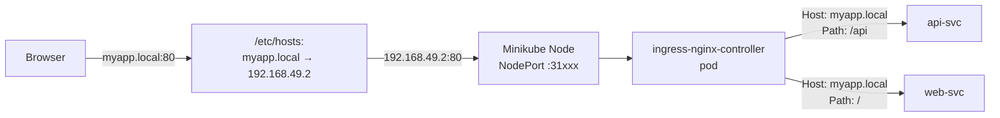

# 6.2 Setting Up NGINX Ingress on Minikube

⏱️ **~5 min read**

> **TL;DR:** One command enables the NGINX Ingress Controller on Minikube. After that, you need a way to reach it — either via `minikube tunnel` or by using Minikube's built-in IP with the NodePort the controller exposes.

---

## Enable the Minikube Ingress Addon

```bash
minikube addons enable ingress
```

**Expected output:**
```
💡  ingress is an addon maintained by Kubernetes. For any concerns contact minikube on GitHub.
You can view the list of minikube maintainers at: https://github.com/kubernetes/minikube/blob/master/OWNERS
    ▪ Using image registry.k8s.io/ingress-nginx/controller:v1.10.x
    ▪ Using image registry.k8s.io/ingress-nginx/kube-webhook-certgen:v1.4.x
    ▪ Using image registry.k8s.io/ingress-nginx/kube-webhook-certgen:v1.4.x
🔎  Verifying ingress addon...
🌟  The 'ingress' addon is enabled
```

---

## Verify It's Running

```bash
# Check the controller pod (takes ~60 seconds to start)
kubectl get pods -n ingress-nginx

# Wait for it to be Ready
kubectl wait --namespace ingress-nginx \
  --for=condition=ready pod \
  --selector=app.kubernetes.io/component=controller \
  --timeout=120s
```

**Expected pod output:**
```
NAME                                        READY   STATUS    RESTARTS   AGE
ingress-nginx-controller-xxxxxxxxx-yyyyy    1/1     Running   0          90s
```

```bash
# See what Services the controller exposes
kubectl get svc -n ingress-nginx
```

**Expected:**
```
NAME                                 TYPE        CLUSTER-IP     EXTERNAL-IP   PORT(S)
ingress-nginx-controller             NodePort    10.96.37.205   <none>        80:31xxx/TCP,443:32xxx/TCP
ingress-nginx-controller-admission   ClusterIP   10.96.88.14    <none>        443/TCP
```

The controller is exposed as a **NodePort** on Minikube, listening on ports 80 and 443.

---

## The IngressClass

When the addon installs, it creates an `IngressClass` named `nginx`:

```bash
kubectl get ingressclass
```

**Expected:**
```
NAME    CONTROLLER             PARAMETERS   AGE
nginx   k8s.io/ingress-nginx   <none>       2m
```

Reference this in your Ingress Resources with `ingressClassName: nginx`.

---

## Accessing Ingress on Minikube

Ingress on Minikube works best by **adding hosts to `/etc/hosts`** pointing to the Minikube IP:

```bash
# Get Minikube's IP
minikube ip
# Output: 192.168.49.2

# Add to /etc/hosts (requires sudo)
echo "$(minikube ip) myapp.local api.local" | sudo tee -a /etc/hosts

# Now these hostnames work:
curl http://myapp.local
curl http://api.local
```

Alternatively — use `--header` with curl to fake the Host header:

```bash
MINIKUBE_IP=$(minikube ip)

# Fake the host header — useful for testing without /etc/hosts
curl -H "Host: myapp.local" http://$MINIKUBE_IP
```

---

## Architecture Overview



---

### Try It — Quick Smoke Test

```bash
# Verify the addon is enabled
minikube addons list | grep ingress

# Deploy a test app
kubectl create deployment smoke-test --image=nginx:1.25
kubectl expose deployment smoke-test --port=80

# Create an Ingress rule
cat <<'EOF' | kubectl apply -f -
apiVersion: networking.k8s.io/v1
kind: Ingress
metadata:
  name: smoke-test-ingress
spec:
  ingressClassName: nginx
  rules:
  - host: smoke.local
    http:
      paths:
      - path: /
        pathType: Prefix
        backend:
          service:
            name: smoke-test
            port:
              number: 80
EOF

# Test with curl (fake host header)
curl -H "Host: smoke.local" http://$(minikube ip)

# Cleanup
kubectl delete deployment smoke-test
kubectl delete svc smoke-test
kubectl delete ingress smoke-test-ingress
```

**Expected:** nginx welcome page HTML.

---

## Key Takeaways

| # | Concept | One-liner |
|---|---------|-----------|
| 1 | `minikube addons enable ingress` | One command installs NGINX Ingress Controller |
| 2 | Controller runs in `ingress-nginx` namespace | Check pod health there, not `default` |
| 3 | IngressClass `nginx` is auto-created | Use `ingressClassName: nginx` in Ingress Resources |
| 4 | Use `/etc/hosts` or `Host:` header | Route custom hostnames to Minikube IP for testing |

---

## ✅ Quick Check

**Q1:** The NGINX Ingress controller pod is in `CrashLoopBackOff`. What happens to existing Ingress Resources?

<details>
<summary>Answer</summary>
Existing traffic routing breaks — no new requests are processed by the Ingress controller. The underlying Services still exist, so direct Service-level access (ClusterIP, NodePort) still works. But all Ingress-based routing fails until the controller recovers.
</details>

**Q2:** Why does Minikube use NodePort for the Ingress controller instead of LoadBalancer?

<details>
<summary>Answer</summary>
Minikube doesn't have a cloud controller by default, so LoadBalancer Services stay in pending state (as we saw in Chapter 5). NodePort lets the controller be accessible on a specific high port on the Minikube node IP. `minikube tunnel` would also work to give it a proper external IP.
</details>

**Q3:** You apply an Ingress with `ingressClassName: traefik` but only have NGINX Ingress installed. What happens?

<details>
<summary>Answer</summary>
The Ingress Resource is created in Kubernetes but never acted on. No controller claims it, so no routing rules are configured. Traffic to the matching hosts/paths goes nowhere. The Ingress will remain in `ADDRESS` empty state indefinitely.
</details>
