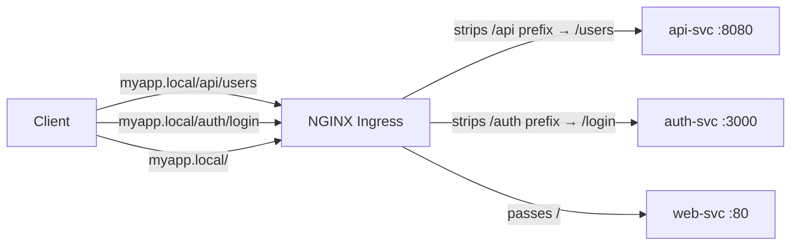

# 6.3 Path-Based and Host-Based Routing

⏱️ **~7 min read**

> **TL;DR:** Ingress supports two routing dimensions: **path-based** (same domain, different URL paths → different services) and **host-based** (different domains → different services). You can combine both in one Ingress resource.

---

## Path-Based Routing

All traffic to the same domain, split by URL path:

```yaml
# path-based-ingress.yaml
apiVersion: networking.k8s.io/v1
kind: Ingress
metadata:
  name: path-routing
  annotations:
    nginx.ingress.kubernetes.io/rewrite-target: /$2    # Strip the path prefix
spec:
  ingressClassName: nginx
  rules:
  - host: myapp.local
    http:
      paths:
      - path: /api(/|$)(.*)
        pathType: ImplementationSpecific
        backend:
          service:
            name: api-svc
            port:
              number: 8080

      - path: /auth(/|$)(.*)
        pathType: ImplementationSpecific
        backend:
          service:
            name: auth-svc
            port:
              number: 3000

      - path: /()(.*)
        pathType: ImplementationSpecific
        backend:
          service:
            name: web-svc
            port:
              number: 80
```



---

## The Rewrite Problem

Without the `rewrite-target` annotation, requests to `/api/users` would hit the backend service as `/api/users`. But your backend probably expects just `/users` — the `/api` prefix is just for Ingress routing.

```
# Without rewrite:
Client → /api/users → api-svc receives: /api/users  ← often breaks

# With rewrite-target: /$2
Client → /api/users → api-svc receives: /users  ← correct
```

The regex `(/|$)(.*)` captures the path after the prefix into group `$2`, and `rewrite-target: /$2` sends just that part to the backend.

> 💡 **Tip:** For simpler cases where your backend CAN handle the full path (e.g., serving at `/api/...`), omit the rewrite annotation entirely and use `pathType: Prefix`.

---

## Simple Path Routing (No Rewrite)

If your services handle the full path, keep it simple:

```yaml
# simple-path-ingress.yaml
apiVersion: networking.k8s.io/v1
kind: Ingress
metadata:
  name: simple-routing
spec:
  ingressClassName: nginx
  rules:
  - host: myapp.local
    http:
      paths:
      - path: /api        # /api and all sub-paths → api-svc
        pathType: Prefix
        backend:
          service:
            name: api-svc
            port:
              number: 8080

      - path: /           # Everything else → web-svc
        pathType: Prefix
        backend:
          service:
            name: web-svc
            port:
              number: 80
```

> ⚠️ **Warning:** Order matters with `Prefix` paths. Always put **more specific paths first** (e.g., `/api` before `/`). NGINX Ingress picks the longest matching path, but listing specific paths first avoids ambiguity.

---

## Host-Based Routing

Route different domains to different services — all on the same IP:

```yaml
# host-based-ingress.yaml
apiVersion: networking.k8s.io/v1
kind: Ingress
metadata:
  name: host-routing
spec:
  ingressClassName: nginx
  rules:
  # Public-facing app
  - host: myapp.local
    http:
      paths:
      - path: /
        pathType: Prefix
        backend:
          service:
            name: web-svc
            port:
              number: 80

  # Admin panel — separate domain
  - host: admin.local
    http:
      paths:
      - path: /
        pathType: Prefix
        backend:
          service:
            name: admin-svc
            port:
              number: 9000

  # API subdomain
  - host: api.local
    http:
      paths:
      - path: /
        pathType: Prefix
        backend:
          service:
            name: api-svc
            port:
              number: 8080
```

The NGINX controller reads the HTTP `Host` header to determine which rule applies.

---

## Combining Path + Host

You can mix both dimensions in one Ingress:

```yaml
spec:
  rules:
  - host: myapp.local            # Specific host
    http:
      paths:
      - path: /api               # AND specific path
        pathType: Prefix
        backend:
          service:
            name: api-svc
            port:
              number: 8080
      - path: /
        pathType: Prefix
        backend:
          service:
            name: web-svc
            port:
              number: 80

  - host: api.myapp.local       # API subdomain — all paths to api-svc
    http:
      paths:
      - path: /
        pathType: Prefix
        backend:
          service:
            name: api-svc
            port:
              number: 8080
```

---

## Default Backend

When no rule matches, you can specify a default backend:

```yaml
spec:
  defaultBackend:           # Catch-all for unmatched requests
    service:
      name: default-404-svc
      port:
        number: 80
  rules:
  - ...
```

Without a `defaultBackend`, NGINX returns its own 404 page for unmatched requests.

---

### Try It

```bash
# Deploy two services
kubectl create deployment app-a --image=nginx:1.25
kubectl create deployment app-b --image=nginx:1.25
kubectl expose deployment app-a --port=80 --name=svc-a
kubectl expose deployment app-b --port=80 --name=svc-b

# Customize their responses so we can tell them apart
kubectl exec -it deploy/app-a -- sh -c "echo 'Service A' > /usr/share/nginx/html/index.html"
kubectl exec -it deploy/app-b -- sh -c "echo 'Service B' > /usr/share/nginx/html/index.html"

# Create a path-based Ingress
cat <<'EOF' | kubectl apply -f -
apiVersion: networking.k8s.io/v1
kind: Ingress
metadata:
  name: path-demo
spec:
  ingressClassName: nginx
  rules:
  - host: demo.local
    http:
      paths:
      - path: /a
        pathType: Prefix
        backend:
          service:
            name: svc-a
            port:
              number: 80
      - path: /b
        pathType: Prefix
        backend:
          service:
            name: svc-b
            port:
              number: 80
EOF

MINIKUBE_IP=$(minikube ip)

# Test path routing
echo "=== /a should go to Service A ==="
curl -s -H "Host: demo.local" http://$MINIKUBE_IP/a

echo "=== /b should go to Service B ==="
curl -s -H "Host: demo.local" http://$MINIKUBE_IP/b

# Cleanup
kubectl delete deployment app-a app-b
kubectl delete svc svc-a svc-b
kubectl delete ingress path-demo
```

---

## Key Takeaways

| # | Concept | One-liner |
|---|---------|-----------|
| 1 | Path routing | Same host, different URL paths → different Services |
| 2 | Host routing | Different `Host` headers → different Services |
| 3 | `rewrite-target` | Strip routing prefix before forwarding to backend |
| 4 | Specificity order | More specific paths should come before catch-alls |
| 5 | `defaultBackend` | Catch-all for unmatched requests |

---

## ✅ Quick Check

**Q1:** You have two Ingress rules: path `/api` and path `/`. A request comes in for `/apikeys`. Which rule matches?

<details>
<summary>Answer</summary>
With `pathType: Prefix`, `/api` does NOT match `/apikeys` — prefix matching is by path segments, not string prefix. So `/apikeys` matches only the `/` rule. If you used `pathType: ImplementationSpecific` with regex, the behavior would depend on the regex used.
</details>

**Q2:** A client sends a request with `Host: unknown.local` — no Ingress rule matches this host. What does the user see?

<details>
<summary>Answer</summary>
The NGINX Ingress Controller returns a 404 or its default backend response (if one is configured). The request doesn't reach any of your application services. If you have a `defaultBackend` defined on the Ingress, that service handles it instead.
</details>

**Q3:** You want `/api/v1/users` and `/api/v2/users` to go to the same backend service. What's the simplest Ingress rule?

<details>
<summary>Answer</summary>
A single rule with `path: /api` and `pathType: Prefix`. This matches `/api`, `/api/v1/users`, `/api/v2/users`, and all other `/api/*` paths — routing them all to the same backend service.
</details>
