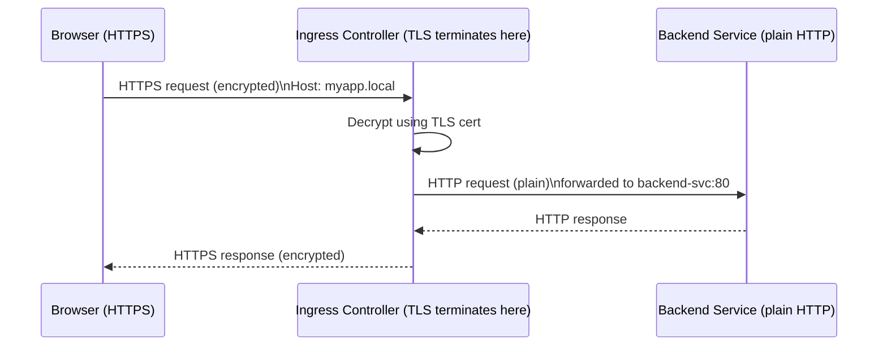

# 6.4 TLS Termination

⏱️ **~6 min read**

> **TL;DR:** The Ingress Controller handles TLS (HTTPS) so your backend services don't have to. You create a TLS Secret containing a certificate and key, reference it in your Ingress, and the controller handles encryption/decryption transparently.

---

## How TLS Termination Works



Your backend pods only ever see plain HTTP. The Ingress Controller handles all the TLS complexity. This is called **TLS termination at the edge**.

---

## Step 1: Create the TLS Secret

You need a certificate and private key. For local dev, generate a self-signed cert:

```bash
# Generate a self-signed certificate (valid for 365 days)
openssl req -x509 -nodes -days 365 \
  -newkey rsa:2048 \
  -keyout tls.key \
  -out tls.crt \
  -subj "/CN=myapp.local/O=myapp" \
  -addext "subjectAltName=DNS:myapp.local,DNS:api.local"

# Create a TLS Secret in Kubernetes
kubectl create secret tls myapp-tls \
  --cert=tls.crt \
  --key=tls.key

# Verify
kubectl get secret myapp-tls
kubectl describe secret myapp-tls
```

**Expected secret output:**
```
Name:         myapp-tls
Namespace:    default
Type:         kubernetes.io/tls

Data
====
tls.crt:  1234 bytes
tls.key:  1679 bytes
```

> ⚠️ **Warning:** Self-signed certificates cause browser "Not Secure" warnings. For production, use [cert-manager](https://cert-manager.io) with Let's Encrypt to get free, auto-renewing trusted certificates.

---

## Step 2: Reference the Secret in Ingress

```yaml
# tls-ingress.yaml
apiVersion: networking.k8s.io/v1
kind: Ingress
metadata:
  name: tls-ingress
  annotations:
    nginx.ingress.kubernetes.io/ssl-redirect: "true"    # Redirect HTTP → HTTPS
spec:
  ingressClassName: nginx
  tls:
  - hosts:
    - myapp.local             # Must match the certificate's CN/SAN
    secretName: myapp-tls     # The TLS Secret created above
  rules:
  - host: myapp.local
    http:
      paths:
      - path: /
        pathType: Prefix
        backend:
          service:
            name: web-svc
            port:
              number: 80
```

The `tls` block tells the controller which certificate to use for which hostname. The `rules` block still uses `http` — it's the *routing rules*, not the protocol. The controller handles the HTTPS→HTTP translation.

---

## HTTP to HTTPS Redirect

The annotation `nginx.ingress.kubernetes.io/ssl-redirect: "true"` makes NGINX automatically redirect any HTTP request to HTTPS:

```
Client: GET http://myapp.local/
Ingress: 301 Redirect → https://myapp.local/
Client: GET https://myapp.local/ (now HTTPS)
Ingress: 200 OK (TLS terminated, forwarded to backend as HTTP)
```

Without this annotation, both HTTP and HTTPS work simultaneously.

---

## Multiple Domains, Multiple Certs

You can have multiple TLS entries for different domains:

```yaml
spec:
  tls:
  - hosts:
    - myapp.local
    secretName: myapp-tls        # cert for myapp.local

  - hosts:
    - admin.local
    secretName: admin-tls        # separate cert for admin.local

  rules:
  - host: myapp.local
    http:
      paths: [...]
  - host: admin.local
    http:
      paths: [...]
```

---

## In Production: cert-manager + Let's Encrypt

For production, never use self-signed certs. The standard setup:

```yaml
# With cert-manager installed, just add this annotation:
metadata:
  annotations:
    cert-manager.io/cluster-issuer: "letsencrypt-prod"

spec:
  tls:
  - hosts:
    - myapp.example.com
    secretName: myapp-tls     # cert-manager creates and rotates this automatically
```

cert-manager watches Ingress Resources with this annotation, requests certificates from Let's Encrypt, stores them as Secrets, and automatically rotates them before expiry. Zero manual cert management.

---

### Try It

```bash
# Generate a self-signed cert
openssl req -x509 -nodes -days 365 \
  -newkey rsa:2048 \
  -keyout /tmp/tls.key \
  -out /tmp/tls.crt \
  -subj "/CN=tls-demo.local/O=demo" \
  2>/dev/null

# Create the Secret
kubectl create secret tls demo-tls \
  --cert=/tmp/tls.crt \
  --key=/tmp/tls.key

# Deploy a test app
kubectl create deployment tls-app --image=nginx:1.25
kubectl expose deployment tls-app --port=80 --name=tls-svc

# Create TLS Ingress
cat <<'EOF' | kubectl apply -f -
apiVersion: networking.k8s.io/v1
kind: Ingress
metadata:
  name: tls-demo
  annotations:
    nginx.ingress.kubernetes.io/ssl-redirect: "true"
spec:
  ingressClassName: nginx
  tls:
  - hosts:
    - tls-demo.local
    secretName: demo-tls
  rules:
  - host: tls-demo.local
    http:
      paths:
      - path: /
        pathType: Prefix
        backend:
          service:
            name: tls-svc
            port:
              number: 80
EOF

MINIKUBE_IP=$(minikube ip)

# Test HTTP → HTTPS redirect
curl -v -H "Host: tls-demo.local" http://$MINIKUBE_IP 2>&1 | grep -E "< HTTP|Location"

# Test HTTPS directly (skip cert verification since self-signed)
curl -k -s -H "Host: tls-demo.local" https://$MINIKUBE_IP

# Cleanup
kubectl delete deployment tls-app
kubectl delete svc tls-svc
kubectl delete ingress tls-demo
kubectl delete secret demo-tls
```

**Expected redirect output:**
```
< HTTP/1.1 308 Permanent Redirect
Location: https://tls-demo.local/
```

---

## Key Takeaways

| # | Concept | One-liner |
|---|---------|-----------|
| 1 | TLS termination at the controller | Backends only see plain HTTP |
| 2 | `kubernetes.io/tls` Secret | Holds `tls.crt` + `tls.key` |
| 3 | `ssl-redirect` annotation | Automatically redirects HTTP → HTTPS |
| 4 | cert-manager for production | Auto-provisions and rotates Let's Encrypt certs |

---

## ✅ Quick Check

**Q1:** Your TLS certificate is for `myapp.example.com` but your Ingress `host` is `app.example.com`. What happens?

<details>
<summary>Answer</summary>
NGINX serves the certificate anyway, but browsers will show a certificate error — the cert's Common Name and Subject Alternative Names don't match the hostname. Users see "Your connection is not private." Always ensure the certificate's CN/SAN matches the Ingress host exactly.
</details>

**Q2:** You enable `ssl-redirect: true`. A client sends a plain HTTP request. What response do they get?

<details>
<summary>Answer</summary>
A `308 Permanent Redirect` to the HTTPS version of the same URL. The browser (or curl) then follows the redirect to the HTTPS endpoint. 308 is used instead of 301 because 308 preserves the HTTP method (important for POST requests).
</details>

**Q3:** Your TLS Secret's certificate expires. What happens to traffic?

<details>
<summary>Answer</summary>
HTTPS traffic continues to work but browsers show certificate expiry warnings and may block the connection. The Ingress controller keeps serving the expired cert — Kubernetes doesn't automatically rotate TLS Secrets. This is exactly why cert-manager with Let's Encrypt is essential in production: it auto-rotates certs before they expire.
</details>
