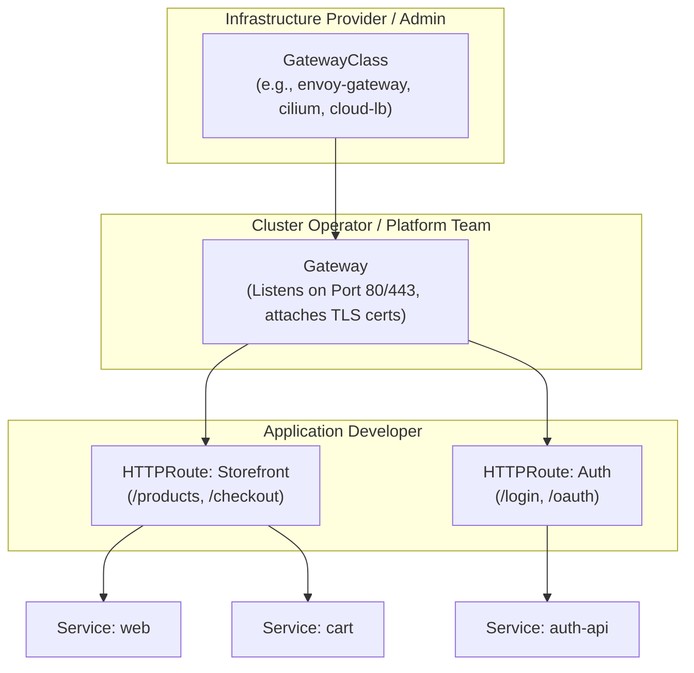

# 6.5 The Kubernetes Gateway API

⏱️ **6 min read · 6 min hands-on** · 🟡 Intermediate

> **TL;DR:** The Gateway API is the modern, role-oriented successor to Ingress (GA since Kubernetes 1.26+). It separates infrastructure provisioning (`GatewayClass`), cluster ingress points (`Gateway`), and application routing (`HTTPRoute`, `GRPCRoute`) across team roles, natively supporting advanced traffic management like header matching, traffic splitting, and multi-tenancy.

> **After this section you will be able to:**
> - Explain why the Kubernetes Gateway API was created to succeed the Ingress API
> - Understand the three core Gateway API resources (`GatewayClass`, `Gateway`, `HTTPRoute`) and their role separation
> - Write and configure an `HTTPRoute` for path/header routing and traffic splitting

---

## Why Gateway API? The Ingress Bottleneck

The original `Ingress` resource created in 2015 had fundamental architectural limitations:

1. **Monolithic Role Model:** A single `Ingress` YAML combined infrastructure concerns (TLS certificates, hostnames, IP allocations) with application routing rules. In multi-tenant teams, developers couldn't configure routes without risking cluster-wide ingress misconfigurations.
2. **Annotation Proliferation:** Because `Ingress` lacked native support for weighted routing, header-based canary releases, request redirects, and URL rewrites, vendors filled the void with non-standard annotations (`nginx.ingress.kubernetes.io/...`, `traefik.ingress...`). This broke portability across cloud providers.
3. **HTTP-Only Design:** Standard Ingress only handled HTTP/HTTPS. TCP, UDP, and gRPC required vendor-specific extensions.

The **Gateway API** (`gateway.networking.k8s.io`) redesigns routing from the ground up using expressive, role-oriented Custom Resource Definitions (CRDs).

---

## The Role-Oriented Resource Model

Gateway API structures routing responsibilities across three distinct personas:



| Resource | Managed By | Responsibility |
|----------|------------|----------------|
| **`GatewayClass`** | Cluster Admin / Cloud | Defines the controller template (e.g. Istio, Envoy, AWS VPC Lattice, Cilium). |
| **`Gateway`** | Platform / Ops Team | Requests a load balancer IP, opens ports (80, 443), binds TLS secrets, and defines which namespaces may attach routes. |
| **`HTTPRoute` / `GRPCRoute`** | App Developers | Defines paths, header filters, traffic splits, and connects to target backend Services. |

---

## Comparison: Ingress vs. Gateway API

| Feature | Classic Ingress | Gateway API |
|---------|-----------------|-------------|
| **API Status** | Maintenance / Legacy | Active Standard (GA in K8s 1.26+) |
| **Multi-Tenancy** | Weak (all in one object or global conflicts) | Strong (cross-namespace route attachment) |
| **Traffic Splitting (Canary)** | Vendor-specific annotations | First-class native spec (`weight: 90` / `weight: 10`) |
| **Header Matching** | Custom annotations | Built-in standard syntax |
| **Supported Protocols** | HTTP, HTTPS | HTTP, HTTPS, gRPC, TCP, UDP, TLS passthrough |
| **Portability** | Low (heavy vendor annotations) | High (standardized conformant implementations) |

---

## Declarative Example: Gateway & HTTPRoute

### Step 1: The Platform Team Provisions the Gateway

```yaml
apiVersion: gateway.networking.k8s.io/v1
kind: Gateway
metadata:
  name: prod-gateway
  namespace: infra-gateway
spec:
  gatewayClassName: eg # e.g., Envoy Gateway, NGINX Gateway, or cloud controller
  listeners:
  - name: https
    protocol: HTTPS
    port: 443
    tls:
      mode: Terminate
      certificateRefs:
      - kind: Secret
        name: production-wildcard-tls
    allowedRoutes:
      namespaces:
        from: All # Allows dev namespaces to attach routes
```

### Step 2: The Application Team Deploys an HTTPRoute with Canary Splitting

```yaml
apiVersion: gateway.networking.k8s.io/v1
kind: HTTPRoute
metadata:
  name: product-service-route
  namespace: e-commerce
spec:
  parentRefs:
  - name: prod-gateway
    namespace: infra-gateway
  hostnames:
  - "shop.example.com"
  rules:
  - matches:
    - path:
        type: PathPrefix
        value: /api/products
    backendRefs:
    - name: product-v1-svc
      port: 8080
      weight: 90
    - name: product-v2-svc # 10% Canary release
      port: 8080
      weight: 10
```

Notice how clean the traffic splitting is: no annotation hacks, just pure, standardized declarative Kubernetes specifications.

---

## ✅ Quick Check

**Q1:** How does Gateway API solve the permission conflict between platform teams and developers?

<details>
<summary>Answer</summary>
By separating the <code>Gateway</code> (which configures IP addresses, open ports, and TLS certs) from the <code>HTTPRoute</code> (which configures URL path matching and backend services). The platform team controls the Gateway in an infrastructure namespace, while application developers create HTTPRoutes in their own project namespaces and attach them to the shared Gateway via <code>parentRefs</code>.
</details>

**Q2:** Can an `HTTPRoute` in the `payments` namespace attach to a `Gateway` in the `ingress-system` namespace?

<details>
<summary>Answer</summary>
Yes, provided the <code>Gateway</code>'s listener explicitly permits cross-namespace attachment via <code>allowedRoutes.namespaces.from</code> (e.g., <code>from: All</code> or <code>from: Selector</code>). This cross-namespace reference model enables secure multi-tenancy.
</details>
