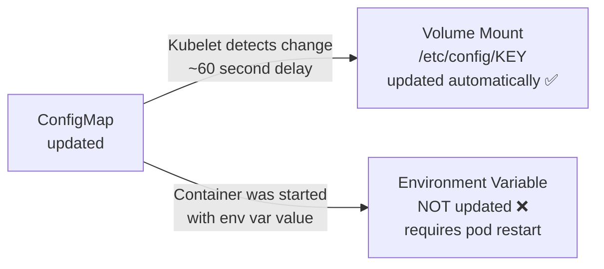

# 7.3 Environment Variables vs Volume Mounts

⏱️ **~5 min read**

> **TL;DR:** You can inject ConfigMap/Secret data into pods as environment variables (simple, but static) or as file mounts (more powerful, support live updates). Choose based on whether your app reads config from env vars or files.

---

## Method 1: Environment Variables

### Inject specific keys

```yaml
spec:
  containers:
  - name: app
    image: myapp:latest
    env:
    # From a ConfigMap key
    - name: DB_HOST
      valueFrom:
        configMapKeyRef:
          name: app-config       # ConfigMap name
          key: DB_HOST           # Key inside ConfigMap

    # From a Secret key
    - name: DB_PASSWORD
      valueFrom:
        secretKeyRef:
          name: db-credentials   # Secret name
          key: password          # Key inside Secret

    # Plain static value (for reference)
    - name: APP_VERSION
      value: "1.2.3"
```

### Inject ALL keys from a ConfigMap/Secret

```yaml
spec:
  containers:
  - name: app
    image: myapp:latest
    envFrom:
    - configMapRef:
        name: app-config       # All keys become env vars
    - secretRef:
        name: db-credentials   # All keys become env vars
```

```bash
# Inside the pod — all ConfigMap keys are env vars
kubectl exec -it my-pod -- env | grep -E "DB_HOST|LOG_LEVEL|MAX_CONN"
```

**Env var limitations:**
- Static at container start — updates to ConfigMap/Secret require pod restart
- If a key doesn't exist in the ConfigMap, the pod fails to start
- All keys from `envFrom` become env vars — potential for name collisions

---

## Method 2: Volume Mounts

Mount ConfigMaps and Secrets as files in the container's filesystem:

```yaml
spec:
  volumes:
  # ConfigMap as a volume
  - name: config-volume
    configMap:
      name: app-config          # Each key becomes a file

  # Secret as a volume
  - name: secret-volume
    secret:
      secretName: db-credentials
      defaultMode: 0400          # File permissions (owner read-only)

  containers:
  - name: app
    image: myapp:latest
    volumeMounts:
    - name: config-volume
      mountPath: /etc/config    # ConfigMap keys appear as files here
    - name: secret-volume
      mountPath: /etc/secrets   # Secret keys appear as files here
      readOnly: true
```

Inside the container:
```
/etc/config/
  DB_HOST          ← contains "postgres-svc"
  LOG_LEVEL        ← contains "info"
  app.properties   ← contains the multi-line properties content

/etc/secrets/
  username         ← contains "admin"
  password         ← contains "s3cr3t!"
```

---

## Mounting Specific Keys as Files

Mount only specific keys, with custom filenames:

```yaml
volumes:
- name: config-volume
  configMap:
    name: app-config
    items:
    - key: app.properties       # ConfigMap key
      path: application.properties  # File name inside the mount
    - key: nginx.conf
      path: nginx/nginx.conf    # Nested path
```

---

## The Critical Difference: Live Updates



| | Env Vars | Volume Mounts |
|---|---|---|
| Setup complexity | Low | Medium |
| Live config updates | ❌ No — pod restart needed | ✅ Yes — ~60s propagation |
| Access pattern | `os.getenv("KEY")` | Read file at `/etc/config/KEY` |
| Secret security | ⚠️ Appears in `env` output | ✅ File, not env — less exposure |
| Binary data support | ❌ No | ✅ Yes (via `binaryData`) |

> 💡 **Tip:** For secrets especially, prefer volume mounts over env vars. A compromised process can dump all env vars trivially (`os.environ` in Python, `process.env` in Node.js). Reading a file requires explicit code. It's a small but meaningful security improvement.

---

### Try It

```bash
# Create both a ConfigMap and a Secret
cat <<'EOF' | kubectl apply -f -
apiVersion: v1
kind: ConfigMap
metadata:
  name: demo-config
data:
  APP_ENV: production
  LOG_LEVEL: info
  config.json: |
    {"timeout": 30, "retries": 3}
---
apiVersion: v1
kind: Secret
metadata:
  name: demo-secret
type: Opaque
stringData:
  DB_PASSWORD: "supersecret"
  API_KEY: "key-12345"
EOF

# Pod using BOTH env vars and volume mounts
cat <<'EOF' | kubectl apply -f -
apiVersion: v1
kind: Pod
metadata:
  name: config-demo
spec:
  volumes:
  - name: config-vol
    configMap:
      name: demo-config
  - name: secret-vol
    secret:
      secretName: demo-secret
      defaultMode: 0400
  containers:
  - name: app
    image: busybox
    command: ["sh", "-c", "sleep 3600"]
    env:
    - name: APP_ENV
      valueFrom:
        configMapKeyRef:
          name: demo-config
          key: APP_ENV
    - name: DB_PASSWORD
      valueFrom:
        secretKeyRef:
          name: demo-secret
          key: DB_PASSWORD
    volumeMounts:
    - name: config-vol
      mountPath: /etc/config
    - name: secret-vol
      mountPath: /etc/secrets
      readOnly: true
    resources:
      limits:
        memory: "32Mi"
        cpu: "50m"
EOF

kubectl wait pod config-demo --for=condition=Ready --timeout=30s

# Check env vars
kubectl exec config-demo -- env | grep -E "APP_ENV|DB_PASSWORD"

# Check volume-mounted files
kubectl exec config-demo -- ls /etc/config/
kubectl exec config-demo -- cat /etc/config/config.json

kubectl exec config-demo -- ls /etc/secrets/
kubectl exec config-demo -- cat /etc/secrets/API_KEY

# Cleanup
kubectl delete pod config-demo
kubectl delete configmap demo-config
kubectl delete secret demo-secret
```

---

## Key Takeaways

| # | Concept | One-liner |
|---|---------|-----------|
| 1 | Env vars from ConfigMap | `configMapKeyRef` for specific keys, `configMapRef` for all |
| 2 | Volume mounts = files | Each ConfigMap/Secret key becomes a file in the mount path |
| 3 | Live updates | Only volume mounts update without pod restart |
| 4 | Secrets as files | Prefer over env vars for sensitive data |
| 5 | `defaultMode: 0400` | Set file permissions on Secret mounts |

---

## ✅ Quick Check

**Q1:** Your app reads config from environment variables. You update a ConfigMap. What must you do to apply the new config?

<details>
<summary>Answer</summary>
Trigger a rolling restart of the Deployment: `kubectl rollout restart deployment/my-app`. This creates new pods that start with the updated environment variables from the ConfigMap. The old pods are terminated in a rolling fashion.
</details>

**Q2:** You mount a ConfigMap as a volume. The ConfigMap has 5 keys. How many files appear in the mount directory?

<details>
<summary>Answer</summary>
5 files — one per key. The key name becomes the filename, and the key's value becomes the file content. If you only want specific keys mounted, use the `items` field to select which keys to include and optionally rename them.
</details>

**Q3:** A pod has `envFrom: - secretRef: name: my-secret`. The Secret has a key `MY_SECRET_VALUE`. Another env var in the same pod is also named `MY_SECRET_VALUE`. Which one wins?

<details>
<summary>Answer</summary>
An explicitly defined `env` entry wins over `envFrom`. The order of precedence is: explicit `env` > `envFrom`. This lets you override specific values from a bulk-imported ConfigMap/Secret without modifying the source object.
</details>
