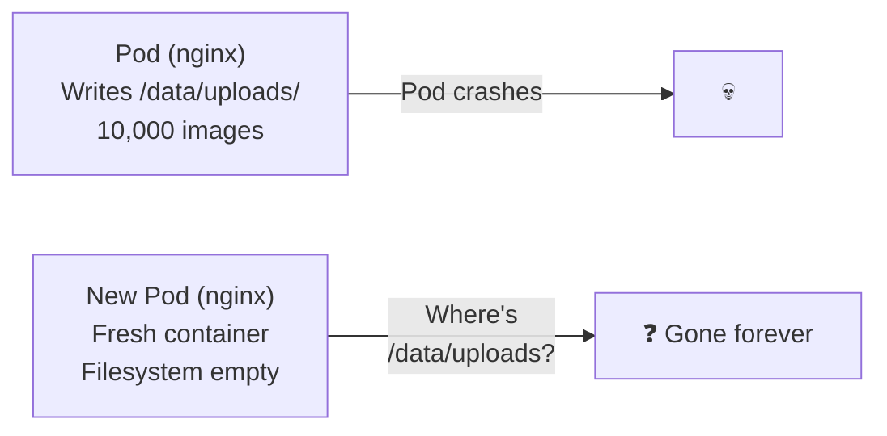

# 8.1 The Storage Problem and Volume Types

⏱️ **5 min read · 5 min hands-on** · 🟡 Intermediate

> **TL;DR:** Container filesystems are ephemeral — they vanish when the container restarts. Kubernetes Volumes solve this by attaching external storage to pods. There are many volume types; knowing which to use when is the skill.

> **After this section you will be able to:**
> - Explain why container filesystems are ephemeral and require external volume storage
> - Utilize `emptyDir` volumes for temporary scratch space and container data sharing
> - Understand `hostPath` risks and cloud block storage volume abstractions

---

## The Ephemeral Filesystem Problem



Any data written inside a container lives only as long as the container lives. This is by design — it makes containers stateless and reproducible. But databases, file storage, and caches *need* persistence.

> 🔗 **Docker Parallel:** In Docker/Compose, you use bind mounts (`./data:/data`) or named volumes (`myvolume:/data`). Kubernetes has equivalents — `hostPath` (like bind mount) and PersistentVolumes (like named volumes, but cluster-managed).

---

## Volume Types — The Menu

Kubernetes supports many volume types. Here are the ones you'll actually use:

| Volume Type | What It Is | Use Case |
|-------------|-----------|----------|
| `emptyDir` | Temporary dir, lives with the pod | Sharing data between containers in a pod (sidecar, init) |
| `hostPath` | Mounts a directory from the node | DaemonSets, single-node dev — avoid in production |
| `configMap` / `secret` | K8s objects as files | Inject config and credentials (Chapter 7) |
| `persistentVolumeClaim` | Dynamically provisioned storage | Databases, file stores — the standard production approach |
| `nfs` | Network File System | Shared read-write storage across nodes |
| `csi` | Container Storage Interface plugin | Cloud block storage (AWS EBS, GCP PD, Azure Disk) |

---

## `emptyDir` — Ephemeral Shared Storage

You've already seen this in Chapter 3 (sidecar pattern). Quick recap:

```yaml
spec:
  volumes:
  - name: shared-data
    emptyDir: {}          # Created when pod starts, deleted when pod dies
    # emptyDir:
    #   medium: Memory    # Store in RAM instead of disk (faster, uses node RAM)
    #   sizeLimit: 500Mi  # Limit how much storage it can use

  containers:
  - name: writer
    volumeMounts:
    - name: shared-data
      mountPath: /data
  - name: reader
    volumeMounts:
    - name: shared-data
      mountPath: /shared
```

`emptyDir` survives container restarts within the same pod — but is deleted if the pod is rescheduled to another node.

---

## `hostPath` — Node Filesystem Mount

```yaml
spec:
  volumes:
  - name: node-logs
    hostPath:
      path: /var/log          # Actual directory on the node
      type: Directory         # Must exist | DirectoryOrCreate | File | Socket

  containers:
  - name: log-reader
    volumeMounts:
    - name: node-logs
      mountPath: /logs
```

> ⚠️ **Warning:** `hostPath` volumes are tied to a specific node. If the pod is rescheduled to a different node, it sees a different (empty or different-content) directory. Only use for DaemonSets (always on the same node) or single-node Minikube development.

---

## The Standard Path: PersistentVolumeClaims

For anything beyond ephemeral sharing or DaemonSets, use PersistentVolumeClaims (PVCs). The PVC abstracts the actual storage backend — whether it's an EBS volume, NFS server, or Minikube's local storage:

```yaml
spec:
  volumes:
  - name: data
    persistentVolumeClaim:
      claimName: my-pvc     # Reference a PVC by name

  containers:
  - name: database
    volumeMounts:
    - name: data
      mountPath: /var/lib/postgresql/data
```

The PVC is covered in detail in the next section.

---

## Key Takeaways

| # | Concept | One-liner |
|---|---------|-----------|
| 1 | Container filesystem is ephemeral | Data gone when container restarts |
| 2 | `emptyDir` = pod-lifetime storage | Survives container restart, not pod rescheduling |
| 3 | `hostPath` = node directory | Use only for DaemonSets or single-node dev |
| 4 | PVC = the production answer | Abstracts cloud/NFS/local storage behind a claim |

---

## ✅ Quick Check

**Q1:** An nginx pod writes uploaded files to `/tmp/uploads`. The pod crashes and is restarted by the ReplicaSet controller. Are the uploaded files still there?

<details>
<summary>Answer</summary>
No. `/tmp/uploads` is part of the container's writable layer — a plain directory in the container's ephemeral filesystem. When the container restarts, it gets a fresh filesystem from the image. All uploaded files are gone. To persist them, mount a PersistentVolumeClaim at `/tmp/uploads`.
</details>

**Q2:** Two containers in the same pod need to share files. Which volume type is appropriate?

<details>
<summary>Answer</summary>
`emptyDir`. It's created when the pod starts and shared between all containers that mount it. It's the canonical way to share files between sidecar containers. Use `medium: Memory` if you need very fast shared storage (at the cost of node RAM).
</details>

**Q3:** You have a DaemonSet that collects logs from `/var/log` on each node. Which volume type do you use?

<details>
<summary>Answer</summary>
`hostPath`. DaemonSets run exactly one pod per node, so there's no risk of the pod being rescheduled to a different node. `hostPath` is the correct and standard choice for DaemonSets that need access to the node's local filesystem (logs, container runtime sockets, etc.).
</details>
