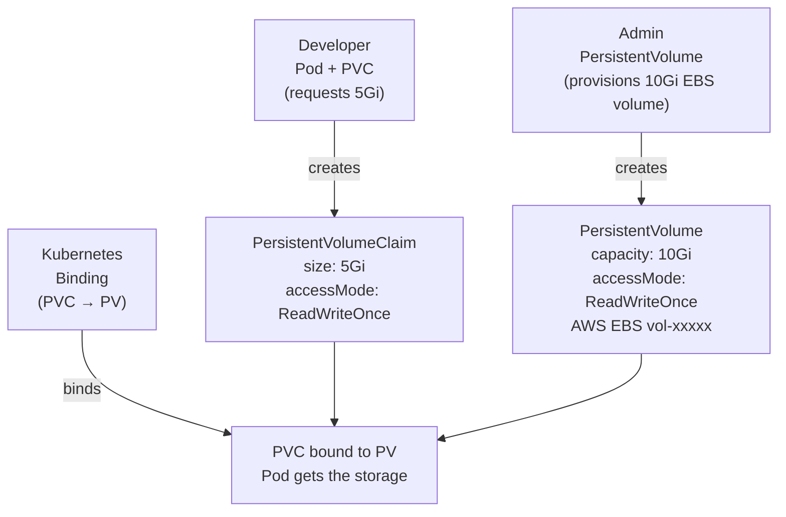
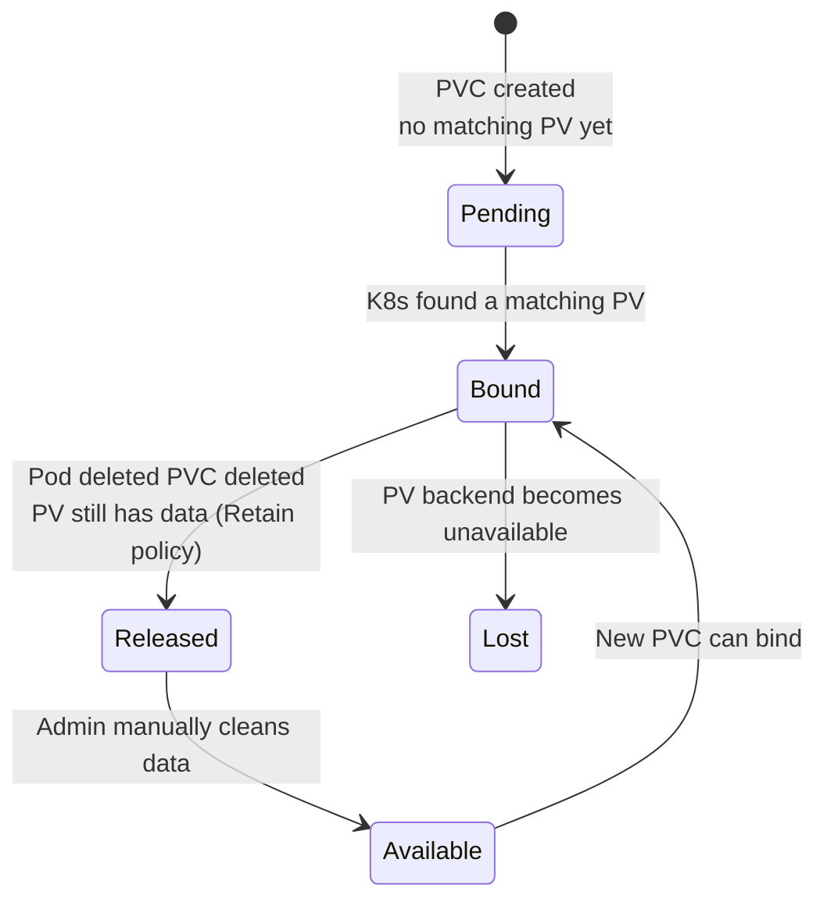

# 8.2 PersistentVolumes and PersistentVolumeClaims

⏱️ **6 min read · 7 min hands-on** · 🟡 Intermediate

> **TL;DR:** A PersistentVolume (PV) is a piece of actual storage provisioned by an admin. A PersistentVolumeClaim (PVC) is a pod's request for storage. Kubernetes binds PVCs to PVs automatically. In practice, StorageClasses (next section) eliminate the need to create PVs manually.

> **After this section you will be able to:**
> - Understand the separation of concerns between PersistentVolumes (admin) and PVCs (developer)
> - Trace the binding lifecycle from PVC creation to PV matching and pod mounting
> - Inspect bound volume statuses and storage allocation parameters

---

## The Three-Layer Model



- **PV** = the actual storage resource (an EBS volume, NFS export, etc.)
- **PVC** = a request for storage, written by the developer
- **Binding** = Kubernetes matches a PVC to a compatible PV

> 🔗 **Docker Parallel:** A PV is like a named Docker volume that exists on the host. A PVC is like a container's `volumes:` request for that named volume. The difference: Kubernetes manages the matching automatically.

---

## PersistentVolume (Manual Provisioning)

Admins create PVs to represent physical storage:

```yaml
# pv.yaml — Admin-managed
apiVersion: v1
kind: PersistentVolume
metadata:
  name: postgres-pv
spec:
  capacity:
    storage: 10Gi
  accessModes:
  - ReadWriteOnce              # One node can mount read-write
  persistentVolumeReclaimPolicy: Retain   # Keep data after PVC deleted
  storageClassName: manual     # Label for matching with PVCs

  # The actual storage backend:
  hostPath:                    # Minikube dev only
    path: /mnt/postgres-data
  # In production, this would be:
  # awsElasticBlockStore:
  #   volumeID: vol-0abcd1234
  #   fsType: ext4
```

---

## PersistentVolumeClaim (Developer-Facing)

Pods don't reference PVs directly — they reference PVCs:

```yaml
# pvc.yaml — Developer-managed
apiVersion: v1
kind: PersistentVolumeClaim
metadata:
  name: postgres-pvc
spec:
  accessModes:
  - ReadWriteOnce
  storageClassName: manual     # Must match a PV's storageClassName
  resources:
    requests:
      storage: 5Gi             # Request 5Gi from the pool of PVs
```

```bash
kubectl apply -f pv.yaml
kubectl apply -f pvc.yaml

# Kubernetes binds them automatically
kubectl get pv,pvc
```

**Expected output:**
```
NAME                           CAPACITY   ACCESS MODES   RECLAIM POLICY   STATUS   CLAIM
persistentvolume/postgres-pv   10Gi       RWO            Retain           Bound    default/postgres-pvc

NAME                                 STATUS   VOLUME        CAPACITY   ACCESS MODES
persistentvolumeclaim/postgres-pvc   Bound    postgres-pv   10Gi       RWO
```

The PVC requested 5Gi but was bound to a 10Gi PV — PVs can be larger than the claim, but not smaller.

---

## Using the PVC in a Pod

```yaml
# pod-with-pvc.yaml
apiVersion: v1
kind: Pod
metadata:
  name: postgres
spec:
  volumes:
  - name: data
    persistentVolumeClaim:
      claimName: postgres-pvc   # Reference the PVC by name

  containers:
  - name: postgres
    image: postgres:16
    env:
    - name: POSTGRES_PASSWORD
      value: "password"
    - name: PGDATA
      value: /var/lib/postgresql/data/pgdata
    volumeMounts:
    - name: data
      mountPath: /var/lib/postgresql/data
```

---

## PVC Lifecycle States



```bash
# Check PVC status
kubectl get pvc postgres-pvc

# STATUS column:
# Pending  → waiting for a PV
# Bound    → matched and ready to use
# Lost     → the underlying PV disappeared
```

---

## When PVC is Pending

The most common issue: a PVC stays `Pending` forever.

```bash
# Find out why
kubectl describe pvc my-pvc | grep -A10 "Events:"
```

Typical causes:
- No PV with matching `storageClassName` exists
- No PV with sufficient capacity (PVC requests 10Gi, only 5Gi PVs available)
- No PV with matching `accessModes`
- StorageClass doesn't exist or its provisioner isn't running

---

### Try It

```bash
# Create a PV backed by hostPath (Minikube only)
cat <<'EOF' | kubectl apply -f -
apiVersion: v1
kind: PersistentVolume
metadata:
  name: demo-pv
spec:
  capacity:
    storage: 1Gi
  accessModes:
  - ReadWriteOnce
  persistentVolumeReclaimPolicy: Delete
  storageClassName: manual
  hostPath:
    path: /tmp/demo-pv-data
---
apiVersion: v1
kind: PersistentVolumeClaim
metadata:
  name: demo-pvc
spec:
  accessModes:
  - ReadWriteOnce
  storageClassName: manual
  resources:
    requests:
      storage: 500Mi
EOF

# Check binding
kubectl get pv,pvc

# Use it in a pod
cat <<'EOF' | kubectl apply -f -
apiVersion: v1
kind: Pod
metadata:
  name: pvc-writer
spec:
  volumes:
  - name: data
    persistentVolumeClaim:
      claimName: demo-pvc
  containers:
  - name: writer
    image: busybox
    command: ["sh", "-c", "echo 'Hello from PVC!' > /data/test.txt && sleep 3600"]
    volumeMounts:
    - name: data
      mountPath: /data
    resources:
      limits:
        memory: "16Mi"
        cpu: "50m"
EOF

kubectl wait pod pvc-writer --for=condition=Ready --timeout=30s
kubectl exec pvc-writer -- cat /data/test.txt

# Delete the pod — data survives!
kubectl delete pod pvc-writer

# Recreate — data still there
kubectl apply -f - <<'EOF'
apiVersion: v1
kind: Pod
metadata:
  name: pvc-reader
spec:
  volumes:
  - name: data
    persistentVolumeClaim:
      claimName: demo-pvc
  containers:
  - name: reader
    image: busybox
    command: ["sh", "-c", "cat /data/test.txt && sleep 60"]
    volumeMounts:
    - name: data
      mountPath: /data
    resources:
      limits:
        memory: "16Mi"
        cpu: "50m"
EOF

kubectl wait pod pvc-reader --for=condition=Ready --timeout=30s
kubectl logs pvc-reader  # "Hello from PVC!" — data survived pod deletion!

# Cleanup
kubectl delete pod pvc-reader
kubectl delete pvc demo-pvc
kubectl delete pv demo-pv
```

---

## Key Takeaways

| # | Concept | One-liner |
|---|---------|-----------|
| 1 | PV = physical storage | Admin-provisioned; represents real disk |
| 2 | PVC = storage request | Developer-written; K8s binds it to a PV |
| 3 | Data survives pod deletion | The PV/PVC live independently of pods |
| 4 | PVC `Pending` = no matching PV | Check storageClass, capacity, and accessMode |

---

## ✅ Quick Check

**Q1:** A PVC requests `500Mi` but the only available PV has `1Gi`. Is the binding successful?

<details>
<summary>Answer</summary>
Yes — a PV can satisfy a PVC as long as the PV's capacity is **equal or greater** than what the PVC requests, and the other constraints (storageClassName, accessModes) also match. The PVC gets bound to the 1Gi PV, and the extra 500Mi is "wasted" (not usable by other PVCs since the PV is now bound).
</details>

**Q2:** You delete a pod that uses a PVC. Is the PVC deleted?

<details>
<summary>Answer</summary>
No. PVCs and pods have independent lifecycles. Deleting a pod doesn't delete its PVC, and the underlying PV data is preserved. You must explicitly delete the PVC with `kubectl delete pvc my-pvc`. This prevents accidental data loss.
</details>

**Q3:** Two pods in the same namespace try to use the same PVC with `accessMode: ReadWriteOnce`. What happens?

<details>
<summary>Answer</summary>
Only one pod can use a `ReadWriteOnce` PVC at a time — from a single node. If both pods are scheduled to the same node, both can mount it. If they're on different nodes, the second pod will fail to mount it. For multi-node multi-pod access, you need `ReadWriteMany` (requires NFS or compatible storage backend).
</details>
