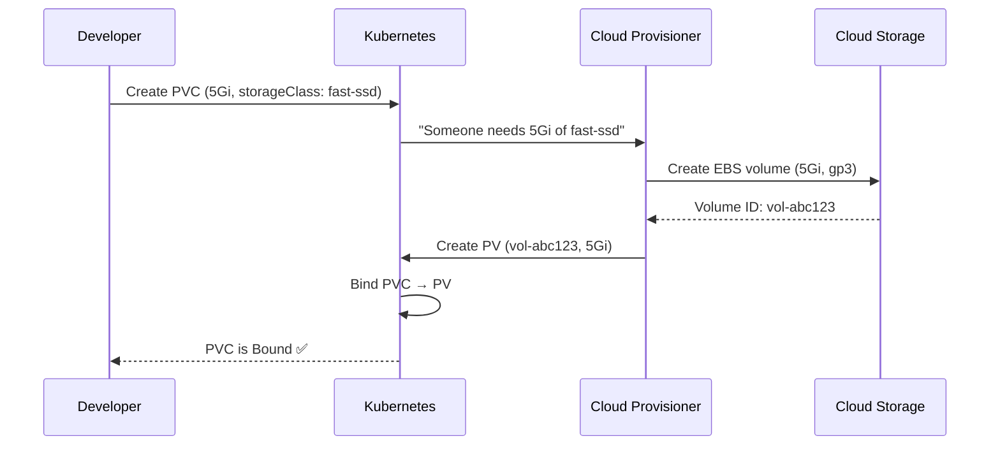

# 8.3 StorageClasses and Dynamic Provisioning

⏱️ **5 min read · 6 min hands-on** · 🟡 Intermediate

> **TL;DR:** Instead of admins creating PVs by hand, a StorageClass tells Kubernetes how to **automatically** provision storage on demand. When a PVC is created, the StorageClass's provisioner creates the backing volume automatically. This is how every major cloud Kubernetes offering works.

> **After this section you will be able to:**
> - Enable dynamic volume provisioning using StorageClasses and volume provisioners
> - Configure volume expansion capabilities and `volumeBindingMode: WaitForFirstConsumer`
> - Differentiate between cloud storage tiers (SSD vs HDD) via distinct StorageClasses

---

## The Problem with Manual PVs

Manual provisioning doesn't scale:
- Admin creates 10 PVs → developer creates 10 PVCs → bindings happen
- If a PVC needs 7Gi but only 5Gi PVs exist → stuck
- Admin must predict future storage needs
- Every cloud environment needs different PV specs

StorageClasses solve this with **on-demand provisioning**.

---

## StorageClass YAML

```yaml
# storageclass.yaml
apiVersion: storage.k8s.io/v1
kind: StorageClass
metadata:
  name: fast-ssd
provisioner: kubernetes.io/aws-ebs    # Which plugin creates the volumes
parameters:
  type: gp3                           # Storage type (provider-specific)
  fsType: ext4
  encrypted: "true"
reclaimPolicy: Delete                 # Delete volume when PVC is deleted
allowVolumeExpansion: true            # Allow PVCs to grow (not shrink)
volumeBindingMode: WaitForFirstConsumer  # Create volume only when pod is scheduled
```

**Popular provisioners:**

| Cloud | Provisioner | Storage Type |
|-------|-------------|-------------|
| AWS EKS | `ebs.csi.aws.com` | gp3/io2 EBS volumes |
| GKE | `pd.csi.storage.gke.io` | Standard/SSD Persistent Disks |
| AKS | `disk.csi.azure.com` | Azure Managed Disks |
| Minikube | `k8s.io/minikube-hostpath` | Local hostPath (dev only) |
| On-premise | `rancher.io/local-path` | Node-local storage |

---

## How Dynamic Provisioning Works



The developer writes a 5-line PVC YAML. Everything else is automatic.

---

## Default StorageClass

Most clusters have a default StorageClass. If a PVC omits `storageClassName`, it uses the default:

```bash
# See StorageClasses in your cluster
kubectl get storageclass

# On Minikube:
# NAME                 PROVISIONER                RECLAIMPOLICY   VOLUMEBINDINGMODE
# standard (default)   k8s.io/minikube-hostpath   Delete          Immediate
```

The `(default)` annotation means PVCs without a `storageClassName` use this class automatically.

```bash
# See which StorageClass is marked default
kubectl get storageclass -o jsonpath='{range .items[?(@.metadata.annotations.storageclass\.kubernetes\.io/is-default-class=="true")]}{.metadata.name}{"\n"}{end}'
```

---

## Dynamic Provisioning in Practice

With dynamic provisioning, you only write the PVC — no PV needed:

```yaml
# dynamic-pvc.yaml — No PV required, StorageClass handles it
apiVersion: v1
kind: PersistentVolumeClaim
metadata:
  name: database-storage
spec:
  accessModes:
  - ReadWriteOnce
  storageClassName: standard    # Minikube default (or fast-ssd in cloud)
  resources:
    requests:
      storage: 5Gi
```

```bash
kubectl apply -f dynamic-pvc.yaml

# A PV is automatically created and bound
kubectl get pv,pvc
```

---

## `volumeBindingMode: WaitForFirstConsumer`

A critical setting for cloud clusters:

```yaml
volumeBindingMode: Immediate         # Create volume NOW when PVC is created
volumeBindingMode: WaitForFirstConsumer  # Create volume only when a pod using the PVC is scheduled
```

**Why `WaitForFirstConsumer` matters:**

Cloud block storage (EBS, Azure Disk) is zone-specific. If the volume is created in `us-east-1a` but your pod gets scheduled to `us-east-1b`, the pod can't attach the volume.

With `WaitForFirstConsumer`, Kubernetes waits until it knows which node (and zone) the pod will run on, then creates the volume in that same zone.

> 🏭 **In Production:** Always use `WaitForFirstConsumer` for cloud block storage StorageClasses. `Immediate` can cause unschedulable pods in multi-zone clusters.

---

### Try It

```bash
# See Minikube's default StorageClass
kubectl get storageclass

# Create a PVC without specifying storageClassName (uses default)
cat <<'EOF' | kubectl apply -f -
apiVersion: v1
kind: PersistentVolumeClaim
metadata:
  name: dynamic-pvc
spec:
  accessModes:
  - ReadWriteOnce
  resources:
    requests:
      storage: 256Mi
EOF

# A PV was created automatically!
kubectl get pv,pvc

# See the auto-created PV details
kubectl describe pvc dynamic-pvc | grep -E "StorageClass|Volume:|Capacity"

# Use it
cat <<'EOF' | kubectl apply -f -
apiVersion: v1
kind: Pod
metadata:
  name: dynamic-test
spec:
  volumes:
  - name: data
    persistentVolumeClaim:
      claimName: dynamic-pvc
  containers:
  - name: app
    image: busybox
    command: ["sh", "-c", "echo 'Dynamic provisioning works!' > /data/test.txt && sleep 60"]
    volumeMounts:
    - name: data
      mountPath: /data
    resources:
      limits:
        memory: "16Mi"
        cpu: "50m"
EOF

kubectl wait pod dynamic-test --for=condition=Ready --timeout=30s
kubectl exec dynamic-test -- cat /data/test.txt

# Cleanup
kubectl delete pod dynamic-test
kubectl delete pvc dynamic-pvc
# PV is deleted automatically (reclaimPolicy: Delete)
kubectl get pv  # Should be gone
```

---

## Key Takeaways

| # | Concept | One-liner |
|---|---------|-----------|
| 1 | StorageClass = provisioner config | Tells K8s HOW to create volumes on demand |
| 2 | Dynamic provisioning | PVC created → storage provisioned automatically |
| 3 | Default StorageClass | PVCs without `storageClassName` use it |
| 4 | `WaitForFirstConsumer` | Prevents zone-mismatch issues in multi-zone clouds |

---

## ✅ Quick Check

**Q1:** You delete a PVC backed by a StorageClass with `reclaimPolicy: Delete`. What happens to the data?

<details>
<summary>Answer</summary>
The underlying PersistentVolume and the actual storage (e.g., EBS volume) are deleted automatically. The data is gone. This is why `Delete` is the default for cloud storage — it prevents orphaned (and paid-for) volumes. Use `reclaimPolicy: Retain` if you want to preserve data after a PVC is deleted.
</details>

**Q2:** A PVC in `Pending` state has `storageClassName: fast-ssd`. No StorageClass named `fast-ssd` exists. Will Kubernetes use the default StorageClass?

<details>
<summary>Answer</summary>
No. When you explicitly specify `storageClassName`, Kubernetes looks only for that specific class. If it doesn't exist, the PVC stays in `Pending` indefinitely. The default StorageClass is only used when `storageClassName` is omitted entirely (or set to `""`).
</details>

**Q3:** Can you resize a PVC from 5Gi to 10Gi after it's bound?

<details>
<summary>Answer</summary>
Only if the StorageClass has `allowVolumeExpansion: true`. Edit the PVC's `resources.requests.storage` to the new size — Kubernetes will expand the underlying volume. You may need to restart the pod for the filesystem resize to take effect inside the container. Note: shrinking PVCs is not supported.
</details>
