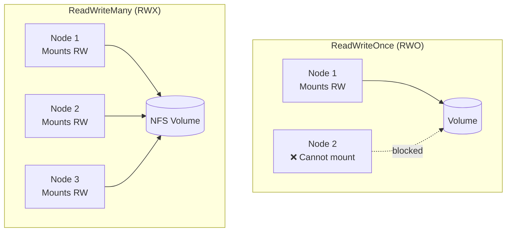
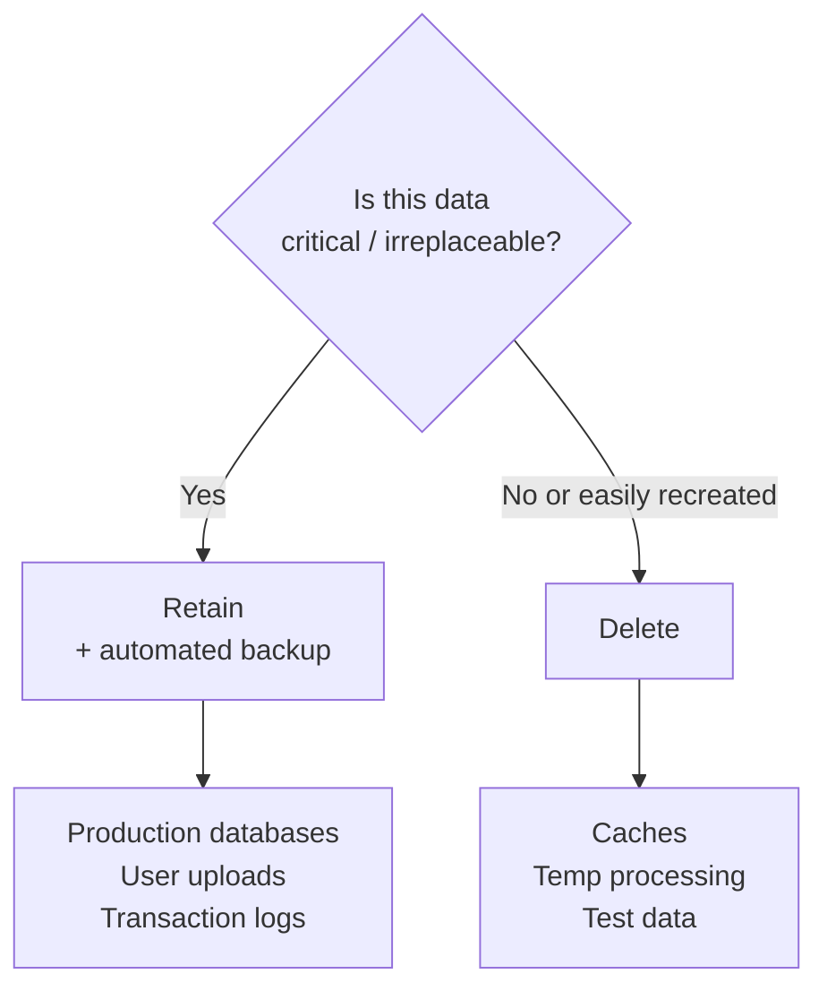

# 8.4 Access Modes and Reclaim Policies

⏱️ **~5 min read**

> **TL;DR:** Access modes define how many nodes can mount a volume simultaneously. Reclaim policies define what happens to the underlying storage when a PVC is deleted. Getting these right prevents both data loss and runaway cloud costs.

---

## Access Modes

| Mode | Short | Meaning | Storage Type |
|------|-------|---------|-------------|
| `ReadWriteOnce` | RWO | One node can mount read-write | Cloud block storage (EBS, Azure Disk) |
| `ReadOnlyMany` | ROX | Multiple nodes can mount read-only | S3-backed, shared config |
| `ReadWriteMany` | RWX | Multiple nodes can mount read-write | NFS, CephFS, Azure Files |
| `ReadWriteOncePod` | RWOP | One **pod** (not just one node) read-write | High-security single-writer scenarios |



**The practical reality:**
- `ReadWriteOnce` — works for almost all databases and single-replica apps
- `ReadWriteMany` — needed only for shared file storage across multiple pods on different nodes; requires NFS or cloud file storage
- Most cloud block storage (EBS, Azure Disk, GCP PD) is **RWO only**

```yaml
spec:
  accessModes:
  - ReadWriteOnce    # Most common — put in a list even for a single mode
```

---

## What Happens with Multiple Pods on the Same Node

`ReadWriteOnce` is per-**node**, not per-pod. Multiple pods on the **same node** can all mount the same RWO volume:

```
Node 1:
  pod-a → /data (mounted RWO) ✅
  pod-b → /data (same volume, same node) ✅

Node 2:
  pod-c → /data (different node) ❌ blocked
```

This is why StatefulSets use `volumeClaimTemplates` — each pod gets its OWN PVC. They don't share a single RWO volume across nodes.

---

## Reclaim Policies

When a PVC is deleted, what happens to the PV and its data?

| Policy | Behavior | Use Case |
|--------|----------|----------|
| `Delete` | PV and underlying storage deleted | Default for dynamically provisioned; avoids orphaned cloud volumes |
| `Retain` | PV stays (in Released state); data preserved | Production databases; manual cleanup required |
| `Recycle` | Deprecated — basic scrub then make available again | Don't use |

```yaml
# In PV spec (for manually created PVs):
spec:
  persistentVolumeReclaimPolicy: Retain

# In StorageClass (for dynamically provisioned):
reclaimPolicy: Delete
```

---

## Choosing the Right Policy



> ⚠️ **Warning:** `reclaimPolicy: Delete` with a production database is a common disaster scenario. A developer runs `kubectl delete pvc prod-db-pvc` thinking it's a dev environment — the EBS volume and all its data are gone instantly, with no recycle bin. Always use `Retain` for production databases.

---

## The Retain Workflow (After PVC Deletion)

With `Retain`, the PV enters `Released` state. To reuse it:

```bash
# 1. PVC was deleted — PV is now Released
kubectl get pv
# STATUS: Released

# 2. Recover data (copy off the volume before doing anything)

# 3. To allow a new PVC to bind this PV:
kubectl patch pv my-pv -p '{"spec":{"claimRef":null}}'
# Now the PV is Available again

# 4. Create a new PVC that matches this PV's storageClass and capacity
```

In practice, most teams use `Retain` + a separate backup strategy (Velero, pg_dump, etc.) rather than trying to rebind old PVs.

---

## Checking PV Status

```bash
# Full PV status overview
kubectl get pv

# Detailed info on a specific PV
kubectl describe pv my-pv

# Check which PVC is bound to a PV
kubectl get pv -o jsonpath='{range .items[*]}{.metadata.name}{"\t"}{.status.phase}{"\t"}{.spec.claimRef.name}{"\n"}{end}'
```

**PV Status phases:**

| Status | Meaning |
|--------|---------|
| `Available` | Ready to be claimed |
| `Bound` | Claimed by a PVC |
| `Released` | PVC deleted; data still exists (Retain policy) |
| `Failed` | Automatic reclamation failed |

---

### Try It

```bash
# Create a PV with Retain policy
cat <<'EOF' | kubectl apply -f -
apiVersion: v1
kind: PersistentVolume
metadata:
  name: retain-demo-pv
spec:
  capacity:
    storage: 100Mi
  accessModes:
  - ReadWriteOnce
  persistentVolumeReclaimPolicy: Retain
  storageClassName: manual
  hostPath:
    path: /tmp/retain-demo
---
apiVersion: v1
kind: PersistentVolumeClaim
metadata:
  name: retain-demo-pvc
spec:
  accessModes:
  - ReadWriteOnce
  storageClassName: manual
  resources:
    requests:
      storage: 100Mi
EOF

kubectl get pv,pvc

# Write data
cat <<'EOF' | kubectl apply -f -
apiVersion: v1
kind: Pod
metadata:
  name: retain-writer
spec:
  volumes:
  - name: data
    persistentVolumeClaim:
      claimName: retain-demo-pvc
  containers:
  - name: w
    image: busybox
    command: ["sh", "-c", "echo 'Important data!' > /data/important.txt && sleep 10"]
    volumeMounts:
    - name: data
      mountPath: /data
    resources:
      limits:
        memory: "16Mi"
        cpu: "50m"
EOF

kubectl wait pod retain-writer --for=condition=Ready --timeout=30s
kubectl exec retain-writer -- cat /data/important.txt
kubectl delete pod retain-writer

# Delete the PVC
kubectl delete pvc retain-demo-pvc

# PV is now Released — NOT deleted
kubectl get pv retain-demo-pv
# STATUS: Released  ← data preserved on disk

# The actual data is still on the node
minikube ssh "cat /tmp/retain-demo/important.txt"

# Cleanup
kubectl delete pv retain-demo-pv
```

---

## Key Takeaways

| # | Concept | One-liner |
|---|---------|-----------|
| 1 | RWO = one node at a time | Most cloud block storage; fine for single-replica apps |
| 2 | RWX = multi-node shared | Requires NFS/CephFS; for multi-replica shared storage |
| 3 | `Delete` policy = risky | Default; auto-deletes data when PVC deleted |
| 4 | `Retain` for production | Data survives PVC deletion; manual cleanup required |

---

## ✅ Quick Check

**Q1:** A Deployment with 3 replicas uses a single PVC with `accessMode: ReadWriteOnce`. All 3 pods are on the same node. Does this work?

<details>
<summary>Answer</summary>
Yes — RWO is per-node, not per-pod. Multiple pods on the same node can all mount the same RWO volume simultaneously. However, if the Deployment ever scales or reschedules pods to other nodes, those pods will fail to mount the volume. For multi-node deployments that need shared storage, use RWX.
</details>

**Q2:** You have `reclaimPolicy: Delete` on your production PostgreSQL PVC. A junior developer runs `kubectl delete pvc postgres-data`. What's the damage?

<details>
<summary>Answer</summary>
Total data loss. With `reclaimPolicy: Delete`, the EBS volume (or other backing storage) is permanently deleted the moment the PVC is deleted. There is no undo. This is one of the most common and catastrophic mistakes in Kubernetes operations. Solution: use `Retain` policy and enable RBAC to prevent unauthorized PVC deletion.
</details>

**Q3:** Can you change a PV's `reclaimPolicy` after it's created?

<details>
<summary>Answer</summary>
Yes — patch the PV: `kubectl patch pv my-pv -p '{"spec":{"persistentVolumeReclaimPolicy":"Retain"}}'`. This is useful when you realize a production PV was accidentally created with `Delete` policy — fix it before any PVC deletions happen.
</details>
