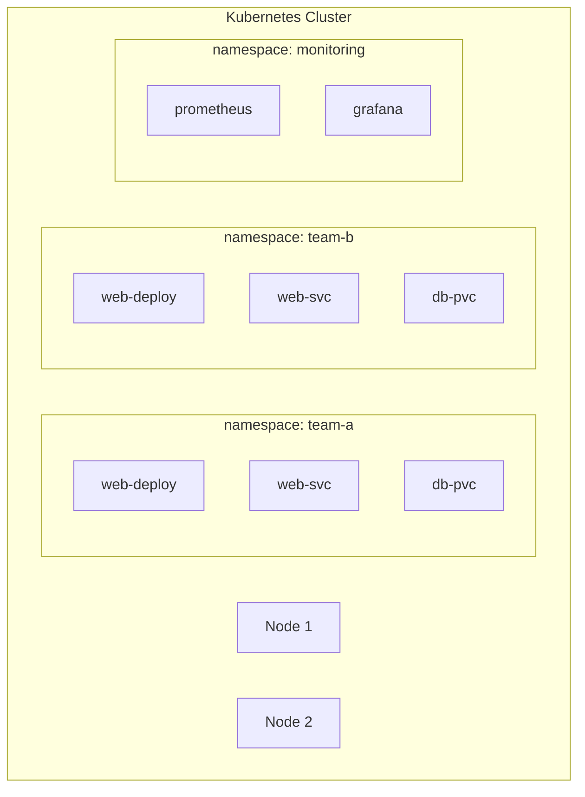

# 9.1 Namespaces — Cluster Partitioning

⏱️ **5 min read · 5 min hands-on** · 🟡 Intermediate

> **TL;DR:** A namespace is a virtual cluster inside a physical cluster. Resources in different namespaces are isolated by name but share the same underlying nodes and networking. Use namespaces to separate teams, environments, or applications.

> **After this section you will be able to:**
> - Partition cluster resources logically across teams and environments using Namespaces
> - Understand what namespaces isolate (names, quotas) and what they do not (networks, nodes)
> - Apply namespace-level resource quotas and limit ranges

---

## What Namespaces Do (and Don't) Isolate



**Namespaces isolate:**
- Resource names (two `web-svc` Services can coexist in different namespaces)
- RBAC policies (permissions are namespace-scoped)
- Resource quotas and limits
- Network policies (with a CNI that supports them)

**Namespaces do NOT isolate:**
- Nodes — all pods share the same node pool
- Node-level resources (CPU, RAM) — workloads from all namespaces compete
- Network traffic by default — cross-namespace pod communication is allowed

---

## System Namespaces

```bash
kubectl get namespaces
```

**Default namespaces every cluster starts with:**

| Namespace | Purpose |
|-----------|---------|
| `default` | Where resources go if you don't specify a namespace |
| `kube-system` | Kubernetes system components (CoreDNS, kube-proxy, etc.) |
| `kube-public` | Publicly readable (ConfigMap with cluster info) |
| `kube-node-lease` | Node heartbeat objects |

> ⚠️ **Warning:** Never deploy your own applications into `kube-system`. If you break something there, the entire cluster's control plane can be affected.

---

## Namespace-Scoped vs Cluster-Scoped Resources

Not everything lives in a namespace:

| Namespace-Scoped | Cluster-Scoped |
|-----------------|----------------|
| Pods, Deployments, Services | Nodes |
| ConfigMaps, Secrets | PersistentVolumes |
| PVCs | StorageClasses |
| Roles, RoleBindings | ClusterRoles, ClusterRoleBindings |
| Ingress | IngressClass |

```bash
# Check if a resource type is namespace-scoped
kubectl api-resources --namespaced=true    # Namespace-scoped
kubectl api-resources --namespaced=false   # Cluster-scoped
```

---

## Creating and Using Namespaces

```bash
# Create
kubectl create namespace team-a

# Declarative (preferred)
cat <<'EOF' | kubectl apply -f -
apiVersion: v1
kind: Namespace
metadata:
  name: team-b
  labels:
    team: b
    environment: production
EOF

# Switch default namespace in your context
kubectl config set-context --current --namespace=team-a

# Or use -n per command
kubectl get pods -n kube-system

# See all resources in all namespaces
kubectl get pods -A        # Short for --all-namespaces
kubectl get deploy -A
```

---

## Namespace Resource Quotas

Prevent one team's namespace from consuming all cluster resources:

```yaml
# resource-quota.yaml
apiVersion: v1
kind: ResourceQuota
metadata:
  name: team-quota
  namespace: team-a
spec:
  hard:
    requests.cpu: "4"           # Total CPU requests in namespace
    requests.memory: 4Gi        # Total memory requests
    limits.cpu: "8"             # Total CPU limits
    limits.memory: 8Gi          # Total memory limits
    pods: "20"                  # Max number of pods
    services: "10"              # Max number of Services
    persistentvolumeclaims: "5" # Max PVCs
```

```bash
kubectl apply -f resource-quota.yaml

# See current usage vs quota
kubectl describe resourcequota team-quota -n team-a
```

---

### Try It

```bash
# Create two namespaces
kubectl create namespace team-a
kubectl create namespace team-b

# Create same-named resources in each — no conflict
kubectl run nginx --image=nginx:1.25 -n team-a
kubectl run nginx --image=nginx:1.25 -n team-b

# Both exist independently
kubectl get pods -n team-a
kubectl get pods -n team-b

# Cross-namespace DNS still works (Service required for DNS)
# From a pod in team-a:
# curl http://my-svc.team-b.svc.cluster.local

# Cleanup
kubectl delete namespace team-a team-b
```

---

## Key Takeaways

| # | Concept | One-liner |
|---|---------|-----------|
| 1 | Namespace = virtual cluster | Name isolation; RBAC scope; quota boundaries |
| 2 | Network is NOT isolated by default | Cross-namespace pod traffic is allowed without NetworkPolicy |
| 3 | Nodes and PVs are cluster-scoped | They exist outside any namespace |
| 4 | ResourceQuota limits namespace consumption | Prevents noisy-neighbor resource exhaustion |

---

## ✅ Quick Check

**Q1:** Team A's `web-svc` Service is in namespace `team-a`. Team B's pod needs to reach it. What DNS name do they use?

<details>
<summary>Answer</summary>
`web-svc.team-a.svc.cluster.local` — the full DNS name includes the namespace. The short form `web-svc` would only resolve to a Service named `web-svc` in team-b's own namespace.
</details>

**Q2:** You apply a ResourceQuota to namespace `dev` with `pods: "5"`. A developer tries to create a 6th pod. What happens?

<details>
<summary>Answer</summary>
The API server rejects the request with an error: `"pods" exceeded quota`. The 6th pod is never created. The developer must delete an existing pod or request a quota increase from the cluster admin.
</details>

**Q3:** Can you move a running pod from one namespace to another?

<details>
<summary>Answer</summary>
No. Namespace is immutable — you cannot change a pod's namespace after creation. To "move" a pod to another namespace, you delete it in the old namespace and create a new one in the target namespace. The same applies to all namespace-scoped resources.
</details>
