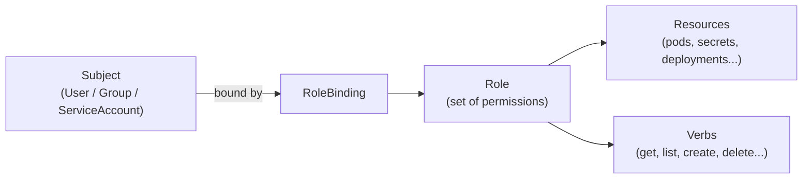

# 9.2 RBAC — Roles, ClusterRoles, and Bindings

⏱️ **~8 min read**

> **TL;DR:** RBAC (Role-Based Access Control) controls who can do what on which resources. A **Role** defines permissions. A **RoleBinding** says "this user/group/serviceaccount gets those permissions." It's the primary security mechanism for controlling kubectl access.

---

## The RBAC Model



Four object types:

| Object | Scope | Purpose |
|--------|-------|---------|
| `Role` | Namespace | Permissions within one namespace |
| `ClusterRole` | Cluster | Permissions cluster-wide (or reusable across namespaces) |
| `RoleBinding` | Namespace | Grants a Role/ClusterRole to a subject in one namespace |
| `ClusterRoleBinding` | Cluster | Grants a ClusterRole to a subject cluster-wide |

---

## Role — Define Permissions

```yaml
# role.yaml
apiVersion: rbac.authorization.k8s.io/v1
kind: Role
metadata:
  name: pod-reader
  namespace: team-a       # Only applies within team-a namespace
rules:
- apiGroups: [""]         # "" = core API group (pods, services, configmaps)
  resources: ["pods", "pods/log"]
  verbs: ["get", "list", "watch"]
  
- apiGroups: ["apps"]     # apps API group (deployments, replicasets)
  resources: ["deployments"]
  verbs: ["get", "list"]
```

**Available verbs:**

| Verb | HTTP Method | Meaning |
|------|------------|---------|
| `get` | GET | Read a single resource |
| `list` | GET (collection) | List all resources of a type |
| `watch` | GET (streaming) | Stream updates to resources |
| `create` | POST | Create a new resource |
| `update` | PUT | Replace an existing resource |
| `patch` | PATCH | Partially update a resource |
| `delete` | DELETE | Delete a resource |
| `deletecollection` | DELETE (collection) | Delete multiple resources |

**`apiGroups` reference:**

```bash
# Find the API group for a resource
kubectl api-resources | grep deployment
# NAME          SHORTNAMES  APIVERSION   NAMESPACED  KIND
# deployments   deploy      apps/v1      true        Deployment
#                           ^^^^
#                           apiGroup = "apps"

kubectl api-resources | grep pod
# pods   po   v1    true   Pod
#              ^
#              v1 = core group → apiGroups: [""]
```

---

## ClusterRole — Cluster-Wide or Reusable

```yaml
# clusterrole.yaml
apiVersion: rbac.authorization.k8s.io/v1
kind: ClusterRole
metadata:
  name: node-reader           # No namespace — cluster-scoped
rules:
- apiGroups: [""]
  resources: ["nodes"]        # Nodes are cluster-scoped
  verbs: ["get", "list", "watch"]
- apiGroups: [""]
  resources: ["namespaces"]
  verbs: ["get", "list"]
```

ClusterRoles can also be bound per-namespace via a **RoleBinding** (not ClusterRoleBinding) — useful for defining common permission sets once and reusing them:

```yaml
# Bind the ClusterRole "view" to a user, but only in namespace "team-a"
kind: RoleBinding          # ← RoleBinding, not ClusterRoleBinding
subjects:
- kind: User
  name: alice
roleRef:
  kind: ClusterRole        # ← References a ClusterRole
  name: view               # Built-in ClusterRole
```

---

## RoleBinding — Grant Permissions

```yaml
# rolebinding.yaml
apiVersion: rbac.authorization.k8s.io/v1
kind: RoleBinding
metadata:
  name: alice-pod-reader
  namespace: team-a         # Only applies in team-a
subjects:
- kind: User               # User | Group | ServiceAccount
  name: alice              # The username
  apiGroup: rbac.authorization.k8s.io

roleRef:
  kind: Role               # Role | ClusterRole
  name: pod-reader         # Must exist in same namespace (for Role)
  apiGroup: rbac.authorization.k8s.io
```

**Subject kinds:**

```yaml
# User (human)
- kind: User
  name: alice
  apiGroup: rbac.authorization.k8s.io

# Group (all users in a group)
- kind: Group
  name: team-a-developers
  apiGroup: rbac.authorization.k8s.io

# ServiceAccount (for pods — covered in section 9.3)
- kind: ServiceAccount
  name: my-service-account
  namespace: team-a         # ServiceAccounts are namespaced
```

---

## Built-in ClusterRoles

Kubernetes ships with useful ClusterRoles you can reuse:

| ClusterRole | What It Allows |
|-------------|----------------|
| `view` | Read-only access to most resources |
| `edit` | Read-write access to most resources (not Roles/RoleBindings) |
| `admin` | Full access within a namespace, including Roles |
| `cluster-admin` | Full access to everything — equivalent to root |

```bash
# Grant a user read-only access to a specific namespace
kubectl create rolebinding alice-viewer \
  --clusterrole=view \
  --user=alice \
  --namespace=team-a

# Grant cluster-admin to a user (use with extreme caution)
kubectl create clusterrolebinding alice-admin \
  --clusterrole=cluster-admin \
  --user=alice
```

---

## Checking Permissions

```bash
# Can I do this?
kubectl auth can-i get pods --namespace=team-a
# yes

# Can another user do this?
kubectl auth can-i get secrets --namespace=team-a --as=alice
# no

# What can alice do?
kubectl auth can-i --list --as=alice --namespace=team-a

# Audit: see all RoleBindings in a namespace
kubectl get rolebindings -n team-a -o wide
kubectl get clusterrolebindings -o wide | grep alice
```

---

### Try It

```bash
kubectl create namespace rbac-demo

# Create a Role that allows reading pods only
cat <<'EOF' | kubectl apply -f -
apiVersion: rbac.authorization.k8s.io/v1
kind: Role
metadata:
  name: pod-reader
  namespace: rbac-demo
rules:
- apiGroups: [""]
  resources: ["pods"]
  verbs: ["get", "list", "watch"]
---
apiVersion: rbac.authorization.k8s.io/v1
kind: RoleBinding
metadata:
  name: test-user-pod-reader
  namespace: rbac-demo
subjects:
- kind: User
  name: test-user
  apiGroup: rbac.authorization.k8s.io
roleRef:
  kind: Role
  name: pod-reader
  apiGroup: rbac.authorization.k8s.io
EOF

# Check what test-user can do
kubectl auth can-i get pods --namespace=rbac-demo --as=test-user       # yes
kubectl auth can-i delete pods --namespace=rbac-demo --as=test-user    # no
kubectl auth can-i get secrets --namespace=rbac-demo --as=test-user    # no
kubectl auth can-i get pods --namespace=default --as=test-user         # no (only in rbac-demo)

# Cleanup
kubectl delete namespace rbac-demo
```

---

## Key Takeaways

| # | Concept | One-liner |
|---|---------|-----------|
| 1 | Role = permission set | Defines what verbs on what resources |
| 2 | RoleBinding = assignment | Gives a Role to a subject in a namespace |
| 3 | ClusterRole = reusable | Same as Role but cluster-scoped or namespace-reusable |
| 4 | Built-in roles | `view`/`edit`/`admin`/`cluster-admin` cover most needs |
| 5 | `kubectl auth can-i` | Test permissions before and after applying RBAC |

---

## ✅ Quick Check

**Q1:** You want a pod to be able to list ConfigMaps in its own namespace. What subject type do you use in the RoleBinding?

<details>
<summary>Answer</summary>
`ServiceAccount` — pods have ServiceAccount identities, not User identities. Create a ServiceAccount, create a Role with `configmaps: ["get","list"]`, bind them with a RoleBinding, and set the pod's `serviceAccountName` to the ServiceAccount. Covered in detail in section 9.3.
</details>

**Q2:** You grant a user the `view` ClusterRole via a **ClusterRoleBinding**. What can they see?

<details>
<summary>Answer</summary>
Everything in every namespace — all pods, services, deployments, configmaps, etc. (read-only). ClusterRoleBinding + ClusterRole = cluster-wide permissions. If you want to limit them to one namespace, use a **RoleBinding** (not ClusterRoleBinding) that references the same `view` ClusterRole.
</details>

**Q3:** A developer accidentally deletes a production Deployment. You add `delete` to their Role's allowed verbs list after the fact. What should you actually do?

<details>
<summary>Answer</summary>
Remove `delete` from their Role (or use the `view` ClusterRole which has no write permissions). Apply the principle of least privilege — developers shouldn't have `delete` on production resources. Use separate clusters or namespaces for production with stricter RBAC, and implement admission webhooks or OPA policies to add a confirmation layer for destructive operations.
</details>
