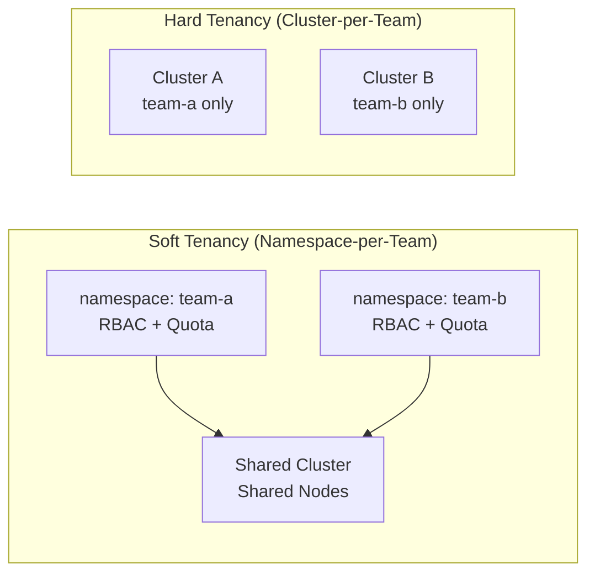

# 9.4 Multi-Tenancy Patterns

⏱️ **~5 min read**

> **TL;DR:** Multi-tenancy means multiple teams or customers share one cluster safely. The standard Kubernetes approach uses namespaces + RBAC + ResourceQuotas + NetworkPolicy. For stronger isolation, use separate clusters.

---

## Isolation Levels



| Isolation Level | Mechanism | Security | Cost | Use When |
|----------------|-----------|----------|------|----------|
| **Soft** | Namespace + RBAC + Quota | Medium | Low | Internal teams; trusted users |
| **Hard** | Separate clusters | High | High | Different customers; regulatory boundaries |
| **vCluster** | Virtual cluster per tenant | High | Medium | SaaS platforms needing k8s API isolation |

---

## The Namespace-Per-Team Pattern

The most common production approach:

```yaml
# Per-team namespace with labels
apiVersion: v1
kind: Namespace
metadata:
  name: team-payments
  labels:
    team: payments
    environment: production
    cost-center: "123"
```

For each namespace, apply the standard set:

```
namespace/team-payments
├── ResourceQuota       ← CPU/memory/pod limits
├── LimitRange          ← Default requests/limits for pods without them
├── NetworkPolicy       ← Block cross-team traffic
├── Role + RoleBinding  ← Team-specific permissions
└── ServiceAccount      ← Per-team app identity
```

---

## LimitRange — Default Resource Bounds

ResourceQuota limits the total for a namespace. LimitRange sets defaults for individual pods that forget to set resources:

```yaml
# limitrange.yaml
apiVersion: v1
kind: LimitRange
metadata:
  name: default-limits
  namespace: team-payments
spec:
  limits:
  - type: Container
    default:              # Applied if container has no limits
      cpu: "500m"
      memory: "256Mi"
    defaultRequest:       # Applied if container has no requests
      cpu: "100m"
      memory: "128Mi"
    max:                  # No container in this namespace can exceed
      cpu: "2"
      memory: "2Gi"
    min:                  # No container can go below
      cpu: "50m"
      memory: "32Mi"
```

Without LimitRange, pods without resource specs become `BestEffort` QoS class — first to be evicted.

---

## NetworkPolicy — Traffic Isolation

By default, all pods in a cluster can talk to all other pods. NetworkPolicy restricts this:

```yaml
# deny-all-ingress.yaml — Block all incoming traffic by default
apiVersion: networking.k8s.io/v1
kind: NetworkPolicy
metadata:
  name: deny-all-ingress
  namespace: team-payments
spec:
  podSelector: {}          # Applies to all pods in this namespace
  policyTypes:
  - Ingress
  # No ingress rules = deny all incoming traffic

---
# allow-same-namespace.yaml — Allow traffic within the namespace
apiVersion: networking.k8s.io/v1
kind: NetworkPolicy
metadata:
  name: allow-same-namespace
  namespace: team-payments
spec:
  podSelector: {}
  policyTypes:
  - Ingress
  ingress:
  - from:
    - podSelector: {}      # Any pod in the same namespace
```

> ⚠️ **Warning:** NetworkPolicy requires a CNI plugin that supports it (Calico, Cilium, Weave). Minikube's default CNI does NOT enforce NetworkPolicy. Apply them anyway — they'll be enforced when you deploy to a production cluster with the right CNI.

---

## Namespace Template (Standard Starter)

Here's a complete namespace setup for a team:

```bash
# Script to create a fully configured team namespace
TEAM=payments
TEAM_NS=team-$TEAM

kubectl create namespace $TEAM_NS

# Resource limits
kubectl apply -f - <<EOF
apiVersion: v1
kind: ResourceQuota
metadata:
  name: ${TEAM}-quota
  namespace: ${TEAM_NS}
spec:
  hard:
    requests.cpu: "4"
    requests.memory: 4Gi
    limits.cpu: "8"
    limits.memory: 8Gi
    pods: "20"
    services: "10"
---
apiVersion: v1
kind: LimitRange
metadata:
  name: ${TEAM}-limits
  namespace: ${TEAM_NS}
spec:
  limits:
  - type: Container
    default:
      cpu: "500m"
      memory: "256Mi"
    defaultRequest:
      cpu: "100m"
      memory: "128Mi"
EOF

# Team ServiceAccount
kubectl create serviceaccount ${TEAM}-sa -n ${TEAM_NS}

# Bind 'edit' ClusterRole to team SA in their namespace
kubectl create rolebinding ${TEAM}-edit \
  --clusterrole=edit \
  --serviceaccount=${TEAM_NS}:${TEAM}-sa \
  -n ${TEAM_NS}
```

---

## Key Takeaways

| # | Pattern | One-liner |
|---|---------|-----------|
| 1 | Namespace + RBAC + Quota | Soft multi-tenancy; sufficient for internal teams |
| 2 | Separate clusters | Hard multi-tenancy; for different customers or compliance |
| 3 | LimitRange | Sets defaults so no pod is `BestEffort` by accident |
| 4 | NetworkPolicy | Isolates traffic; requires a compatible CNI plugin |
| 5 | Namespace template | Apply ResourceQuota + LimitRange + RBAC consistently |

---

## ✅ Quick Check

**Q1:** Team A and Team B share a cluster with namespace-per-team. Team A's pod sends a request directly to Team B's pod IP. Is this blocked?

<details>
<summary>Answer</summary>
Not by default. Pod-to-pod networking is open by default in Kubernetes — namespace boundaries don't block network traffic. You need a NetworkPolicy to enforce traffic isolation. And even then, you need a CNI plugin (Calico, Cilium) that enforces NetworkPolicy. Without it, the policy objects exist but have no effect.
</details>

**Q2:** A developer in namespace `team-a` runs `kubectl get pods -n team-b`. They have the `edit` role in `team-a`. Can they see team-b's pods?

<details>
<summary>Answer</summary>
No. The `edit` RoleBinding in `team-a` only grants permissions within `team-a`. There's no permission for `team-b`. The kubectl command returns `Error from server (Forbidden)`.
</details>

**Q3:** A pod has no resource requests defined. The namespace has a LimitRange with `defaultRequest.cpu: 100m`. What CPU request does the pod actually have?

<details>
<summary>Answer</summary>
`100m` — the LimitRange admission controller injects the default values at pod creation time. The pod's spec is mutated to include `requests.cpu: 100m` before it's stored in etcd. This prevents `BestEffort` pods from being created inadvertently.
</details>
