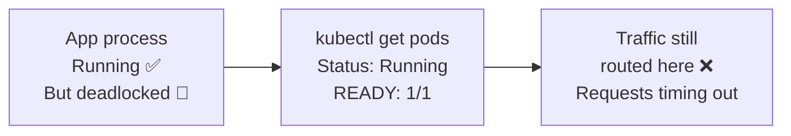
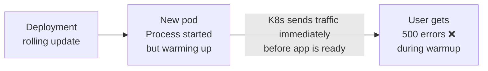

# 10.1 Why Probes Exist — The Problem They Solve

⏱️ **~4 min read**

> **TL;DR:** Kubernetes can't read your app's source code. Without probes, it only knows whether the container process is running — not whether your app is actually healthy. Probes are how you teach Kubernetes what "healthy" means for your specific application.

---

## The Two Failure Modes Probes Solve

### 1. The Zombie Process



The container is running, but the app is stuck in a deadlock, holding all worker threads, or has a corrupted internal state. Kubernetes doesn't know — it just sees a live process.

**Liveness probes** fix this: they detect unhealthy-but-running apps and trigger a container restart.

### 2. The Not-Ready-Yet App



A new pod starts, the container process launches, and Kubernetes immediately routes traffic to it. But your app needs 30 seconds to load its cache, connect to the database, and finish initializing.

**Readiness probes** fix this: the pod only receives traffic when the probe passes.

---

## The Three Probe Types

| Probe | Question | Action on Failure |
|-------|----------|------------------|
| **Liveness** | "Is this container alive?" | Restart the container |
| **Readiness** | "Is this container ready for traffic?" | Remove from Service endpoints |
| **Startup** | "Has this slow app finished starting?" | Block liveness/readiness checks |

---

## Probe Mechanisms

All three probe types support the same three check mechanisms:

```yaml
# HTTP GET — checks an HTTP endpoint
httpGet:
  path: /health
  port: 8080
  scheme: HTTP         # HTTP or HTTPS

# TCP Socket — checks if a port accepts connections
tcpSocket:
  port: 5432           # Good for databases

# Exec — runs a command inside the container
exec:
  command:
  - sh
  - -c
  - "redis-cli ping | grep PONG"

# gRPC — checks a gRPC health service (K8s 1.24+)
grpc:
  port: 50051
  service: ""          # gRPC service name (optional)
```

---

## Universal Probe Parameters

```yaml
# These parameters apply to all probe types:
initialDelaySeconds: 10    # Wait this long after container starts before first check
periodSeconds: 10          # How often to run the check
timeoutSeconds: 5          # Max time to wait for a response (failure if exceeded)
successThreshold: 1        # How many successes to consider healthy (usually 1)
failureThreshold: 3        # How many consecutive failures before action is taken
```

> 💡 **Rule of thumb:** Set `initialDelaySeconds` to your app's average startup time × 2. Too short = false failures during startup. Too long = slow detection of real crashes.

---

## Key Takeaways

| # | Concept | One-liner |
|---|---------|-----------|
| 1 | K8s can't read your code | Without probes, it only checks process existence |
| 2 | Liveness = restart trigger | For stuck/deadlocked apps that need a restart |
| 3 | Readiness = traffic gate | For apps that need time to warm up |
| 4 | Startup = slow-start protection | Prevents liveness from killing a slow-starting app |

---

## ✅ Quick Check

**Q1:** Your app is running but its connection pool to the database is exhausted. It can't serve requests. Which probe should detect and fix this?

<details>
<summary>Answer</summary>
**Readiness probe** — if it's a temporary condition (pool will recover), remove the pod from the load balancer until it recovers. **Liveness probe** — if it's an unrecoverable condition (the app needs a restart to clear the pool). In practice, you might use both: readiness to stop traffic quickly, liveness to restart after a longer failure window.
</details>

**Q2:** Kubernetes says your pod is `READY: 1/1` and `Running`. A user reports the app is returning 500 errors. What's likely wrong?

<details>
<summary>Answer</summary>
The liveness probe is passing (process is alive) but the readiness probe is either not configured or checking the wrong thing. The app may have hit an error state that doesn't crash the process but breaks request handling. This is the zombie process problem — you need a more thorough readiness check that validates the app can actually serve requests.
</details>

**Q3:** You set `failureThreshold: 3` on your liveness probe with `periodSeconds: 10`. How long until the container is restarted after it starts failing?

<details>
<summary>Answer</summary>
At least 30 seconds (3 failures × 10-second intervals). The liveness probe must fail `failureThreshold` consecutive times before Kubernetes restarts the container. This window prevents restarting due to temporary blips.
</details>
