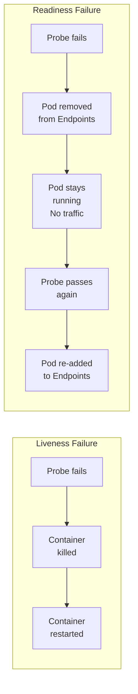
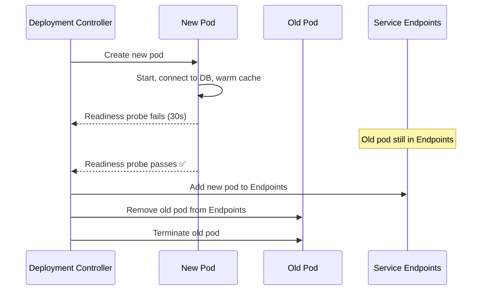

# 10.3 Readiness Probes — Control Traffic

⏱️ **5 min read · 6 min hands-on** · 🟡 Intermediate

> **TL;DR:** A readiness probe answers "Is this container ready to receive traffic?" Failure removes the pod from the Service's Endpoints — requests stop going to it. Unlike liveness, failure does NOT restart the container.

> **After this section you will be able to:**
> - Configure readiness probes to gate incoming HTTP traffic until the application is fully warmed up
> - Contrast readiness probe failure (traffic diversion) with liveness probe failure (pod restart)
> - Achieve zero-downtime rollouts by coordinating readiness probes with deployment rollout strategies

---

## Readiness vs Liveness — The Critical Difference



Use **readiness** when the app can recover on its own (DB reconnect, cache warmup).
Use **liveness** when the app needs a restart to recover.

---

## Readiness Probe YAML

```yaml
spec:
  containers:
  - name: app
    image: myapp:latest
    readinessProbe:
      httpGet:
        path: /health/ready   # Different endpoint from liveness!
        port: 8080
      initialDelaySeconds: 5  # Start checking quickly
      periodSeconds: 5        # Check frequently for fast recovery
      timeoutSeconds: 3
      failureThreshold: 3     # 3 failures = not ready (15s window)
      successThreshold: 2     # Need 2 passes to be considered ready again
```

Note `successThreshold: 2` — after a readiness failure, require 2 consecutive successes before re-adding to the load balancer. This prevents flapping.

---

## What Your Readiness Endpoint Should Check

Unlike liveness, readiness CAN check external dependencies — because the consequence is just traffic removal, not restart:

```python
# ✅ Readiness checks dependencies — this is OK
@app.get("/health/ready")
def readiness():
    # Check database connectivity
    try:
        db.execute("SELECT 1")
    except Exception:
        raise HTTPException(503, "Database not reachable")
    
    # Check cache is populated
    if not cache.is_warmed_up():
        raise HTTPException(503, "Cache not ready")
    
    # Check connection pool
    if db_pool.available_connections() < 2:
        raise HTTPException(503, "Connection pool exhausted")
    
    return {"status": "ready"}
```

```
Check              | Liveness | Readiness
-------------------|----------|----------
Internal state     | ✅ Yes   | ✅ Yes
Database up?       | ❌ No    | ✅ Yes
Cache warmed?      | ❌ No    | ✅ Yes
External API ok?   | ❌ No    | ✅ Yes
```

---

## Zero-Downtime Rolling Updates with Readiness

This is where readiness probes really shine. In Chapter 4, we saw that Deployments wait for pods to be Ready before removing old pods:



Without a readiness probe, the new pod gets traffic immediately after the container starts — before your app has connected to the database. Users see errors.

---

## The `READY: 0/1` State

When readiness fails, the pod shows `0/1` in READY but remains `Running`:

```bash
kubectl get pods
# NAME        READY   STATUS    RESTARTS   AGE
# my-app-xxx  0/1     Running   0          2m   ← not ready, no traffic
# my-app-yyy  1/1     Running   0          5m   ← ready, serving traffic
```

```bash
# Check why a pod is not ready
kubectl describe pod my-app-xxx | grep -A5 "Readiness:"
kubectl describe pod my-app-xxx | tail -20  # Events section
```

---

### Try It

```bash
# Simulate an app that starts "not ready" for 20 seconds
cat <<'EOF' | kubectl apply -f -
apiVersion: v1
kind: Pod
metadata:
  name: readiness-demo
  labels:
    app: readiness-demo
spec:
  containers:
  - name: app
    image: nginx:1.25
    readinessProbe:
      exec:
        command:
        - sh
        - -c
        - "test -f /tmp/ready"
      initialDelaySeconds: 2
      periodSeconds: 3
    resources:
      limits:
        memory: "64Mi"
        cpu: "100m"
EOF

# Pod is Running but NOT ready (file doesn't exist yet)
kubectl get pod readiness-demo -w &
sleep 5

# Mark the pod as ready
kubectl exec readiness-demo -- touch /tmp/ready
sleep 5
kill %1

# Verify the pod became ready
kubectl get pod readiness-demo
```

**Expected progression:**
```
NAME              READY   STATUS    RESTARTS   AGE
readiness-demo    0/1     Running   0          5s    ← not ready
readiness-demo    1/1     Running   0          12s   ← ready after touch!
```

```bash
kubectl delete pod readiness-demo
```

---

## Key Takeaways

| # | Concept | One-liner |
|---|---------|-----------|
| 1 | Readiness = traffic gate | Failure removes from Endpoints; no restart |
| 2 | Can check dependencies | Unlike liveness — DB/cache checks are fine here |
| 3 | Critical for rolling updates | Prevents traffic to not-yet-ready new pods |
| 4 | `successThreshold: 2` | Prevents flapping when recovering |

---

## ✅ Quick Check

**Q1:** A pod's readiness probe fails. The pod has `replicas: 3`. How many pods serve traffic?

<details>
<summary>Answer</summary>
Only 2. The failing pod is removed from the Service Endpoints — requests only go to the 2 healthy pods. The failing pod stays running (it's not restarted), and will be re-added to Endpoints automatically once the probe passes again.
</details>

**Q2:** During a rolling update, should the Deployment use readiness or liveness to gate old pod removal?

<details>
<summary>Answer</summary>
**Readiness**. The Deployment controller checks if the new pod is in `Ready` state (readiness probe passing) before removing old pods. Liveness has nothing to do with the rollout gating — it only triggers restarts. A working readiness probe is the primary mechanism for zero-downtime rolling updates.
</details>

**Q3:** You want the pod to receive traffic only after it has loaded a 500MB ML model into memory (takes ~2 minutes). How do you configure this?

<details>
<summary>Answer</summary>
Use a readiness probe with `initialDelaySeconds: 90` and a `path: /health/ready` endpoint that returns 200 only after the model is loaded. Also consider a startup probe (section 10.4) to be more precise. The readiness probe ensures zero traffic until the model is ready, and if loading fails, the pod stays unready indefinitely (but doesn't restart — use liveness for failure recovery).
</details>
