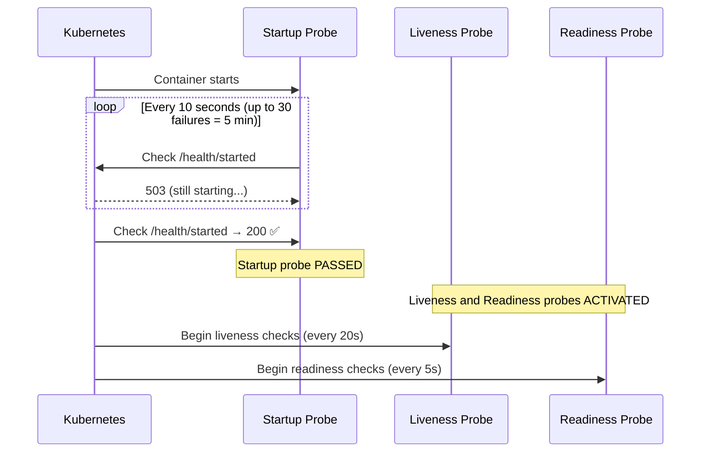

# 10.4 Startup Probes — Slow-Starting Apps

⏱️ **~4 min read**

> **TL;DR:** A startup probe disables liveness and readiness checks until it passes. This solves the "my app takes 3 minutes to start and liveness keeps killing it" problem — without setting a huge `initialDelaySeconds` on every probe.

---

## The Problem: Slow-Starting Apps vs Liveness

Without startup probes, slow-starting apps face a dilemma:

```
App startup time: 120 seconds

Option A: initialDelaySeconds: 120 on liveness
  → Works for startup, but if the app deadlocks at runtime,
    it takes 120 + (failures × period) seconds to detect

Option B: initialDelaySeconds: 10 on liveness
  → App is still starting at 10s → liveness fails → container restarts
  → Restart loop! App never finishes starting!
```

**Startup probe solution:**

```
Startup probe runs until it passes (max: failureThreshold × periodSeconds)
→ Only then do liveness and readiness probes activate
→ Liveness can have short initialDelaySeconds because startup handles the slow part
```

---

## Startup Probe YAML

```yaml
spec:
  containers:
  - name: app
    image: legacy-jvm-app:latest

    # Startup probe: keep checking until success, give up to 5 min
    startupProbe:
      httpGet:
        path: /health/started
        port: 8080
      periodSeconds: 10
      failureThreshold: 30      # 30 × 10s = 5 minutes max wait
      successThreshold: 1

    # These only activate AFTER startup probe passes
    livenessProbe:
      httpGet:
        path: /health/live
        port: 8080
      periodSeconds: 20
      failureThreshold: 3

    readinessProbe:
      httpGet:
        path: /health/ready
        port: 8080
      periodSeconds: 5
      failureThreshold: 3
```

---

## The Startup Probe Timeline



---

## When to Use a Startup Probe

Use startup probes when:
- App startup time is **variable or long** (JVM apps, model loading, DB migrations on startup)
- Startup time is longer than your ideal liveness `initialDelaySeconds`
- You want accurate liveness detection (small `initialDelaySeconds`) without startup kill

```yaml
# Java app with startup probe
startupProbe:
  exec:
    command:
    - sh
    - -c
    - "curl -f http://localhost:8080/actuator/health/startup || exit 1"
  failureThreshold: 60    # 60 × 10s = 10 minutes max startup window
  periodSeconds: 10
```

> 💡 **Tip:** `failureThreshold × periodSeconds` = maximum startup window. Set this generously — if the app takes 3 minutes in production, allow 6–8 minutes for headroom. The probe passes as soon as the app is ready; the full window is only used if something is wrong.

---

### Try It

```bash
# Simulate a slow-starting app: writes /tmp/started after a 20-second delay
cat <<'EOF' | kubectl apply -f -
apiVersion: v1
kind: Pod
metadata:
  name: startup-demo
spec:
  initContainers:
  - name: slow-init
    image: busybox
    command: ["sh", "-c", "echo 'Starting slowly...'; sleep 20; echo 'started' > /shared/started"]
    volumeMounts:
    - name: shared
      mountPath: /shared
    resources:
      limits:
        memory: "16Mi"
        cpu: "50m"

  volumes:
  - name: shared
    emptyDir: {}

  containers:
  - name: app
    image: nginx:1.25
    startupProbe:
      exec:
        command: ["sh", "-c", "test -f /shared/started"]
      periodSeconds: 5
      failureThreshold: 12      # 12 × 5s = 60s max startup window
    livenessProbe:
      httpGet:
        path: /
        port: 80
      initialDelaySeconds: 0   # Safe! Startup probe covers the wait
      periodSeconds: 10
      failureThreshold: 3
    volumeMounts:
    - name: shared
      mountPath: /shared
    resources:
      limits:
        memory: "64Mi"
        cpu: "100m"
EOF

# Watch — pod is not ready until the startup probe passes (~20s)
kubectl get pod startup-demo -w
```

**Expected progression:**
```
NAME           READY   STATUS    RESTARTS   AGE
startup-demo   0/1     Running   0          5s    ← startup probe pending
startup-demo   0/1     Running   0          15s   ← still starting
startup-demo   1/1     Running   0          22s   ← startup passed!
```

```bash
kubectl delete pod startup-demo
```

---

## Key Takeaways

| # | Concept | One-liner |
|---|---------|-----------|
| 1 | Startup probe gates liveness/readiness | Both are disabled until startup passes |
| 2 | `failureThreshold × periodSeconds` = max window | Set generously for slow starters |
| 3 | Liveness can have tight timing | Startup handles the long wait |
| 4 | Use for JVM/ML/legacy apps | Any app with variable or long startup |

---

## ✅ Quick Check

**Q1:** A startup probe has `failureThreshold: 30` and `periodSeconds: 10`. The app starts in 45 seconds. When do liveness and readiness probes activate?

<details>
<summary>Answer</summary>
At approximately t=45s — when the startup probe first succeeds. The startup probe runs every 10 seconds. At t=50s (the next check after 45s), it passes. Liveness and readiness probes activate immediately after that first success. The 30-failure limit (5-minute window) is never reached.
</details>

**Q2:** The startup probe fails more than `failureThreshold` times. What happens?

<details>
<summary>Answer</summary>
Kubernetes kills and restarts the container — the same action as a liveness failure. The startup probe failing its maximum means the app couldn't start in the allotted time. The pod shows `RESTARTS: 1` and starts over.
</details>

**Q3:** Can you have a startup probe without a liveness probe?

<details>
<summary>Answer</summary>
Yes, but it's unusual and mostly pointless. The startup probe's purpose is to protect liveness from killing slow starters. Without a liveness probe, there's nothing to protect. You'd use a startup probe alone only if you want to delay readiness checks during startup (but a readiness probe's `initialDelaySeconds` or `failureThreshold` could handle that too).
</details>
