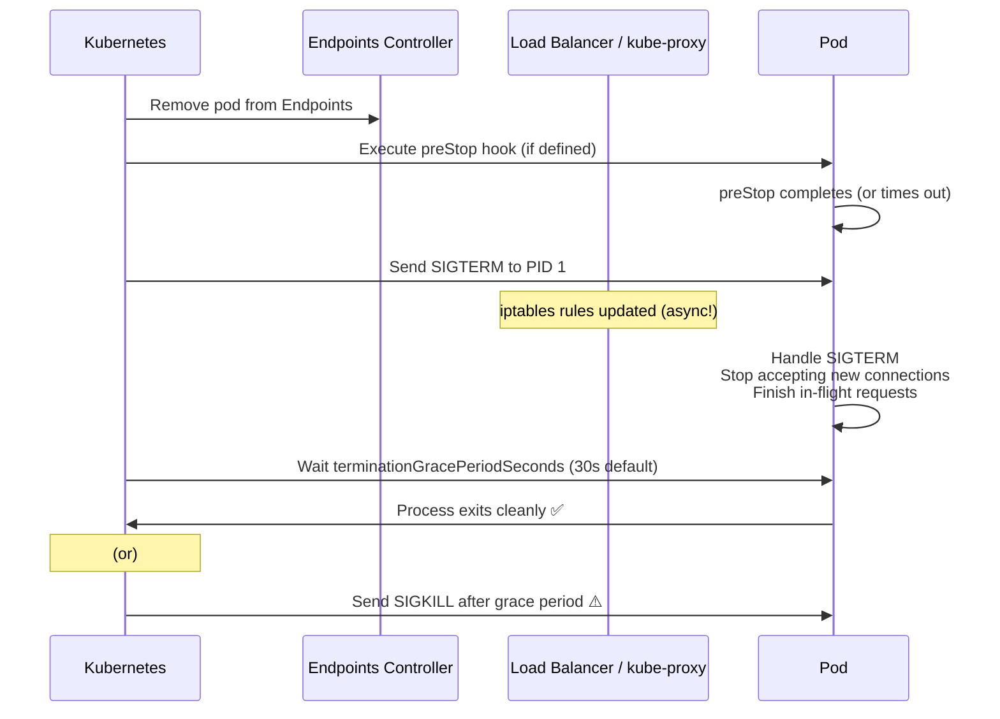

# 10.5 Graceful Shutdown and `preStop` Hooks

⏱️ **5 min read · 6 min hands-on** · 🟡 Intermediate

> **TL;DR:** When Kubernetes terminates a pod, it sends SIGTERM and waits `terminationGracePeriodSeconds` (default 30s) before force-killing with SIGKILL. Use a `preStop` hook and handle SIGTERM to drain connections cleanly and avoid dropped requests.

> **After this section you will be able to:**
> - Trace the step-by-step Pod termination lifecycle (Endpoint removal, SIGTERM, `terminationGracePeriodSeconds`, SIGKILL)
> - Implement `preStop` lifecycle hooks to drain active connections before container shutdown
> - Eliminate 502/504 errors during rolling deployments by synchronizing teardown timers

---

## The Pod Termination Sequence



**The race condition:** iptables rules are updated asynchronously — there's a window where the pod is receiving SIGTERM but the load balancer is still sending it traffic. The `preStop` sleep hack fills this gap.

---

## The `preStop` Sleep Hack

The most widely-used production pattern:

```yaml
spec:
  containers:
  - name: app
    image: myapp:latest
    lifecycle:
      preStop:
        exec:
          command: ["sh", "-c", "sleep 5"]   # Give iptables time to update
    # Or for web servers:
    lifecycle:
      preStop:
        exec:
          command: ["/bin/sh", "-c", "nginx -s quit; while killall -0 nginx; do sleep 1; done"]
```

**Why `sleep 5`?**
- Kubernetes removes the pod from Endpoints and sends `preStop` simultaneously
- But iptables rules on all nodes take a few seconds to propagate
- During that window, traffic can still reach the pod
- A 5-second sleep ensures iptables has caught up before SIGTERM is sent
- Result: pod stops receiving new connections, finishes existing ones

---

## `terminationGracePeriodSeconds`

```yaml
spec:
  terminationGracePeriodSeconds: 60   # Default is 30 seconds
  containers:
  - name: app
    image: myapp:latest
```

Set this based on your longest expected request duration:
- Web API with p99 latency of 5s → 30s is fine
- Data processing job that takes 2 minutes → set to 180s
- Batch job → `terminationGracePeriodSeconds: 3600`

> ⚠️ **Warning:** `preStop` time counts against `terminationGracePeriodSeconds`. If your hook takes 25s and the grace period is 30s, the app only has 5s to finish requests after SIGTERM.

---

## Handling SIGTERM in Your App

Your app should handle SIGTERM properly — don't let it die immediately:

```python
# Python example
import signal, sys, time

in_shutdown = False

def handle_sigterm(signum, frame):
    global in_shutdown
    in_shutdown = True
    print("SIGTERM received — finishing in-flight requests...")
    # Don't exit here — let the request handlers finish

signal.signal(signal.SIGTERM, handle_sigterm)

@app.get("/")
def handle_request():
    if in_shutdown:
        return Response("Service Unavailable", 503)
    # Process normally
    return process()

# Shutdown when all requests done
while not in_shutdown:
    time.sleep(0.1)

server.shutdown()  # Wait for active connections to drain
sys.exit(0)
```

```javascript
// Node.js example
process.on('SIGTERM', () => {
    console.log('SIGTERM received. Draining connections...');
    server.close(() => {
        console.log('All connections drained. Exiting.');
        process.exit(0);
    });
});
```

---

## Full Production Pod Spec

Combining everything — probes + graceful shutdown:

```yaml
spec:
  terminationGracePeriodSeconds: 60
  containers:
  - name: app
    image: myapp:latest
    ports:
    - containerPort: 8080
    
    resources:
      requests:
        memory: "128Mi"
        cpu: "100m"
      limits:
        memory: "256Mi"
        cpu: "500m"

    lifecycle:
      preStop:
        exec:
          command: ["sh", "-c", "sleep 5"]

    startupProbe:
      httpGet:
        path: /health/started
        port: 8080
      periodSeconds: 5
      failureThreshold: 24       # 2 minute window

    livenessProbe:
      httpGet:
        path: /health/live
        port: 8080
      initialDelaySeconds: 0     # Startup probe handles the wait
      periodSeconds: 20
      failureThreshold: 3

    readinessProbe:
      httpGet:
        path: /health/ready
        port: 8080
      initialDelaySeconds: 0
      periodSeconds: 5
      failureThreshold: 3
      successThreshold: 2
```

---

## Key Takeaways

| # | Concept | One-liner |
|---|---------|-----------|
| 1 | SIGTERM → 30s grace → SIGKILL | Handle SIGTERM or your app is force-killed |
| 2 | `preStop: sleep 5` | Closes the iptables update race condition |
| 3 | `terminationGracePeriodSeconds` | Set ≥ your longest request duration |
| 4 | preStop time counts against grace period | Don't let preStop eat all your shutdown time |

---

## ✅ Quick Check

**Q1:** Your `terminationGracePeriodSeconds` is 30 and `preStop` sleeps for 5 seconds. An in-flight request takes 28 seconds. Does it complete cleanly?

<details>
<summary>Answer</summary>
No. Timeline: `preStop` sleeps 5s → SIGTERM sent at t=5s → 25s remaining for the app → request needs 28s → SIGKILL fires at t=30s → request is aborted. To fix: either increase `terminationGracePeriodSeconds` to 40+ or reduce preStop sleep time.
</details>

**Q2:** You don't handle SIGTERM in your Node.js app — it uses the default behavior. What happens when the pod is terminated?

<details>
<summary>Answer</summary>
Node.js exits immediately on SIGTERM (default signal behavior). Active requests are dropped mid-flight. The graceful period is wasted because the process exits before it's used. Always register a SIGTERM handler in production apps.
</details>

**Q3:** Why is removing a pod from Endpoints and sending SIGTERM done simultaneously instead of sequentially?

<details>
<summary>Answer</summary>
Kubernetes designed them to happen in parallel for speed. In theory, Endpoints removal + kube-proxy iptables updates should complete before the preStop hook finishes and SIGTERM is sent. In practice, iptables propagation has network latency, so the preStop sleep is the safety net for that async gap.
</details>
