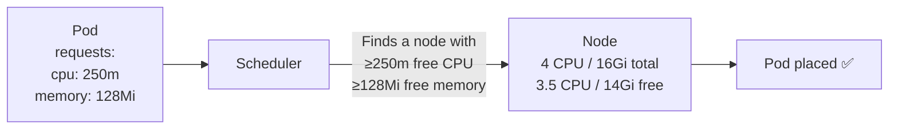

# 11.1 Requests and Limits — The Fundamentals

⏱️ **~6 min read**

> **TL;DR:** `requests` is what the scheduler uses to place your pod on a node (guaranteed capacity). `limits` is the maximum your container can consume before being throttled (CPU) or killed (memory). Never omit both — it causes chaos.

---

## The Two Numbers You Must Set

```yaml
resources:
  requests:           # "I need at least this much"
    cpu: "250m"       # ← Scheduler uses this to find a node with enough capacity
    memory: "128Mi"   # ← Guaranteed allocation
  limits:             # "I must never exceed this"
    cpu: "500m"       # ← Throttled if exceeded (not killed)
    memory: "256Mi"   # ← OOMKilled if exceeded (container killed)
```

**What each does:**

| Field | Used By | What Happens If Exceeded |
|-------|---------|--------------------------|
| `requests.cpu` | Scheduler (node placement) | N/A — just a reservation |
| `requests.memory` | Scheduler (node placement) | N/A — just a reservation |
| `limits.cpu` | Kernel cgroups | Throttled (slowed down, not killed) |
| `limits.memory` | Kernel cgroups | Container killed with `OOMKilled` |

---

## CPU Units

```yaml
cpu: "1"        # 1 full CPU core
cpu: "0.5"      # 500 millicores = half a core
cpu: "250m"     # 250 millicores = quarter core (most common)
cpu: "100m"     # 100 millicores = 0.1 core
```

`1000m` = `1` CPU = one hyperthread on a cloud node. CPU throttling is smooth — a container at its CPU limit gets slowed down proportionally, not killed.

---

## Memory Units

```yaml
memory: "128Mi"   # Mebibytes — use this (powers of 2)
memory: "1Gi"     # Gibibytes
memory: "256Mi"

memory: "128M"    # Megabytes (powers of 10) — avoid confusion, use Mi
```

**Memory limits are hard.** Exceeding the memory limit causes an immediate `OOMKilled` (Out of Memory Killed) — the container is restarted. This is the most common cause of mysterious pod restarts in production.

---

## How the Scheduler Uses Requests



The scheduler does **bin packing** based on requests — it doesn't look at actual usage, only declared requests. This means:
- Overcommit by setting requests too low → nodes get overloaded
- Underutilize by setting requests too high → waste money

---

## Common Patterns

```yaml
# Web API — bursty CPU, bounded memory
resources:
  requests:
    cpu: "100m"
    memory: "128Mi"
  limits:
    cpu: "500m"     # Allow bursting to 5× request
    memory: "256Mi" # Memory rarely changes at runtime

# Background worker — steady CPU, larger memory
resources:
  requests:
    cpu: "500m"
    memory: "512Mi"
  limits:
    cpu: "1"
    memory: "1Gi"

# Init container — usually runs once, higher CPU burst OK
resources:
  requests:
    cpu: "100m"
    memory: "64Mi"
  limits:
    cpu: "2"        # High limit to finish fast
    memory: "256Mi"
```

---

## The No-Resources Anti-Pattern

```yaml
# ❌ Anti-pattern: no resources set
containers:
- name: app
  image: myapp:latest
  # No resources block — pod becomes BestEffort QoS!
```

Without resources, the pod:
1. Gets `BestEffort` QoS class (lowest priority)
2. Is first to be evicted under node pressure
3. Provides no data for the scheduler to make good placement decisions
4. Can consume all node resources, affecting other pods

> ⚠️ **Warning:** In production, **always set resource requests and limits**. Use a LimitRange (Chapter 9) to enforce this namespace-wide.

---

## Right-Sizing: How to Find Good Values

```bash
# 1. Deploy with generous limits first
# 2. After running in production for a few days, check actual usage

# See actual CPU and memory usage (requires metrics-server)
kubectl top pods
kubectl top pods --sort-by=memory
kubectl top pods --sort-by=cpu

# Check a specific pod
kubectl top pod my-pod

# VPA (next sections) can recommend values automatically
```

```bash
# Check if metrics-server is running on Minikube
minikube addons enable metrics-server
kubectl top nodes   # Should show CPU/memory usage
```

---

### Try It

```bash
# Deploy with resource constraints
cat <<'EOF' | kubectl apply -f -
apiVersion: v1
kind: Pod
metadata:
  name: resource-demo
spec:
  containers:
  - name: cpu-hog
    image: busybox
    command: ["sh", "-c", "while true; do echo scale=2000; bc /dev/urandom | head -1; done 2>/dev/null | head -c 100000000 > /dev/null; sleep 9999"]
    resources:
      requests:
        cpu: "100m"
        memory: "32Mi"
      limits:
        cpu: "200m"       # CPU capped — will be throttled, not killed
        memory: "64Mi"
EOF

kubectl wait pod resource-demo --for=condition=Ready --timeout=30s

# Check the pod's actual resource usage
kubectl top pod resource-demo

# See resource specs via describe
kubectl describe pod resource-demo | grep -A8 "Limits:"

# Cleanup
kubectl delete pod resource-demo
```

---

## Key Takeaways

| # | Concept | One-liner |
|---|---------|-----------|
| 1 | `requests` = scheduler input | Pod placed only on nodes with enough free capacity |
| 2 | `limits.cpu` = throttle | Excess CPU throttled; container not killed |
| 3 | `limits.memory` = kill | Exceed memory limit → OOMKilled immediately |
| 4 | Never skip resources | No resources = BestEffort = first evicted |

---

## ✅ Quick Check

**Q1:** A pod requests 500m CPU on a node with 600m free. Another pod needs 400m CPU. Can the second pod be scheduled on the same node?

<details>
<summary>Answer</summary>
No. The scheduler sees 600m total free, but the first pod's 500m request reserves 500m. Only 100m appears available to the scheduler. The second pod's 400m request can't be satisfied, so it's scheduled elsewhere. (Even if the first pod is only using 100m at runtime — the scheduler uses requests, not actual usage.)
</details>

**Q2:** Your pod's memory limit is 256Mi. It allocates 260Mi of memory. What happens?

<details>
<summary>Answer</summary>
The container is killed with `OOMKilled` (Out of Memory). Kubernetes restarts it. If it keeps OOMKilling, the pod enters `CrashLoopBackOff`. The fix: increase the memory limit, fix a memory leak in the app, or reduce the app's memory footprint.
</details>

**Q3:** A pod uses 800m CPU but its limit is 500m. Does Kubernetes kill it?

<details>
<summary>Answer</summary>
No. CPU throttling is applied — the kernel cgroup limits the container's CPU time to 500m equivalent. The container continues running but slower. Unlike memory, CPU over-limit doesn't cause a kill — it just reduces the container's processing speed proportionally.
</details>
