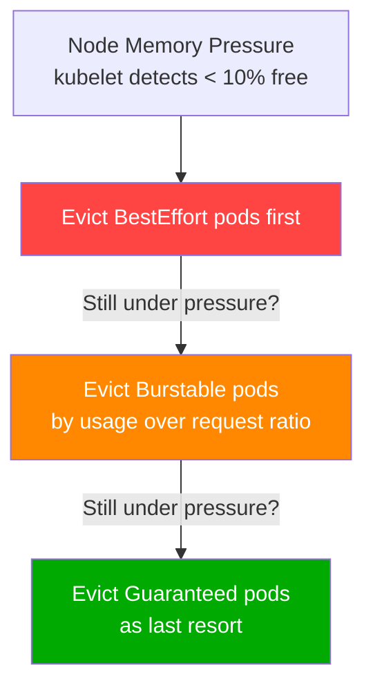

# 11.2 QoS Classes and Pod Eviction

⏱️ **~5 min read**

> **TL;DR:** Kubernetes assigns each pod a QoS (Quality of Service) class based on its resource spec. When a node runs out of resources, pods are evicted in QoS order — `BestEffort` first, then `Burstable`, `Guaranteed` last.

---

## The Three QoS Classes

| Class | Requirements | Eviction Priority |
|-------|-------------|------------------|
| **Guaranteed** | `requests == limits` for ALL containers, for both CPU and memory | Last to be evicted |
| **Burstable** | At least one container has a request or limit set | Middle |
| **BestEffort** | NO resource spec on ANY container | First evicted |

```yaml
# Guaranteed — requests == limits exactly
resources:
  requests:
    cpu: "500m"
    memory: "256Mi"
  limits:
    cpu: "500m"     # ← Same as request
    memory: "256Mi" # ← Same as request

# Burstable — requests < limits (most production apps)
resources:
  requests:
    cpu: "100m"
    memory: "128Mi"
  limits:
    cpu: "500m"     # ← Different from request
    memory: "256Mi"

# BestEffort — nothing set (never do this in production)
# (no resources block at all)
```

---

## What Eviction Looks Like

Under node memory pressure (node is running out of memory):



Within the same QoS class, eviction order is determined by how much a pod is using **relative to its request**:
- Pod using 200Mi with a 128Mi request (156% of request) → evicted before
- Pod using 200Mi with a 500Mi request (40% of request)

---

## Checking a Pod's QoS Class

```bash
kubectl describe pod my-pod | grep "QoS Class:"
# QoS Class: Burstable

# Or with jsonpath
kubectl get pod my-pod -o jsonpath='{.status.qosClass}'
```

---

## Setting Guaranteed for Critical Pods

For your most critical pods (databases, caches), use `Guaranteed`:

```yaml
# PostgreSQL — Guaranteed QoS
spec:
  containers:
  - name: postgres
    image: postgres:16
    resources:
      requests:
        cpu: "1"
        memory: "2Gi"
      limits:
        cpu: "1"       # ← Exactly equal
        memory: "2Gi"  # ← Exactly equal
```

The tradeoff: `Guaranteed` pods can't burst above their limit. You're trading flexibility for eviction protection.

---

## Eviction vs OOMKilled — The Difference

Both result in pod restarts, but they're different mechanisms:

| Event | Trigger | Who Does It |
|-------|---------|------------|
| **OOMKilled** | Container exceeds its own memory limit | Linux kernel / cgroups |
| **Eviction** | Node overall memory pressure | kubelet (evicts entire pods) |

```bash
# Check if a pod was OOMKilled (container exceeded its own limit)
kubectl describe pod my-pod | grep -A5 "Last State:"
# Last State:  Terminated
#   Reason:    OOMKilled      ← Container exceeded its memory limit
#   Exit Code: 137

# Check node conditions for eviction pressure
kubectl describe node my-node | grep -A5 "Conditions:"
# MemoryPressure   True   ← kubelet will start evicting BestEffort pods
```

---

## Key Takeaways

| # | Concept | One-liner |
|---|---------|-----------|
| 1 | `Guaranteed` = requests == limits | Best protection against eviction |
| 2 | `Burstable` = most production apps | Good balance of flexibility and protection |
| 3 | `BestEffort` = no resources | First evicted under node pressure — avoid in production |
| 4 | OOMKilled ≠ Eviction | OOMKilled is per-container; eviction is per-pod |

---

## ✅ Quick Check

**Q1:** A pod has memory `requests: 512Mi` and `limits: 1Gi`. It's using 900Mi. Node memory pressure occurs. Is this pod evicted before a pod using 400Mi with no limits?

<details>
<summary>Answer</summary>
No — the no-limits pod is `BestEffort` (evicted first). The 900Mi pod is `Burstable` (evicted second). BestEffort is always evicted before Burstable, regardless of actual usage. The 900Mi pod is safe until all BestEffort pods are gone.
</details>

**Q2:** Your database pod needs eviction protection but also needs occasional memory bursting for large queries. What QoS class do you use?

<details>
<summary>Answer</summary>
`Burstable` — set `requests` to the baseline memory needed (e.g., 2Gi) and `limits` to the max burst capacity (e.g., 4Gi). This gives you more eviction protection than `BestEffort` while allowing memory bursting. For true eviction immunity, use `Guaranteed` (requests == limits) and accept that bursting above the limit causes OOMKill.
</details>

**Q3:** An init container has no resources set but the main container has full requests/limits. What QoS class is the pod?

<details>
<summary>Answer</summary>
`Burstable`. For `Guaranteed` QoS, ALL containers (including init containers) must have matching requests and limits. A single container without resources drops the entire pod to at most `Burstable` (and if NO container has resources, it's `BestEffort`).
</details>
