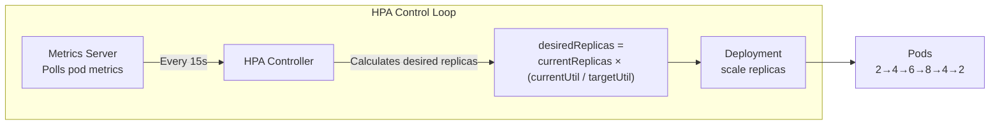

# 11.3 Horizontal Pod Autoscaler (HPA)

⏱️ **~7 min read**

> **TL;DR:** HPA watches CPU (or custom) metrics and automatically scales your Deployment's replica count up when load increases and down when it drops. It's the standard autoscaling primitive for stateless apps.

---

## How HPA Works



**The formula:**
```
desiredReplicas = ceil(currentReplicas × (currentMetricValue / targetMetricValue))
```

Example: 3 pods, 80% CPU usage, target 50%:
```
desiredReplicas = ceil(3 × (80 / 50)) = ceil(4.8) = 5 pods
```

---

## Prerequisites: Metrics Server

HPA requires metrics-server to be running:

```bash
# Enable on Minikube
minikube addons enable metrics-server

# Verify it's working
kubectl top pods
kubectl top nodes
```

---

## Creating an HPA

**Imperative (quick):**

```bash
kubectl autoscale deployment my-app \
  --cpu-percent=50 \       # Target: keep average CPU at 50%
  --min=2 \                # Never scale below 2 replicas
  --max=10                 # Never scale above 10 replicas
```

**Declarative YAML (preferred):**

```yaml
# hpa.yaml
apiVersion: autoscaling/v2
kind: HorizontalPodAutoscaler
metadata:
  name: my-app-hpa
spec:
  scaleTargetRef:
    apiVersion: apps/v1
    kind: Deployment
    name: my-app           # The Deployment to scale

  minReplicas: 2
  maxReplicas: 10

  metrics:
  - type: Resource
    resource:
      name: cpu
      target:
        type: Utilization
        averageUtilization: 50   # Target: 50% of requests.cpu

  - type: Resource
    resource:
      name: memory
      target:
        type: Utilization
        averageUtilization: 70   # Also scale on memory
```

> ⚠️ **Warning:** HPA requires `resources.requests.cpu` to be set on the pod. HPA calculates CPU utilization as `(actual CPU usage / requests.cpu) × 100%`. Without `requests.cpu`, HPA can't compute utilization and will not scale.

---

## Watching HPA in Action

```bash
# See current state
kubectl get hpa my-app-hpa

# Expected output:
# NAME          REFERENCE          TARGETS         MINPODS  MAXPODS  REPLICAS  AGE
# my-app-hpa   Deployment/my-app  45%/50% (cpu)   2        10       3         5m
#                                  ^^^
#                                  current utilization

# Watch it change
kubectl get hpa -w

# Describe for full details
kubectl describe hpa my-app-hpa
```

**Describe output includes:**
```
Current Metrics:
  resource cpu on pods:  45% (target 50%)
Conditions:
  ScalingActive    True    ValidMetricFound
  AbleToScale      True    ReadyForNewScale
  ScalingLimited   False   DesiredWithinRange
Events:
  SuccessfulRescale  Scaled up to 5 replicas: "cpu utilization above target"
  SuccessfulRescale  Scaled down to 3 replicas: "all metrics below target"
```

---

## Scale-Down Cooldown (Stabilization Window)

HPA scales up aggressively but scales down conservatively to prevent flapping:

```yaml
spec:
  behavior:
    scaleDown:
      stabilizationWindowSeconds: 300   # Default: 300s (5 min)
      # Won't scale down until metrics are low for 5 consecutive minutes
      policies:
      - type: Pods
        value: 1                        # Remove at most 1 pod per period
        periodSeconds: 60

    scaleUp:
      stabilizationWindowSeconds: 0     # Default: 0 (scale up immediately)
      policies:
      - type: Percent
        value: 100                      # Double replicas per period if needed
        periodSeconds: 60
```

> 💡 **Tip:** The default 5-minute scale-down window prevents thrashing when a traffic spike briefly drops. Only change it if your workload has very predictable, fast-changing traffic patterns.

---

## Custom and External Metrics

Beyond CPU/memory, HPA can scale on:

```yaml
metrics:
# Custom metric from your app (via Prometheus Adapter)
- type: Pods
  pods:
    metric:
      name: http_requests_per_second
    target:
      type: AverageValue
      averageValue: 1000    # 1000 RPS per pod

# External metric (e.g., SQS queue depth)
- type: External
  external:
    metric:
      name: sqs_queue_depth
    target:
      type: AverageValue
      averageValue: 30      # Scale when queue depth > 30 per pod
```

This requires a custom metrics adapter (Prometheus Adapter, KEDA) — beyond the scope of this chapter, but important to know it exists.

---

### Try It

```bash
# Enable metrics-server
minikube addons enable metrics-server
sleep 30  # Give it time to collect initial metrics

# Deploy an app
cat <<'EOF' | kubectl apply -f -
apiVersion: apps/v1
kind: Deployment
metadata:
  name: php-apache
spec:
  replicas: 1
  selector:
    matchLabels:
      app: php-apache
  template:
    metadata:
      labels:
        app: php-apache
    spec:
      containers:
      - name: php-apache
        image: registry.k8s.io/hpa-example
        ports:
        - containerPort: 80
        resources:
          requests:
            cpu: "200m"    # ← HPA requires this
          limits:
            cpu: "500m"
---
apiVersion: v1
kind: Service
metadata:
  name: php-apache
spec:
  selector:
    app: php-apache
  ports:
  - port: 80
EOF

kubectl rollout status deployment/php-apache

# Create HPA
kubectl autoscale deployment php-apache \
  --cpu-percent=50 \
  --min=1 \
  --max=5

kubectl get hpa
```

Generate load in a separate terminal to watch scaling:

```bash
# Run this in a SEPARATE terminal to generate load
kubectl run load-generator \
  --image=busybox \
  --restart=Never \
  -- sh -c "while sleep 0.01; do wget -q -O- http://php-apache; done"

# In this terminal, watch HPA scale up
kubectl get hpa -w    # Watch CPU% rise and replicas increase

# After a minute or two, stop the load:
kubectl delete pod load-generator

# Watch HPA scale back down (takes ~5 minutes due to cooldown)
kubectl get hpa -w
```

---

## Key Takeaways

| # | Concept | One-liner |
|---|---------|-----------|
| 1 | HPA requires metrics-server | Enable with `minikube addons enable metrics-server` |
| 2 | `requests.cpu` is mandatory | HPA measures utilization as usage/request |
| 3 | Scales up fast, down slow | 5-min default cooldown prevents thrashing |
| 4 | Custom metrics via adapters | KEDA or Prometheus Adapter for queue depth, RPS |

---

## ✅ Quick Check

**Q1:** Your pod `requests.cpu: 200m` and is using 300m CPU. HPA target is 50%. What is the CPU utilization HPA sees?

<details>
<summary>Answer</summary>
150% — (300m / 200m) × 100 = 150%. HPA sees 150% utilization against a 50% target. Desired replicas = ceil(1 × 150/50) = 3 pods. HPA would scale to 3 replicas.
</details>

**Q2:** You have HPA with `minReplicas: 2`. Your Deployment currently has `replicas: 1` in its YAML. What happens when you apply the HPA?

<details>
<summary>Answer</summary>
HPA takes over replica management. It immediately scales to at least `minReplicas: 2` regardless of what the Deployment YAML says. From this point, the `replicas` field in the Deployment spec is managed by HPA — manual changes to it will be overridden by the next HPA reconciliation cycle.
</details>

**Q3:** Traffic drops to zero for 2 minutes. HPA has a 5-minute scale-down window. Are replicas reduced?

<details>
<summary>Answer</summary>
No — not yet. The stabilization window requires metrics to stay below the target for the entire window. At 2 minutes, the window hasn't elapsed. After 5 continuous minutes below target, HPA will scale down. This prevents scaling down during a temporary traffic lull.
</details>
