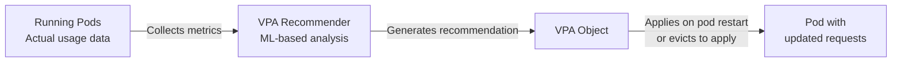

# 11.4 Vertical Pod Autoscaler (VPA)

⏱️ **~4 min read**

> **TL;DR:** VPA automatically adjusts a pod's resource requests and limits based on observed actual usage. It solves the "what should I set my requests to?" question — especially useful for workloads with stable traffic patterns.

---

## VPA vs HPA

| | HPA | VPA |
|---|-----|-----|
| Scales | Number of replicas (out/in) | Pod size — CPU/memory requests (up/down) |
| Best for | Stateless, horizontally scalable apps | Stateful apps, JVM apps, ML workloads |
| Can combine? | ✅ Yes (on different metrics) | ⚠️ Careful — VPA + HPA on CPU can conflict |
| Requires restart? | No | Yes — VPA updates requests by recreating pods |

---

## How VPA Works



VPA has three components:
- **Recommender** — analyzes historical usage and suggests optimal requests
- **Updater** — evicts pods that have outdated requests (to force a restart)
- **Admission Plugin** — mutates pod specs at creation time with VPA recommendations

---

## VPA Modes

```yaml
apiVersion: autoscaling.k8s.io/v1
kind: VerticalPodAutoscaler
metadata:
  name: my-app-vpa
spec:
  targetRef:
    apiVersion: apps/v1
    kind: Deployment
    name: my-app

  updatePolicy:
    updateMode: "Auto"     # Options: Off | Initial | Recreate | Auto

  resourcePolicy:
    containerPolicies:
    - containerName: app
      minAllowed:
        cpu: "50m"
        memory: "64Mi"
      maxAllowed:
        cpu: "4"
        memory: "8Gi"
```

**`updateMode` options:**

| Mode | Behavior |
|------|----------|
| `Off` | Only generate recommendations — never apply them. Read with `kubectl describe vpa`. |
| `Initial` | Apply recommendations only when pods are first created. No eviction of running pods. |
| `Recreate` | Evict and recreate pods to apply updated recommendations. |
| `Auto` | Currently same as `Recreate`. Future: in-place updates when K8s supports it. |

> 💡 **Tip:** Start with `updateMode: Off` to see recommendations without disrupting running pods. Review for a few days, then switch to `Initial` for new pods, then `Auto` for full automation.

---

## Reading VPA Recommendations

```bash
kubectl describe vpa my-app-vpa
```

**Expected output:**
```
Recommendation:
  Container Recommendations:
  - Container Name:  app
    Lower Bound:
      Cpu:     25m
      Memory:  64Mi
    Target:
      Cpu:     100m       ← VPA recommends setting requests to this
      Memory:  256Mi
    Uncapped Target:
      Cpu:     100m
      Memory:  256Mi
    Upper Bound:
      Cpu:     500m
      Memory:  512Mi
```

Use `Target` as your recommended `requests` values.

---

## VPA on Minikube

VPA is not installed by default — it requires a separate installation:

```bash
# Clone the VPA repo and install (requires git)
git clone https://github.com/kubernetes/autoscaler.git
cd autoscaler/vertical-pod-autoscaler
./hack/vpa-up.sh

# Or just use updateMode: Off to see recommendations
# without installing the full VPA admission controller
```

On Minikube, VPA is primarily useful in `Off` mode for recommendations. Full `Auto` mode is better tested in cloud clusters.

---

## VPA + HPA Together

Use VPA for memory (VPA recommends) and HPA for CPU scaling (HPA scales replicas):

```yaml
# HPA on CPU only — let VPA handle memory right-sizing
spec:
  metrics:
  - type: Resource
    resource:
      name: cpu
      target:
        type: Utilization
        averageUtilization: 60
  # Don't add memory HPA if VPA manages memory

# VPA on memory only — don't conflict with HPA's CPU scaling
spec:
  resourcePolicy:
    containerPolicies:
    - containerName: app
      controlledResources: ["memory"]   # Only manage memory, not CPU
```

---

## Key Takeaways

| # | Concept | One-liner |
|---|---------|-----------|
| 1 | VPA adjusts pod size, not count | Right-sizes requests/limits based on actual usage |
| 2 | Start with `Off` mode | Get recommendations without disruption |
| 3 | Requires pod restart to apply | VPA evicts pods to apply new request values |
| 4 | Combine carefully with HPA | Use VPA for memory, HPA for CPU/replica count |

---

## ✅ Quick Check

**Q1:** VPA recommends `cpu: 100m` for your pod which currently has `cpu: 500m` request. Will VPA immediately change the running pod?

<details>
<summary>Answer</summary>
Not immediately. In `Auto`/`Recreate` mode, VPA evicts the pod (deletes it) and the new replacement pod starts with the updated request of 100m. The eviction is done by the VPA Updater component. In `Off` or `Initial` mode, the running pod is never touched.
</details>

**Q2:** Your app has a 5-minute startup time. VPA is in `Auto` mode and evicts the pod to update requests. What's the impact?

<details>
<summary>Answer</summary>
The pod is evicted, then a new pod starts with updated requests but takes 5 minutes to become Ready. During that 5 minutes, your capacity is reduced. For slow-starting apps, use `Initial` mode instead — it only applies recommendations to newly created pods (during deployments/rollouts), never evicting running ones.
</details>

**Q3:** Is there a way to use VPA without any pod disruption at all?

<details>
<summary>Answer</summary>
Use `updateMode: Off`. VPA collects data and provides recommendations via `kubectl describe vpa`, but never actually modifies or evicts pods. You review the recommendations and manually update your Deployment YAML. Kubernetes 1.27+ added in-place pod resource updates (alpha feature) which will eventually allow VPA to update resources without eviction.
</details>
