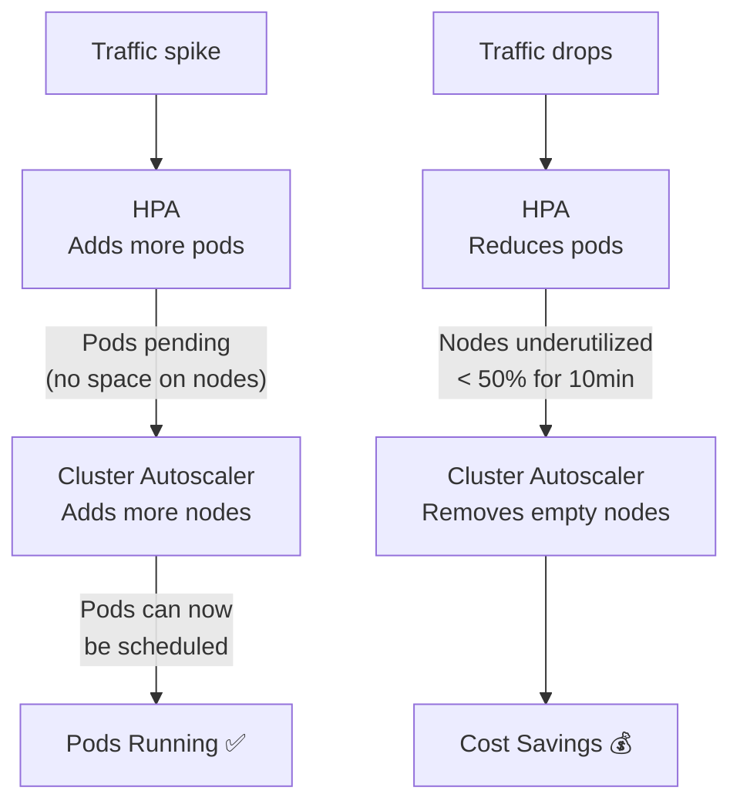

# 11.5 Cluster Autoscaler

⏱️ **~3 min read**

> **TL;DR:** While HPA adds more pods and VPA makes pods bigger, the Cluster Autoscaler (CA) adds more **nodes** when pods can't be scheduled. It also removes underutilized nodes to save cost.

---

## The Three Autoscalers Together



| Autoscaler | What It Scales | Time to React |
|-----------|----------------|---------------|
| HPA | Replica count | ~30 seconds |
| VPA | Pod CPU/memory requests | Minutes (requires restart) |
| CA | Node count | 3–5 minutes (cloud provisioning) |

---

## How CA Works

CA is cloud-specific. It integrates with cloud provider APIs:

```
1. Pod scheduled → no node has enough capacity → Pod is Pending
2. CA detects Pending pods
3. CA calls cloud API: "Add a new node to node group X"
4. Cloud provisions a new node (takes 2–5 minutes)
5. Node registers with the cluster
6. Pending pods get scheduled on the new node

Scale-down:
1. Node is < 50% utilized for 10 consecutive minutes
2. CA checks: can all pods on this node be moved elsewhere?
3. If yes: cordon node (no new scheduling), drain pods, terminate node
```

---

## CA Configuration Example (AWS EKS)

CA runs as a Deployment in the cluster with IAM permissions to call the Auto Scaling Group API:

```yaml
# Cluster Autoscaler annotation on the deployment
metadata:
  annotations:
    cluster-autoscaler.kubernetes.io/safe-to-evict: "false"

# Node group annotations for CA
kubectl annotate nodes my-node \
  cluster-autoscaler.kubernetes.io/scale-down-disabled="true"
```

```bash
# See CA activity
kubectl logs -n kube-system \
  -l app=cluster-autoscaler \
  --tail=20

# See which pods are blocking scale-down
kubectl describe node my-node | grep -E "Annotations|Taints"
```

---

## Preventing CA from Removing a Node

Some pods prevent node scale-down:
- Pods with `PodDisruptionBudget` violations
- Pods with local storage (`hostPath` volumes)
- DaemonSet pods (these are expected on every node)
- Pods annotated with `cluster-autoscaler.kubernetes.io/safe-to-evict: "false"`

> 💡 **Tip:** On Minikube, there is no Cluster Autoscaler (single-node cluster). CA is a production-only concept for cloud-managed node groups (AWS ASG, GKE Node Pools, AKS VMSS).

---

## Key Takeaways

| # | Concept | One-liner |
|---|---------|-----------|
| 1 | CA scales nodes, not pods | Responds to pending pods that can't be scheduled |
| 2 | Scale-up: 3–5 minutes | Cloud provisioning time; plan your buffers accordingly |
| 3 | Scale-down: 10-minute window | Node must be underutilized for 10 minutes |
| 4 | Works with HPA | HPA adds pods → CA adds nodes if needed |

---

## ✅ Quick Check

**Q1:** HPA scaled a Deployment from 3 to 8 replicas. 4 of the new pods are `Pending`. What does the Cluster Autoscaler do?

<details>
<summary>Answer</summary>
CA detects the 4 Pending pods, calculates how many nodes are needed to schedule them (based on node size and pod requests), then calls the cloud provider API to add that many nodes. Once nodes are ready (3–5 minutes), the pending pods get scheduled.
</details>

**Q2:** You have CA enabled. A developer leaves a test pod running with 8 CPU requests on a node that's otherwise idle. Will CA remove that node?

<details>
<summary>Answer</summary>
No — CA will not remove a node if any non-DaemonSet pod running on it cannot be moved elsewhere. Even a single pod with 8 CPU requests prevents scale-down of that node until the pod is deleted or moved. This is intentional — CA never evicts pods unless PodDisruptionBudget and eviction policies permit it.
</details>

**Q3:** Is it safe to use HPA + CA together?

<details>
<summary>Answer</summary>
Yes — this is the standard production pattern. HPA manages replica count based on application load; CA manages node count based on cluster capacity. They complement each other: HPA reacts in ~30 seconds, CA fills the capacity gap in 3–5 minutes. Set HPA `minReplicas` high enough to absorb traffic during the CA node-provisioning delay.
</details>
