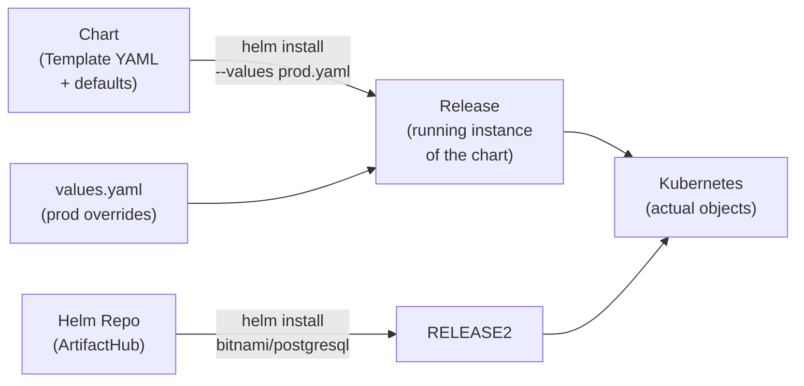

# 12.1 What Helm Is and Why It Exists

⏱️ **4 min read · 4 min hands-on** · 🟡 Intermediate

> **TL;DR:** Helm is the Kubernetes package manager. It bundles all the YAML files for an application (Deployment, Service, Ingress, ConfigMap, Secrets…) into a reusable, versioned package called a **chart**. One command installs, upgrades, or removes the whole stack.

> **After this section you will be able to:**
> - Explain why Helm is the package manager for Kubernetes and how it eliminates YAML duplication
> - Understand the concepts of Charts, Values, and Releases
> - Identify production use cases where Helm provides reproducible deployments

---

## The Problem: YAML Sprawl

A real production app typically needs:

```
my-app/
├── deployment.yaml
├── service.yaml
├── ingress.yaml
├── configmap.yaml
├── secret.yaml
├── hpa.yaml
├── pdb.yaml                  # PodDisruptionBudget
├── serviceaccount.yaml
├── role.yaml
└── rolebinding.yaml
```

Now do this for 3 environments (dev, staging, prod) with different image tags, replica counts, resource limits, and domain names. Without Helm, you maintain 30 YAML files with tiny differences between environments — a maintenance nightmare.

> 🔗 **Docker Parallel:** Helm is to Kubernetes what `docker-compose.yml` is to Docker — it describes your entire application stack. But Helm adds versioning, templating, rollbacks, and a package registry.

---

## What Helm Provides



| Concept | What It Is |
|---------|-----------|
| **Chart** | A package of Kubernetes YAML templates + default values |
| **Release** | A named installed instance of a chart in a cluster |
| **Repository** | A collection of charts (like npm registry but for K8s apps) |
| **Values** | Variables that customize a chart's templates at install time |

---

## Helm vs Raw kubectl

| Task | Raw kubectl | Helm |
|------|------------|------|
| Install an app | `kubectl apply -f dir/` (all files) | `helm install my-app bitnami/nginx` |
| Upgrade to v2 | Edit YAML, re-apply, hope nothing breaks | `helm upgrade my-app bitnami/nginx --set image.tag=2.0` |
| Rollback | Manually revert YAML and re-apply | `helm rollback my-app 1` |
| Deploy to dev/prod | Maintain separate YAML directories | Same chart, different `values.yaml` files |
| Remove completely | `kubectl delete -f dir/` (15 files) | `helm uninstall my-app` (one command) |
| See what's installed | grep/track manually | `helm list` |

---

## Key Helm CLI Commands

```bash
# Repository management
helm repo add bitnami https://charts.bitnami.com/bitnami
helm repo update              # Fetch latest chart lists
helm search repo nginx        # Find charts

# Install / upgrade
helm install my-release bitnami/nginx     # Install
helm upgrade my-release bitnami/nginx     # Upgrade
helm install --upgrade my-release ...     # Install or upgrade (idempotent)

# Release management
helm list                     # See all releases in current namespace
helm list -A                  # All namespaces
helm status my-release        # Detailed status + notes
helm history my-release       # Release history (for rollback)
helm rollback my-release 1    # Roll back to revision 1

# Uninstall
helm uninstall my-release     # Remove all resources created by the release

# Inspect before installing
helm show values bitnami/nginx      # See all configurable values
helm template my-release bitnami/nginx --values my-values.yaml  # Preview YAML
```

---

## Key Takeaways

| # | Concept | One-liner |
|---|---------|-----------|
| 1 | Chart = package | Versioned, reusable bundle of K8s manifests |
| 2 | Release = installed instance | One chart, many releases (dev/staging/prod) |
| 3 | Values = configuration | Customize behavior without editing templates |
| 4 | Helm manages lifecycle | Install → upgrade → rollback → uninstall |

---

## ✅ Quick Check

**Q1:** You install the `bitnami/postgresql` chart twice in the same namespace with different release names. What happens?

<details>
<summary>Answer</summary>
Two independent PostgreSQL instances are created. Each release has its own set of Kubernetes objects (pods, services, PVCs, secrets) prefixed with the release name. They don't interfere with each other. This is how you run dev and staging databases in the same cluster.
</details>

**Q2:** A colleague updates a value in the chart's `values.yaml` file directly. Does the running release change?

<details>
<summary>Answer</summary>
No. Editing the chart's source files doesn't affect already-installed releases. A `helm upgrade` command is needed to apply changes to a running release. This is intentional — Helm releases are immutable snapshots until explicitly upgraded.
</details>

**Q3:** What's the difference between `helm install` and `kubectl apply`?

<details>
<summary>Answer</summary>
`kubectl apply` is stateless — it applies YAML to the cluster with no memory of what it applied before. `helm install` creates a managed **release** — Helm tracks exactly what was installed (stored as a Secret in the namespace), enabling upgrades, rollbacks, and clean uninstalls. `helm uninstall` removes all objects in the release; `kubectl delete` requires you to know what to delete.
</details>
