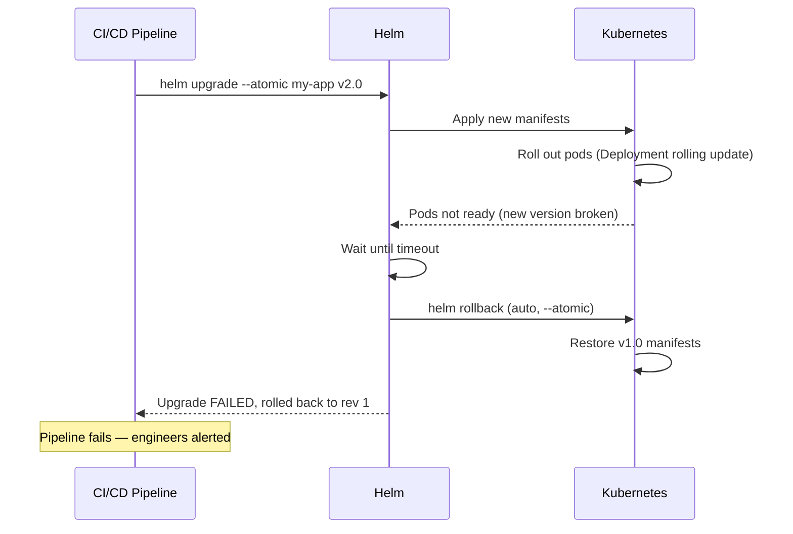

# 12.5 Upgrades, Rollbacks, and Release Management

⏱️ **4 min read · 6 min hands-on** · 🟡 Intermediate

> **TL;DR:** `helm upgrade` applies changes to an existing release and bumps the revision. `helm rollback` reverts to any previous revision instantly. `helm history` shows the full audit trail. This is the Helm lifecycle that makes production deployments safe.

> **After this section you will be able to:**
> - Execute safe, versioned application upgrades with `helm upgrade`
> - Inspect historical revisions with `helm history` and roll back instantly with `helm rollback`
> - Manage chart dependencies and packaged tarballs with `helm dependency`

---

## The Release Revision Model

Every `helm install` or `helm upgrade` creates a new **revision**:

```bash
helm history my-app -n production
```

```
REVISION  UPDATED               STATUS     CHART          APP VERSION  DESCRIPTION
1         2026-07-01 10:00:00  superseded  my-app-0.1.0   1.0.0       Install complete
2         2026-07-08 14:30:00  superseded  my-app-0.1.1   1.1.0       Upgrade complete
3         2026-07-15 09:15:00  deployed    my-app-0.2.0   1.2.0       Upgrade complete
```

Helm stores each revision as a Secret in the namespace — this is how rollback works.

---

## Upgrading a Release

```bash
# Upgrade with a new values file
helm upgrade my-app ./my-app/ \
  --namespace production \
  --values config/values-prod.yaml

# Upgrade with an inline override
helm upgrade my-app ./my-app/ \
  --namespace production \
  --set image.tag=1.3.0

# Install if not exists, upgrade if it does (idempotent — great for CI/CD)
helm upgrade --install my-app ./my-app/ \
  --namespace production \
  --create-namespace \
  --values config/values-prod.yaml

# Preview what would change (dry-run)
helm upgrade my-app ./my-app/ \
  --namespace production \
  --dry-run \
  --values config/values-prod.yaml
```

---

## Safe Upgrade Flags

```bash
helm upgrade my-app ./my-app/ \
  --namespace production \
  --values config/values-prod.yaml \
  --wait \                    # Wait for all pods to be Ready before returning
  --timeout 5m \              # Fail if not ready in 5 minutes
  --atomic \                  # Automatically rollback if upgrade fails
  --cleanup-on-fail           # Remove new resources if upgrade fails
```

**`--atomic` is the recommended production flag.** If the upgrade fails (pods not ready, liveness probe failing), Helm automatically rolls back to the previous revision. No manual intervention needed.

---

## Rolling Back

```bash
# Roll back to the previous revision
helm rollback my-app -n production

# Roll back to a specific revision
helm rollback my-app 1 -n production

# Dry-run rollback (preview what would change)
helm rollback my-app 1 -n production --dry-run

# After rollback, check history
helm history my-app -n production
```

```
REVISION  STATUS     DESCRIPTION
1         superseded  Install complete
2         superseded  Upgrade complete
3         superseded  Upgrade failed
4         deployed    Rollback to 1       ← rollback creates a new revision
```

> 💡 **Tip:** Rollback creates a new revision (revision 4 in the example above) rather than going back in time. This preserves the full audit trail and allows you to see what happened and when.

---

## Uninstalling a Release

```bash
# Remove all resources created by this release
helm uninstall my-app -n production

# Keep the release history (for forensics) but remove all K8s objects
helm uninstall my-app -n production --keep-history

# After uninstall with --keep-history, you can still see history:
helm history my-app -n production

# And even reinstall at a specific old revision:
helm rollback my-app 2 -n production
```

---

## Release Management Commands

```bash
# List all releases (current namespace)
helm list

# All namespaces
helm list -A

# Filter by status
helm list --failed
helm list --deployed

# Release details
helm status my-app -n production

# What values are currently active?
helm get values my-app -n production
helm get values my-app -n production --all   # Including defaults

# What YAML is currently deployed?
helm get manifest my-app -n production
```

---

## The Upgrade → Rollback Safety Pattern



---

## Key Takeaways

| # | Concept | One-liner |
|---|---------|-----------|
| 1 | `helm upgrade --install` | Idempotent — safe to run repeatedly in CI/CD |
| 2 | `--atomic` flag | Auto-rollback if upgrade fails — use in production |
| 3 | `helm rollback` | Instant revert to any previous revision |
| 4 | Rollback = new revision | Full audit trail preserved |
| 5 | `helm history` | See the complete lifecycle of a release |

---

## ✅ Quick Check

**Q1:** You run `helm upgrade --atomic my-app ./my-app/` and the new pods fail their readiness probes. What happens?

<details>
<summary>Answer</summary>
After the `--timeout` duration (default 5m), Helm marks the upgrade as failed and automatically runs a rollback to the previous revision. The Deployment rolls back to the old pods, which are still running (rolling update didn't complete). The command exits with a non-zero code — your CI/CD pipeline fails and alerts the team.
</details>

**Q2:** A developer uninstalls a release without `--keep-history`. Can the release be restored?

<details>
<summary>Answer</summary>
No. Without `--keep-history`, Helm deletes both the K8s objects and the release history Secrets. There's nothing to roll back to. With `--keep-history`, the history remains and `helm rollback` can restore the release. Always use `--keep-history` for production releases before uninstalling.
</details>

**Q3:** You have 20 revisions in history. Does each revision store the full YAML of all objects?

<details>
<summary>Answer</summary>
Yes — each revision stores the complete rendered manifest in a Kubernetes Secret (named `sh.helm.release.v1.RELEASE.vREV`). This is why Helm rollback is instantaneous — it re-applies the stored manifest. In large clusters with many charts, these revision Secrets can accumulate. Helm defaults to keeping 10 revisions; use `--history-max 5` on upgrade to limit storage.
</details>
