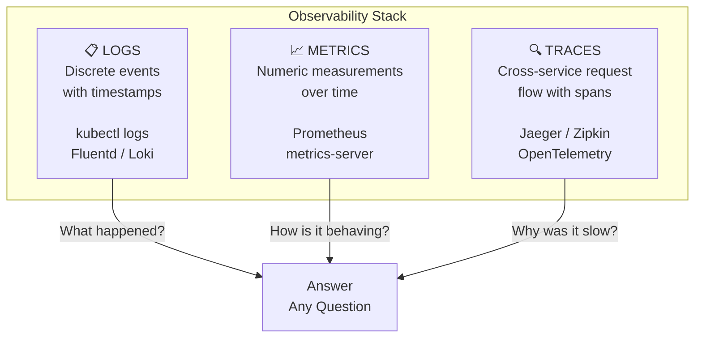

# 13.1 The Three Pillars of Observability

⏱️ **5 min read · 5 min hands-on** · 🔴 Advanced

> 📡 **Scenario:** Users report that page loads suddenly take 12 seconds instead of 200ms across your 40 microservices. You have no centralized logs, no metrics dashboard, and no tracing—you're SSHing into nodes one by one running `kubectl logs` blindly.
>
> *After this section, you'll be able to pinpoint the root cause of production regressions across Metrics, Logs, and Traces in minutes.*

> **TL;DR:** Observability is the ability to understand the internal state of a system from its external outputs. In Kubernetes, this means three things: **Logs** (what happened), **Metrics** (how things are behaving), and **Traces** (why a request was slow). Without all three, you're flying blind.

> **After this section you will be able to:**
> - Understand the Three Pillars of Observability (Metrics, Logs, Traces) in cloud-native systems
> - Evaluate pull-based metrics scraping (Prometheus) vs centralized push logging (Loki/Fluentd)
> - Design an end-to-end observability strategy for Kubernetes production clusters

---

## Why "Monitoring" Isn't Enough

Traditional monitoring asks pre-defined questions: "Is CPU above 80%?" This works for known failure modes. But Kubernetes clusters have **emergent complexity** — failures arise from combinations of normal behavior. You need to ask *arbitrary* questions of your system at any time.

**Observability** means your system is instrumented so you can answer any question about its internal state — even questions you didn't think to ask before it broke.

---

## The Three Pillars



| Pillar | Data Type | Question It Answers | Key Tools |
|--------|-----------|---------------------|-----------|
| **Logs** | Unstructured / JSON text | What happened at a specific time? | `kubectl logs`, Fluentd, Loki, EFK stack |
| **Metrics** | Numbers over time (time series) | How is the system behaving right now and historically? | Prometheus, metrics-server, Grafana |
| **Traces** | Linked spans across services | Which service in a call chain caused the slowness? | Jaeger, Zipkin, OpenTelemetry |

---

## How They Complement Each Other

The pillars work **together**, not in isolation:

1. **Alert fires** → Metric threshold exceeded (e.g., error rate > 1%)
2. **Investigate** → Look at logs for that time window to find the error message
3. **Root cause** → Follow the distributed trace to find which downstream service introduced the latency

```
[Metric Alert] → high error rate on /api/checkout
        ↓
[Logs] → "connection refused: payment-service:3000"
        ↓
[Trace] → checkout → payment (timeout after 5s) → db-query (took 4.8s)
        ↓
Root cause: slow DB query in payment-service causing cascade timeout
```

---

## The Kubernetes Observability Stack

In this chapter we focus on what you can build on Minikube today:

```
┌─────────────────────────────────────────────────────┐
│                  Kubernetes Cluster                  │
│                                                      │
│  ┌──────────┐  ┌──────────┐  ┌──────────────────┐  │
│  │  Your    │  │Prometheus│  │     Grafana       │  │
│  │  Apps    │──│ (scrapes │──│  (dashboards +   │  │
│  │ (metrics │  │ metrics) │  │    alerting)      │  │
│  │endpoint) │  └──────────┘  └──────────────────┘  │
│  └──────────┘                                        │
│       │                                              │
│  stdout/stderr → kubelet → node log files            │
│       │                                              │
│  ┌────▼─────┐                                        │
│  │  kubectl │  (direct log access — no extra infra)  │
│  │   logs   │                                        │
│  └──────────┘                                        │
└─────────────────────────────────────────────────────┘
```

> **Chapter scope:** We cover Logs + Metrics + Dashboards in depth. Distributed Tracing with OpenTelemetry/Jaeger is introduced conceptually — a full tracing setup requires instrumented services and a tracing backend. See the [OpenTelemetry documentation](https://opentelemetry.io/docs/) for getting started.

---

## The Golden Signals

Google's SRE team identified four signals that, if measured, cover most failure modes:

| Signal | What It Measures | Example Metric |
|--------|-----------------|----------------|
| **Latency** | Time to serve requests | `http_request_duration_seconds` |
| **Traffic** | Demand on the system | `http_requests_total` |
| **Errors** | Rate of failed requests | `http_requests_total{status=~"5.."}` |
| **Saturation** | How "full" the system is | CPU/memory utilization |

> 🎯 **Design principle:** Instrument every service to expose the four Golden Signals. Alert on them. Use logs and traces to debug when they fire.

---

## ✅ Quick Check

**Q1:** What's the difference between monitoring and observability?

<details>
<summary>Answer</summary>
Monitoring is about tracking known, pre-defined indicators (dashboards, threshold alerts). Observability means your system is instrumented so you can ask *any* question about its internal state — including questions you didn't anticipate before a new failure mode appeared. Observability is a property of the system; monitoring is what you do with that property.
</details>

**Q2:** A checkout request is slow. You have metrics and logs but no traces. What can't you determine?

<details>
<summary>Answer</summary>
Without traces, you can see that the request was slow (metrics) and possibly find an error message (logs), but you cannot easily determine *which specific service* in the call chain (checkout → payment → inventory → database) caused the slowness, or what the exact breakdown of time spent in each service was. Distributed traces provide a "flamegraph" of a single request across service boundaries.
</details>

**Q3:** Which Golden Signal would you alert on first to catch user-facing problems early?

<details>
<summary>Answer</summary>
**Errors** (error rate) and **Latency** are the most directly user-facing. Latency > threshold means users experience slowness; error rate > threshold means requests are failing. Traffic and Saturation are better for capacity planning and predicting *future* problems before they become user-visible.
</details>
