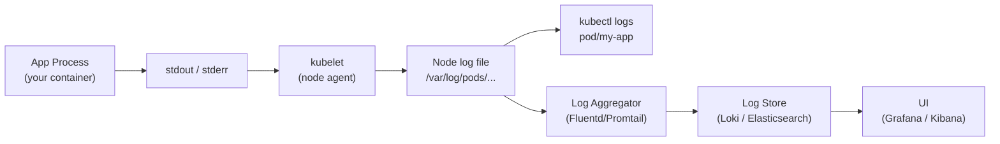

# 13.2 Logging — kubectl logs, Stern, and Aggregation

⏱️ **~7 min read**

> **TL;DR:** Kubernetes collects anything your container writes to **stdout/stderr** and makes it available via `kubectl logs`. For multi-pod scenarios, use **Stern** for fan-out log tailing. For production-grade aggregation, use the **EFK stack** (Elasticsearch + Fluentd + Kibana) or the lighter-weight **PLG stack** (Promtail + Loki + Grafana).

---

## How Kubernetes Logging Works



> **Rule #1:** Write all application logs to **stdout/stderr**. Never log to files inside the container — those files disappear when the pod restarts and are invisible to Kubernetes tooling.

---

## kubectl logs — The Essential Commands

```bash
# Basic log viewing
kubectl logs my-pod                          # Last ~100 lines
kubectl logs my-pod -f                       # Follow (tail -f equivalent)
kubectl logs my-pod --tail=50                # Last 50 lines
kubectl logs my-pod --since=5m               # Last 5 minutes
kubectl logs my-pod --since-time=2024-01-15T10:00:00Z  # Since timestamp

# Multi-container pods
kubectl logs my-pod -c my-container          # Specific container
kubectl logs my-pod --all-containers         # All containers

# Previous (crashed) container
kubectl logs my-pod --previous               # Logs from last crash — very useful!

# Filter with standard unix tools
kubectl logs my-pod | grep ERROR
kubectl logs my-pod | grep -E "(ERROR|WARN)" | tail -20

# Label selector — logs from all matching pods
kubectl logs -l app=my-app                   # All pods with label app=my-app
kubectl logs -l app=my-app --all-containers

# Using shorthand
kubectl logs deploy/my-deployment            # Picks one pod from deployment
kubectl logs svc/my-service                  # Picks one pod from service
```

---

## Understanding Log Retention

Kubernetes does **not** keep logs forever. The kubelet rotates log files based on:

| Setting | Default | Description |
|---------|---------|-------------|
| `containerLogMaxSize` | 10Mi | Max size before rotation |
| `containerLogMaxFiles` | 5 | Number of rotated files to keep |

> ⚠️ **Critical:** If your pod crashes repeatedly, `kubectl logs my-pod --previous` only shows the *immediately previous* container. Older logs are lost once rotated. **This is why you need a log aggregation system for production.**

---

## Structured Logging (JSON)

Always log in JSON in production — it makes filtering and querying vastly easier:

```python
# ❌ Bad — unstructured
print(f"Error processing order {order_id}: {str(e)}")

# ✅ Good — structured JSON
import json, sys
print(json.dumps({
    "level": "error",
    "event": "order_processing_failed",
    "order_id": order_id,
    "error": str(e),
    "user_id": user_id,
    "duration_ms": elapsed_ms
}), file=sys.stderr)
```

**Result:** You can now query `level=error AND order_id=12345` in Kibana/Grafana Loki instead of grep-ing freeform text.

---

## Stern — Multi-Pod Log Tailing

`kubectl logs -l` has limitations (max 5 pods, no color coding, single namespace). **Stern** is the tool that fixes this:

```bash
# Install stern
curl -Lo stern https://github.com/stern/stern/releases/latest/download/stern_linux_amd64
chmod +x stern && sudo mv stern /usr/local/bin/

# Or via Homebrew (macOS/Linux)
brew install stern

# Usage
stern my-app                           # Tail all pods matching "my-app" (regex)
stern my-app --namespace production    # Specific namespace
stern my-app -n production -n staging  # Multiple namespaces
stern .                                # ALL pods in current namespace
stern my-app --since 10m               # Last 10 minutes
stern my-app --container sidecar       # Specific container
stern my-app --output json             # JSON output for piping

# With label selectors
stern -l app=checkout -l tier=backend

# Template output (customize per-line format)
stern my-app --template '{{.PodName}} | {{.Message}}'
```

**Stern** automatically:
- Color-codes output by pod name
- Shows pod name and container name on each line
- Reconnects automatically when pods restart
- Handles pod creation and deletion during tailing

---

## Log Aggregation: EFK vs PLG

For production, you need logs stored centrally and searchable:

| Stack | Components | Characteristics |
|-------|-----------|-----------------|
| **EFK** | Elasticsearch + Fluentd + Kibana | Heavy, powerful, full-text search, complex queries |
| **PLG** | Promtail + Loki + Grafana | Lightweight, label-based (like Prometheus for logs), cheaper storage |
| **ELK** | Elasticsearch + Logstash + Kibana | EFK variant with Logstash for more complex transforms |

> 🔗 **Today's choice:** For Minikube labs and small clusters, use **Loki + Grafana** (covered in the lab). For large enterprise clusters with compliance requirements, EFK is the standard.

### How Loki Works

Loki is "Prometheus for logs" — it doesn't index the content of logs, only the **labels** (like pod name, namespace, container). This makes it much cheaper to run:

```
Prometheus scrapes metrics → stores as time series by labels
Loki scrapes logs          → stores as log streams by labels (no full-text index)
```

```bash
# Loki query language (LogQL) examples
{namespace="production", app="checkout"}                     # All logs for app in namespace
{app="checkout"} |= "ERROR"                                  # Filter for ERROR lines
{app="checkout"} | json | level="error"                      # Parse JSON and filter
{app="checkout"} | json | level="error" | rate[5m]          # Error rate over 5 min
```

---

## Log Levels and Best Practices

| Level | When to Use | Example |
|-------|------------|---------|
| `DEBUG` | Detailed internal state, dev only | "Processing item 42 of batch" |
| `INFO` | Normal operations, key lifecycle events | "Server started on :8080" |
| `WARN` | Unexpected but handled, recoverable | "Retry 2/3 for upstream service" |
| `ERROR` | Failed operation, needs attention | "Failed to write to database" |
| `FATAL` | Unrecoverable, process will exit | "Cannot open config file, exiting" |

**Best practices:**

1. **Include request IDs** in every log line — essential for tracing a request through microservices
2. **Never log secrets or PII** — passwords, tokens, credit card numbers must be redacted
3. **Log at boundaries** — function entry/exit with inputs/outputs at DEBUG level
4. **Set log level via env var** — `LOG_LEVEL=info` in ConfigMap, change without rebuilding

---

## ✅ Quick Check

**Q1:** Your pod crashed and restarted 3 times. How do you see logs from the *previous* run?

<details>
<summary>Answer</summary>
Use `kubectl logs my-pod --previous` (or `-p` shorthand). This shows logs from the immediately preceding container instance. Note that only the most recent previous container's logs are available — logs from 2 crashes ago are gone unless you have a log aggregation system.
</details>

**Q2:** You have a Deployment with 8 replicas. How do you tail logs from ALL of them simultaneously?

<details>
<summary>Answer</summary>
Use **Stern**: `stern my-deployment` or `stern -l app=my-app`. With `kubectl logs`, you can use `kubectl logs -l app=my-app -f --max-log-requests=10` but it has a 5-pod default limit (overridable). Stern handles this transparently, color-codes by pod, and reconnects when pods are replaced.
</details>

**Q3:** Why should you never log to files inside a container?

<details>
<summary>Answer</summary>
Container filesystems are ephemeral — they disappear when the container is deleted or crashes. Files inside a container are not accessible via `kubectl logs`, not forwarded to log aggregation systems, and lost when the pod is rescheduled to a different node. Always write to stdout/stderr, which Kubernetes captures automatically.
</details>
