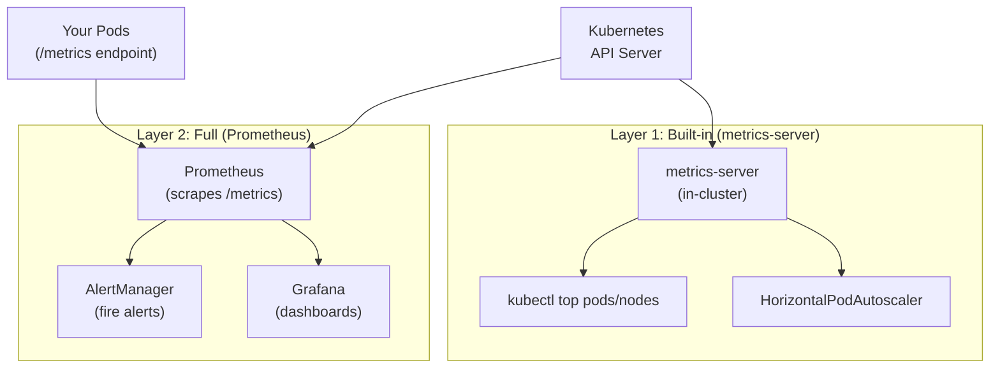

# 13.3 Metrics — Prometheus and metrics-server

⏱️ **~8 min read**

> **TL;DR:** Kubernetes has two layers of metrics: **metrics-server** (lightweight, powers HPA and `kubectl top`) and **Prometheus** (full-featured time-series database for alerting and dashboards). Prometheus uses a **pull model** — it scrapes `/metrics` endpoints from your pods on a schedule. You annotate pods to tell it where to look.

---

## Two Layers of Kubernetes Metrics



| | metrics-server | Prometheus |
|--|----------------|-----------|
| **Purpose** | Real-time resource usage | Historical metrics + alerting |
| **Retention** | In-memory only (no history) | Configurable (days/weeks) |
| **Data source** | kubelet resource summary | Pod `/metrics` endpoints |
| **Query** | `kubectl top` | PromQL |
| **Alerting** | ❌ No | ✅ Yes (AlertManager) |
| **Dashboards** | ❌ No | ✅ Yes (Grafana) |
| **Install** | `minikube addons enable metrics-server` | Helm chart |

---

## metrics-server — Quick Access to Resource Usage

```bash
# Enable on Minikube
minikube addons enable metrics-server

# Wait ~60 seconds for it to collect data, then:
kubectl top nodes               # Node-level CPU and memory
kubectl top pods                # Pod-level CPU and memory (all namespaces: -A)
kubectl top pods --sort-by=cpu  # Sort by CPU usage
kubectl top pods --sort-by=memory

# Example output
NAME                          CPU(cores)   MEMORY(bytes)
my-app-6d4b8f9c7-xk2pq       12m          45Mi
postgres-0                    38m          312Mi
redis-7d9f8b6c-lm9qr          4m           18Mi
```

> ⚠️ **Limitation:** `kubectl top` shows only current usage. It has no history. If your pod OOM-killed 10 minutes ago, the resource spike is gone. That's why Prometheus is essential for production.

---

## How Prometheus Works

Prometheus uses a **pull model** — instead of your app pushing metrics to a collector, Prometheus periodically **scrapes** an HTTP endpoint (`/metrics`) exposed by each target.

```bash
# Example /metrics endpoint output (Prometheus text format)
# HELP http_requests_total Total HTTP requests
# TYPE http_requests_total counter
http_requests_total{method="GET",status="200",path="/api/users"} 14823
http_requests_total{method="POST",status="201",path="/api/orders"} 3247
http_requests_total{method="GET",status="500",path="/api/checkout"} 42

# HELP http_request_duration_seconds Request duration histogram
# TYPE http_request_duration_seconds histogram
http_request_duration_seconds_bucket{le="0.1"} 12940
http_request_duration_seconds_bucket{le="0.5"} 14790
http_request_duration_seconds_bucket{le="1.0"} 14820
http_request_duration_seconds_count 14823
http_request_duration_seconds_sum 1247.3
```

### Metric Types

| Type | Description | Use Case |
|------|-------------|----------|
| **Counter** | Monotonically increasing number | Request count, error count, bytes sent |
| **Gauge** | Can go up or down | Current memory usage, active connections |
| **Histogram** | Distribution of values in buckets | Request duration, response size |
| **Summary** | Pre-calculated quantiles | p50/p95/p99 latency (calculated in app) |

---

## Annotating Pods for Prometheus Scraping

Tell Prometheus to scrape your pod using annotations:

```yaml
apiVersion: apps/v1
kind: Deployment
metadata:
  name: my-app
spec:
  template:
    metadata:
      labels:
        app: my-app
      annotations:
        prometheus.io/scrape: "true"       # Enable scraping
        prometheus.io/port: "8080"          # Port where /metrics is exposed
        prometheus.io/path: "/metrics"      # Default, can omit
    spec:
      containers:
      - name: my-app
        image: my-app:latest
        ports:
        - containerPort: 8080
```

> 🔗 **How it works:** The kube-prometheus-stack Helm chart installs a Prometheus operator that watches these annotations (via ServiceMonitors) and automatically adds/removes scrape targets as pods come and go.

---

## PromQL — Prometheus Query Language

PromQL is how you ask Prometheus questions. It's used in Grafana panels and AlertManager rules.

### Basic Syntax

```promql
# Selector: metric name + label filters
http_requests_total                              # All time series for this metric
http_requests_total{status="200"}               # Filter: only 200s
http_requests_total{status=~"5.."}              # Regex: 5xx errors
http_requests_total{status!="200"}              # Negation: not 200s

# Range vectors (over time)
http_requests_total[5m]                          # All data points in last 5 min
```

### Essential Functions

```promql
# rate() — per-second rate of a counter over a time window
rate(http_requests_total[5m])                    # Requests/sec over 5 min

# irate() — instant rate (last two data points, more responsive)
irate(http_requests_total[1m])

# increase() — total increase over time window
increase(http_requests_total[1h])                # Total requests in last hour

# Aggregation
sum(rate(http_requests_total[5m]))               # Total req/s across all instances
sum by (status) (rate(http_requests_total[5m]))  # Req/s grouped by status code

# Histogram quantiles (latency p95)
histogram_quantile(0.95,
  sum by (le) (rate(http_request_duration_seconds_bucket[5m])))

# Memory usage in MB
container_memory_usage_bytes{namespace="default"} / 1024 / 1024

# CPU usage percentage
rate(container_cpu_usage_seconds_total[5m]) * 100
```

### The Four Golden Signals in PromQL

```promql
# Latency (p99 request duration)
histogram_quantile(0.99,
  sum by (le)(rate(http_request_duration_seconds_bucket[5m])))

# Traffic (requests per second)
sum(rate(http_requests_total[5m]))

# Errors (error rate %)
sum(rate(http_requests_total{status=~"5.."}[5m]))
  /
sum(rate(http_requests_total[5m])) * 100

# Saturation (CPU usage %)
avg(rate(container_cpu_usage_seconds_total[5m])) by (pod) /
avg(kube_pod_container_resource_limits{resource="cpu"}) by (pod) * 100
```

---

## Installing Prometheus via Helm

The **kube-prometheus-stack** chart installs everything in one shot: Prometheus, AlertManager, Grafana, and all the Kubernetes-specific recording rules and dashboards.

```bash
# Add the Prometheus community Helm repo
helm repo add prometheus-community https://prometheus-community.github.io/helm-charts
helm repo update

# Install the full stack (takes 2-3 min on Minikube)
helm install monitoring prometheus-community/kube-prometheus-stack \
  --namespace monitoring \
  --create-namespace \
  --set prometheus.prometheusSpec.serviceMonitorSelectorNilUsesHelmValues=false \
  --set grafana.adminPassword=admin123

# Check all components are running
kubectl get pods -n monitoring

# Expected pods:
# alertmanager-monitoring-kube-prometheus-alertmanager-0   Running
# monitoring-grafana-xxxxx                                 Running
# monitoring-kube-prometheus-operator-xxxxx                Running
# monitoring-kube-state-metrics-xxxxx                      Running
# monitoring-prometheus-node-exporter-xxxxx                Running
# prometheus-monitoring-kube-prometheus-prometheus-0        Running
```

### What Gets Installed

| Component | Purpose |
|-----------|---------|
| **Prometheus** | Time-series database + scraper |
| **AlertManager** | Routes and deduplicates alerts |
| **Grafana** | Dashboard UI |
| **kube-state-metrics** | Exposes Kubernetes object state as metrics (pod count, deployment replicas, etc.) |
| **node-exporter** | Exposes host-level metrics (disk, network, CPU) |
| **Prometheus Operator** | Watches CRDs (ServiceMonitor, PrometheusRule) to configure Prometheus |

---

## Alerting with AlertManager

Define alerting rules as PrometheusRule custom resources:

```yaml
apiVersion: monitoring.coreos.com/v1
kind: PrometheusRule
metadata:
  name: my-app-alerts
  namespace: monitoring
  labels:
    release: monitoring   # Must match kube-prometheus-stack label selector
spec:
  groups:
  - name: my-app
    interval: 30s
    rules:
    # Alert if error rate exceeds 1% for 5 minutes
    - alert: HighErrorRate
      expr: |
        sum(rate(http_requests_total{status=~"5.."}[5m]))
        /
        sum(rate(http_requests_total[5m])) > 0.01
      for: 5m
      labels:
        severity: warning
      annotations:
        summary: "High error rate detected"
        description: "Error rate is {{ $value | humanizePercentage }} for 5 minutes"

    # Alert if pod has been pending for more than 2 minutes
    - alert: PodNotReady
      expr: kube_pod_status_phase{phase="Pending"} == 1
      for: 2m
      labels:
        severity: critical
      annotations:
        summary: "Pod {{ $labels.pod }} stuck in Pending"
```

---

## ✅ Quick Check

**Q1:** What is the fundamental difference between how metrics-server and Prometheus collect data?

<details>
<summary>Answer</summary>
**metrics-server** pulls resource usage data from the kubelet's summary API (CPU, memory) and stores it only in-memory — no history is retained. **Prometheus** scrapes the `/metrics` HTTP endpoint on each pod (a pull model) and stores metrics in a persistent time-series database with configurable retention, enabling historical queries, trend analysis, and alerting.
</details>

**Q2:** You want to know the 95th percentile request latency for your service over the past 30 minutes. Which metric type should your app expose, and what PromQL function do you use?

<details>
<summary>Answer</summary>
Your app should expose a **Histogram** metric (e.g., `http_request_duration_seconds`), which records observations in configurable buckets. Then use: `histogram_quantile(0.95, sum by (le) (rate(http_request_duration_seconds_bucket[30m])))`. The `histogram_quantile()` function interpolates the quantile value from the bucket counts.
</details>

**Q3:** A pod's `/metrics` endpoint is on port 9090 but Prometheus isn't scraping it. What annotation is missing from the pod spec?

<details>
<summary>Answer</summary>
The pod needs these annotations:
```yaml
annotations:
  prometheus.io/scrape: "true"
  prometheus.io/port: "9090"
```
Without `prometheus.io/scrape: "true"`, Prometheus ignores the pod. Without the correct port annotation, it may try the default port (80) and get a 404.
</details>
