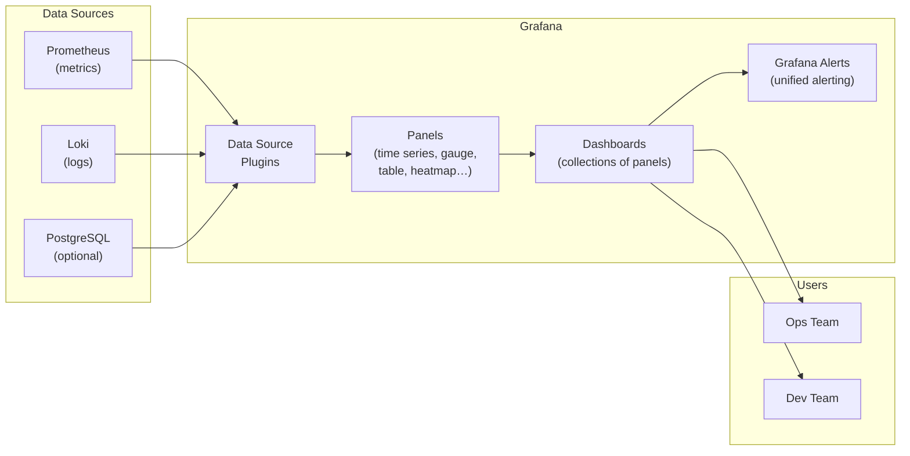

# 13.4 Dashboards with Grafana

⏱️ **~6 min read**

> **TL;DR:** Grafana is the visualization layer for your observability stack. It connects to Prometheus (and Loki) as data sources and turns PromQL queries into live dashboards. The kube-prometheus-stack installs pre-built dashboards for Kubernetes itself — you extend these with your own panels for application-level metrics.

---

## Grafana Architecture



---

## Accessing Grafana on Minikube

After installing `kube-prometheus-stack`:

```bash
# Port-forward Grafana to localhost:3000
kubectl port-forward svc/monitoring-grafana 3000:80 -n monitoring

# Open in browser
open http://localhost:3000
# Login: admin / admin123  (or whatever you set at install)
```

> **Tip:** To find the exact Grafana service name: `kubectl get svc -n monitoring | grep grafana`

---

## Pre-Built Kubernetes Dashboards

The kube-prometheus-stack ships with production-grade dashboards out of the box. Browse them at **Dashboards → Browse**:

| Dashboard | What You See |
|-----------|-------------|
| **Kubernetes / Compute Resources / Namespace (Pods)** | CPU + memory for all pods in a namespace |
| **Kubernetes / Compute Resources / Node** | Per-node resource utilization |
| **Kubernetes / Networking / Namespace** | Network in/out by pod |
| **Node Exporter / Full** | Host-level metrics (disk I/O, filesystem, network) |
| **Kubernetes / Persistent Volumes** | PVC usage and status |
| **Alertmanager / Overview** | Current firing alerts |

---

## Anatomy of a Grafana Dashboard

```
┌─────────────────────────────────────────────────────────┐
│  Dashboard: My App Overview        [Time range: Last 1h]│
│  Variables: [namespace ▼]  [pod ▼]                      │
├─────────────────────────────────────────────────────────┤
│  ┌───────────────┐  ┌──────────────┐  ┌──────────────┐ │
│  │  Requests/sec │  │  Error Rate  │  │   p99 Latency│ │
│  │   [Stat]      │  │  [Gauge]     │  │  [Stat]      │ │
│  │    142/s      │  │   0.3%       │  │   48ms       │ │
│  └───────────────┘  └──────────────┘  └──────────────┘ │
│                                                         │
│  ┌─────────────────────────────────────────────────────┐│
│  │  Request Rate over Time           [Time Series]     ││
│  │  ┌────────────────────────────────────────────────┐ ││
│  │  │ ^                                              │ ││
│  │  │ │  /\  /\/\    /\                              │ ││
│  │  │ │ /  \/    \  /  \___                          │ ││
│  │  │ └──────────────────────────────────────── time │ ││
│  │  └────────────────────────────────────────────────┘ ││
│  └─────────────────────────────────────────────────────┘│
└─────────────────────────────────────────────────────────┘
```

### Panel Types

| Panel Type | Best For |
|-----------|---------|
| **Time Series** | Metrics over time (request rate, latency trends) |
| **Stat** | Single important number (current RPS, uptime) |
| **Gauge** | Value with min/max (error rate %, memory %) |
| **Table** | Multi-column data (pod list with CPU/mem) |
| **Bar Gauge** | Comparing values across instances |
| **Heatmap** | Latency distributions over time |
| **Logs** | Loki log streams embedded in dashboards |
| **Alert list** | Current firing alerts |

---

## Building Your First Custom Panel

Here's how to create a **Request Rate** panel for your app:

### Step 1: Add a Panel
1. Open a dashboard → click **Add** → **Visualization**
2. Select data source: **Prometheus**

### Step 2: Write the PromQL Query

```promql
# Panel: HTTP Request Rate
sum by (status) (
  rate(http_requests_total{namespace="$namespace", pod=~"$pod"}[5m])
)
```

> `$namespace` and `$pod` are **dashboard variables** — dropdown filters at the top.

### Step 3: Configure Visualization
- **Panel type:** Time Series
- **Legend:** `{{status}}`
- **Unit:** `reqps` (requests per second)
- **Thresholds:** Yellow at 100/s, Red at 500/s

### Step 4: Add More Panels

```promql
# Error rate %
sum(rate(http_requests_total{status=~"5..", pod=~"$pod"}[5m]))
/
sum(rate(http_requests_total{pod=~"$pod"}[5m])) * 100

# p95 Latency
histogram_quantile(0.95,
  sum by (le)(rate(http_request_duration_seconds_bucket{pod=~"$pod"}[5m])))

# Memory usage MB
container_memory_usage_bytes{pod=~"$pod"} / 1024 / 1024
```

---

## Dashboard Variables

Variables make dashboards interactive — users pick namespace/pod from dropdowns:

1. Go to **Dashboard Settings → Variables → Add variable**
2. Configure:

```
Name:   namespace
Type:   Query
Query:  label_values(kube_pod_info, namespace)
```

```
Name:   pod
Type:   Query
Query:  label_values(kube_pod_info{namespace="$namespace"}, pod)
```

Now your PromQL queries use `$namespace` and `$pod` as filters, and the dashboard dynamically scopes to whatever the user selects.

---

## Dashboard as Code (GitOps)

In production, dashboards should be version-controlled, not clicked together in the UI:

```yaml
# ConfigMap containing a Grafana dashboard JSON
apiVersion: v1
kind: ConfigMap
metadata:
  name: my-app-dashboard
  namespace: monitoring
  labels:
    grafana_dashboard: "1"   # Grafana sidecar auto-imports this
data:
  my-app.json: |
    {
      "title": "My App Overview",
      "panels": [...],
      "templating": { "list": [...] }
    }
```

The `grafana-sidecar` container in the Grafana pod watches for ConfigMaps with `grafana_dashboard: "1"` and automatically imports them. Export a dashboard as JSON from the Grafana UI and commit it to Git.

---

## Grafana Alerting

Grafana has unified alerting that can trigger from any data source:

```yaml
# Alert rule (configured in Grafana UI or as YAML)
Name: High Error Rate
Condition: sum(rate(http_requests_total{status=~"5.."}[5m])) / sum(rate(http_requests_total[5m])) > 0.01
For: 5m
Notifications:
  - Slack channel #alerts
  - PagerDuty
  - Email
```

> **Note:** For Kubernetes-native alerting, prefer **AlertManager** rules (PrometheusRule CRDs) over Grafana alerts — they work even when Grafana is down.

---

## ✅ Quick Check

**Q1:** You built a Grafana dashboard that shows metrics for a specific pod name (hardcoded). A colleague wants to reuse it for their pod. What's the proper Grafana feature to use?

<details>
<summary>Answer</summary>
**Dashboard Variables.** Create a variable (e.g., `pod`) with a query like `label_values(kube_pod_info, pod)` that dynamically lists all pods. Then replace the hardcoded pod name in all PromQL queries with `$pod`. Users can select any pod from a dropdown at the top of the dashboard.
</details>

**Q2:** Your Grafana dashboard shows a spike in errors at 2:15 AM. How do you correlate this with logs for the same time window?

<details>
<summary>Answer</summary>
If you have **Loki** configured as a data source in Grafana, you can add a **Logs panel** to the same dashboard pointing to the relevant log stream (e.g., `{app="my-app"}`). Grafana's time range selector is global — changing the range to around 2:15 AM will show both the metric panel and the log panel for that window simultaneously. You can also click on a specific point in a time series panel and "Explore" the correlated logs.
</details>

**Q3:** Why should Grafana dashboards be stored in Git rather than only in the Grafana database?

<details>
<summary>Answer</summary>
Grafana stores dashboards in its internal database (SQLite or PostgreSQL). If Grafana's pod/PVC is deleted (e.g., during a cluster migration, namespace deletion, or accidental `helm uninstall`), all dashboards are lost. Storing dashboards as JSON in Git enables: version history, code review for dashboard changes, automatic re-provisioning via ConfigMaps or Helm values, and consistent dashboards across multiple clusters (dev/staging/prod).
</details>
