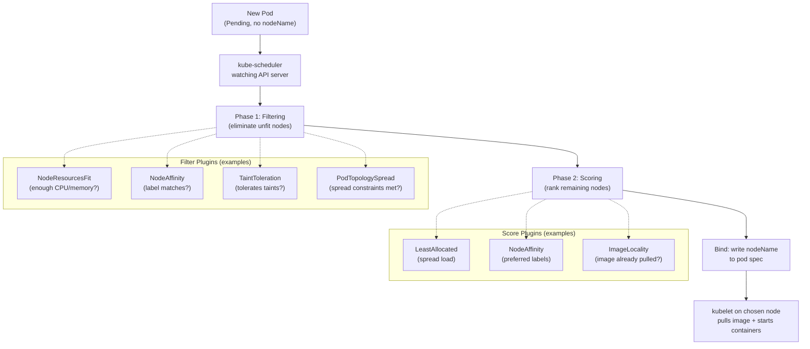

# 14.1 The Kubernetes Scheduler — How It Picks a Node

⏱️ **5 min read · 5 min hands-on** · 🔴 Advanced

> **TL;DR:** The `kube-scheduler` watches for unscheduled pods and picks the best node for each one by running every candidate node through two phases: **Filtering** (eliminate nodes that can't run the pod) and **Scoring** (rank the survivors; highest score wins). You influence both phases using the placement mechanisms covered in this chapter.

> **After this section you will be able to:**
> - Trace the two-phase scheduling process: Filtering (predicates) and Scoring (priorities)
> - Understand how node resources, ports, and selectors influence placement decisions
> - Diagnose and resolve scheduling failures for `Pending` pods

---

## The Scheduling Pipeline

Every pod starts life as `Pending` — it exists in etcd but has no `nodeName`. The scheduler's job is to assign one.



---

## Phase 1 — Filtering (Hard Constraints)

A node is eliminated if **any** filter fails. Common filter checks:

| Filter | What It Checks |
|--------|---------------|
| **NodeResourcesFit** | Node has enough free CPU and memory for the pod's `requests` |
| **NodeAffinity** | Node labels match `requiredDuringSchedulingIgnoredDuringExecution` rules |
| **TaintToleration** | Pod tolerates all `NoSchedule` taints on the node |
| **PodTopologySpread** | Placing here wouldn't violate `topologySpreadConstraints` |
| **VolumeBinding** | Required PersistentVolumes are available in this zone |
| **NodeUnschedulable** | Node is not cordoned (`kubectl cordon`) |

> If **zero nodes** survive filtering, the pod stays `Pending`. This is the most common cause of pods stuck in Pending — always check `kubectl describe pod <name>` for the scheduler's message.

---

## Phase 2 — Scoring (Soft Preferences)

Surviving nodes are each scored 0–100 by each scoring plugin, then weighted and summed. Highest total wins.

| Score Plugin | Goal |
|-------------|------|
| **LeastAllocated** | Prefer nodes with the most free resources (spread load) |
| **MostAllocated** | Prefer fuller nodes (bin-pack, save money) |
| **NodeAffinity** | Boost score for nodes matching `preferredDuringScheduling` rules |
| **ImageLocality** | Prefer nodes that already have the container image cached |
| **InterPodAffinity** | Boost nodes near pods you want to be co-located with |

---

## Diagnosing Scheduling Problems

```bash
# Pod stuck in Pending — check why:
kubectl describe pod my-pod | grep -A 20 "Events:"
```

Common messages and their meaning:

| Event Message | Root Cause |
|---------------|-----------|
| `0/3 nodes are available: 3 Insufficient memory` | All nodes have less free memory than `requests.memory` |
| `0/3 nodes are available: 3 node(s) had untolerated taint` | Nodes are tainted, pod lacks matching toleration |
| `0/3 nodes are available: 3 node(s) didn't match node affinity` | Required node label doesn't exist on any node |
| `0/1 nodes are available: 1 node(s) were unschedulable` | Node is cordoned |
| `no persistent volumes available` | PVC can't be bound (wrong StorageClass or zone) |

```bash
# See all pending pods across the cluster
kubectl get pods -A | grep Pending

# Check scheduler events
kubectl get events --field-selector reason=FailedScheduling -A

# See what resources are actually available on nodes
kubectl describe nodes | grep -A 5 "Allocated resources"
```

---

## Manual Scheduling (Bypass the Scheduler)

You can hard-pin a pod to a specific node by setting `nodeName` directly — the scheduler is skipped entirely:

```yaml
apiVersion: v1
kind: Pod
metadata:
  name: pinned-pod
spec:
  nodeName: minikube-m02   # ← Bypass scheduler; go directly to this node
  containers:
  - name: nginx
    image: nginx:alpine
```

> ⚠️ **Avoid in production.** If that node goes down, the pod is **not** rescheduled — it just stays Failed. Use node affinity rules instead so the scheduler can pick an equivalent node.

---

## The NodeName Flow vs Scheduler Flow

```
Manual (nodeName):    Pod → API Server → kubelet on named node
                      (no scheduler involved, no rescheduling if node fails)

Scheduler Flow:       Pod → API Server → Scheduler → Filter → Score → Bind
                      (rescheduled on failure, respects resource availability)
```

---

## ✅ Quick Check

**Q1:** A pod has `requests.memory: 512Mi` but all nodes only have 400Mi free. What happens?

<details>
<summary>Answer</summary>
The pod stays **Pending**. The `NodeResourcesFit` filter eliminates all nodes because none can satisfy the memory request. You'll see an event like `0/N nodes are available: N Insufficient memory`. Fix options: reduce the pod's memory request, scale up a node, add a new node, or free up memory by evicting lower-priority pods.
</details>

**Q2:** What's the difference between a node surviving Filtering vs being chosen after Scoring?

<details>
<summary>Answer</summary>
**Filtering** is a hard gate — a node either passes or is eliminated. All surviving nodes are *capable* of running the pod. **Scoring** is a soft ranking — it picks the *best* node from the survivors based on preferences (spread load, match labels, image cached, etc.). A pod can run on any node that passes filtering; scoring just picks the optimal one.
</details>

**Q3:** Your pod is stuck in Pending. What's the first command you run?

<details>
<summary>Answer</summary>
`kubectl describe pod MY-POD-NAME` — look at the **Events** section at the bottom. The scheduler emits a `FailedScheduling` event with an exact explanation of why no node was chosen (e.g., "3 Insufficient memory", "3 node(s) had untolerated taint"). This tells you precisely what constraint is blocking placement.
</details>
