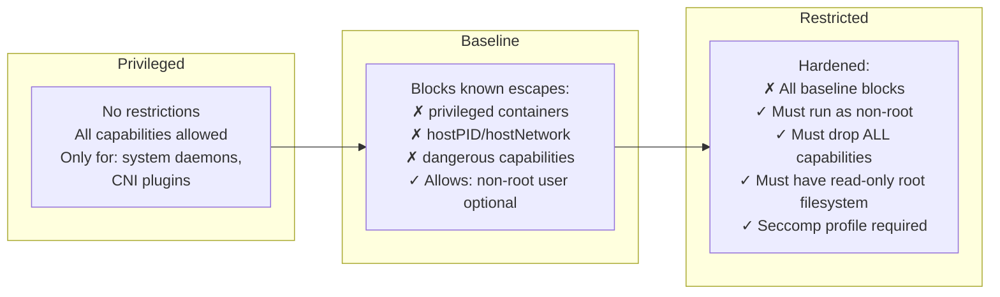

# 15.1 Pod Security Standards and Admission

⏱️ **~8 min read**

> **TL;DR:** Pod Security Standards (PSS) are built-in Kubernetes policies that prevent containers from running with dangerous privileges — root access, host network sharing, mounting host paths, etc. You apply them at the **namespace level** using labels. The three levels are **Privileged** (anything goes), **Baseline** (known escapes blocked), and **Restricted** (hardened — best practice for production).

---

## Why Pods Are a Security Risk by Default

A freshly created pod, without any restrictions, can:

- Run as **root** inside the container
- Mount the **host filesystem** (`hostPath`)
- Use the **host network** (see all traffic on the node)
- Use **privileged mode** (full root on the host — equivalent to `sudo` on the node)
- Run `CAP_SYS_ADMIN` and other dangerous Linux capabilities

Any one of these can allow a compromised container to break out of the container sandbox and compromise the node or the entire cluster.

---

## Pod Security Standards — Three Levels



| Level | Use Case | What It Blocks |
|-------|----------|---------------|
| **Privileged** | System namespaces (`kube-system`), CNI plugins | Nothing |
| **Baseline** | General workloads, legacy apps | `privileged`, `hostPID`, `hostNetwork`, `hostPath`, dangerous capabilities |
| **Restricted** | Production, regulated workloads | Everything in Baseline + requires non-root, dropped capabilities, seccomp |

---

## Applying PSS to a Namespace

Enforce via **namespace labels** — no extra controllers needed (built into `kube-apiserver` since 1.23 GA):

```bash
# Enforce Baseline (blocks creation of violating pods)
kubectl label namespace my-app \
  pod-security.kubernetes.io/enforce=baseline \
  pod-security.kubernetes.io/enforce-version=latest

# Warn + Audit on Restricted (visible in API response and audit log, but doesn't block)
kubectl label namespace my-app \
  pod-security.kubernetes.io/warn=restricted \
  pod-security.kubernetes.io/warn-version=latest \
  pod-security.kubernetes.io/audit=restricted \
  pod-security.kubernetes.io/audit-version=latest
```

### Three Modes

| Label Mode | Effect |
|-----------|--------|
| `enforce` | **Blocks** the pod — returns a 400 error if it violates the policy |
| `warn` | Allows the pod but returns a **warning** in the API response |
| `audit` | Allows the pod and writes a **record to the audit log** |

> **Graduated rollout strategy:** Start with `warn` only in production, fix all warnings, then switch to `enforce`. This prevents surprise outages from tightening policy too quickly.

---

## What Restricted Requires

A pod that passes `restricted` must satisfy all of these:

```yaml
spec:
  # 1. Must NOT be privileged
  securityContext:
    runAsNonRoot: true             # Must run as non-root user
    seccompProfile:
      type: RuntimeDefault         # Must have seccomp profile
  
  containers:
  - name: app
    image: my-app:latest
    securityContext:
      allowPrivilegeEscalation: false   # Cannot escalate to root
      capabilities:
        drop: ["ALL"]                   # Drop ALL Linux capabilities
        add: ["NET_BIND_SERVICE"]       # Only add back what's needed
      readOnlyRootFilesystem: true      # No writes to container root FS
      runAsUser: 1000                   # Explicit non-root UID
      runAsGroup: 1000
```

---

## Common Violations and Fixes

| Violation | Error | Fix |
|-----------|-------|-----|
| Running as root | `runAsNonRoot` fails | Add `runAsUser: 1000` to securityContext |
| `privileged: true` | Blocked by Baseline | Remove; use specific capabilities instead |
| `hostNetwork: true` | Blocked by Baseline | Use a Service instead |
| Missing `allowPrivilegeEscalation: false` | Blocked by Restricted | Add to container securityContext |
| Missing `capabilities.drop: [ALL]` | Blocked by Restricted | Explicitly drop all caps |
| Missing seccomp | Blocked by Restricted | Add `seccompProfile.type: RuntimeDefault` |

---

## SecurityContext — The Per-Pod and Per-Container Settings

```yaml
apiVersion: v1
kind: Pod
metadata:
  name: hardened-pod
spec:
  # Pod-level security context (applies to all containers)
  securityContext:
    runAsNonRoot: true
    runAsUser: 1001
    runAsGroup: 1001
    fsGroup: 1001              # Group for mounted volumes
    seccompProfile:
      type: RuntimeDefault
  
  containers:
  - name: app
    image: nginx:alpine
    # Container-level overrides pod-level for its specific container
    securityContext:
      allowPrivilegeEscalation: false
      readOnlyRootFilesystem: true
      capabilities:
        drop: ["ALL"]
        add: ["NET_BIND_SERVICE"]  # Needed only if binding port < 1024
    
    # If readOnlyRootFilesystem=true, mount writable dirs as emptyDir
    volumeMounts:
    - name: tmp
      mountPath: /tmp
    - name: var-run
      mountPath: /var/run/nginx
  
  volumes:
  - name: tmp
    emptyDir: {}
  - name: var-run
    emptyDir: {}
```

---

## Admission Controllers Beyond PSS

PSS is built-in, but you can extend admission control with:

| Tool | What It Does |
|------|-------------|
| **OPA Gatekeeper** | Custom policy-as-code using Rego; validates any Kubernetes object |
| **Kyverno** | Policy engine with YAML-native rules; can also generate/mutate resources |
| **Falco** | Runtime security — detects anomalous behavior (shell in container, file writes) |

> **Recommended path:** Start with PSS `enforce=baseline` everywhere, `enforce=restricted` for prod namespaces. Add Kyverno or Gatekeeper for org-specific rules (naming conventions, required labels, image registries).

---

## ✅ Quick Check

**Q1:** What's the difference between `enforce` and `warn` modes for Pod Security Standards?

<details>
<summary>Answer</summary>
`enforce` **blocks** the pod — the API server rejects the create/update request with a 400 error if the pod violates the policy. `warn` **allows** the pod but adds a warning message to the API response (visible in `kubectl apply` output). Both modes let you apply the same PSS level; `warn` is used for gradual rollout to surface violations before blocking them.
</details>

**Q2:** A pod running nginx needs to bind to port 80 (below 1024). What's the minimal securityContext to pass `restricted` and still bind to port 80?

<details>
<summary>Answer</summary>
```yaml
securityContext:
  allowPrivilegeEscalation: false
  readOnlyRootFilesystem: true
  runAsNonRoot: true
  runAsUser: 1000
  capabilities:
    drop: ["ALL"]
    add: ["NET_BIND_SERVICE"]   # Allows binding ports below 1024 without root
```
Alternatively, configure nginx to listen on port 8080 (above 1024) and drop `NET_BIND_SERVICE` too, which is the cleaner solution. A Service or Ingress maps external port 80 to internal port 8080.
</details>

**Q3:** Your `kube-system` namespace runs CNI plugins and system daemons that need host access. Should you apply `restricted` to it?

<details>
<summary>Answer</summary>
No — `kube-system` should remain **Privileged** (the default). System components like the CNI plugin (Calico, Cilium), DNS (CoreDNS), and metrics-server legitimately need elevated access to function. Applying `restricted` or even `baseline` to `kube-system` would break these components. Apply restrictive PSS only to application namespaces, not infrastructure namespaces.
</details>
